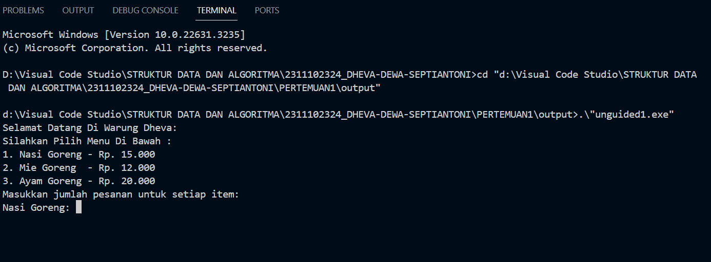
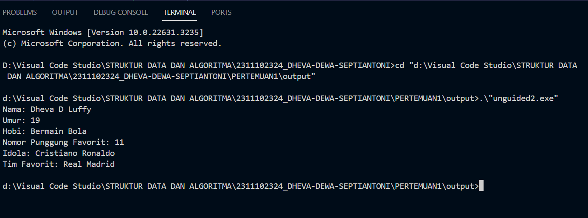
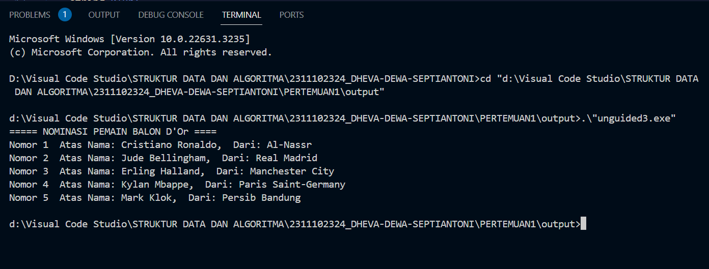

# <h1 align="center">Laporan Praktikum Modul 1 - Tipe Data</h1>
<p align="center">Dheva Dewa Septiantoni - 2311102324</p>

## Dasar Teori

Tipe data adalah suatu memori atau media pada komputer yang digunakan untuk menampung informasi atau data sementara. Tipe data berfungsi untuk mempresentasikan jenis dari sebuah nilai yang terdapat dalam program. Berikut ini merupakan macam-macam tipe data serta penjelasannya yang terdapat pada C++:

1. Tipe Data Primitif<br/>
Tipe data primitif adalah tipe data yang sudah ditentukan oleh sistem dan disediakan oleh banyak bahasa pemrograman. Ini adalah blok bangunan fundamental untuk menyimpan nilai-nilai sederhana. Contoh tipe data primitif:
    - Int (Bilangan bulat)
    - Float (Bilangan desimal)
    - Char (Huruf)
    - Boolean (True/False)

2. Tipe Data Abstrak<br/>
Tipe data abstrak atau yang biasa disebut Abstrak Data Type merupakan tipe data yang dibentuk oleh programmer itu sendiri. Pada tipe data abstrak bisa berisi banyak tipe data, jadi nilainya bisa lebih dari satu dan beragam tipe data

3. Tipe Data Koleksi<br/>
Tipe data koleksi (Collection Data Type) adalah tipe data yang digunakan untuk mengelompokkan dan menyimpan beberapa nilai atau objek secara bersamaan. Tipe data koleksi memungkinkan Anda menyimpan, mengelola, dan mengakses sejumlah besar data dengan cara yang terstruktur. Contoh data koleksi:
    - Array (struktur data statis yang menyimpan elemen-elemen dengan
    tipe data yang sama)
    - Vector (vector mirip seperti array yang memiliki
    kemampuan untuk menyimpan data dalam bentuk elemen-elemen yang alokasi
    memorinya dilakukan otomatis dan bersebelahan)
    - Map (Map terasa mirip dengan array namun dengan index yang memungkinkan
    untuk berupa tipe data selain integer)

## Guided 

### 1. Tipe Data Primitif

```C++
#include <iostream>
#include <iomanip>

using namespace std;

// Tipe Data Primitif by Jordan

int main(){
    char op;
    float num1, num2;

    cout << "Enter operator (+, -, *, /): ";
    cin >> op;

    cout << "Enter two operands: ";
    cin >> num1 >> num2;

    switch (op)
    {
    case '+':
        cout << "Result: " << num1 + num2 << endl;
        break;
    case '-':
        cout << "Result: " << num1 - num2 << endl;
        break;
    case '*':
        cout << "Result: " << num1 * num2 << endl;
        break;
    case '/':
        if (num2 == 0) {
            cout << "Result: " << fixed << setprecision(2) << num1 / num2 << endl;
        } else {
            cout << "Error!: Division by zero" << endl;
        }
        break;

    default:
        cout << "Error! operator is not correct" << endl;
        break;
    }
    return 0;
}
```
Kode di atas digunakan untuk memilih operasi penambahan (+), pengurangan (-), perkalian (*), dan pembagian (/). Keempat operasi ini akan jalan jika user sudah menginput dua angka pada saat penginputan cin. Terdapat juga dua tipe data primitif pada program ini, yaitu char dan float. Tipe data char digunakan pada saat pemilihan switch case dan float digunakan sebagai tipe data 2 angka yang diinput user.

### 2. Tipe Data Abstrak

```C++
#include <stdio.h>
#include <string.h>

// Struct
struct Mahasiswa
{
    char name[50];
    char address[50];
    int age;
};

// Tipe Data Abstrak by Jordan

int main() {
    // Menggunakan Struct
    struct Mahasiswa mhs1, mhs2;

    // Mengisi nilai ke struct
    strcpy(mhs1.name, "Dian");
    strcpy(mhs1.address, "Mataram");
    mhs1.age = 22;
    strcpy(mhs2.name, "Bambang");
    strcpy(mhs2.address, "Surabaya");
    mhs2.age = 23;

    // Mencetak isi dari struct
    printf("## Mahasiswa 1 ##\n");
    printf("Nama: %s\n", mhs1.name);
    printf("Alamat: %s\n", mhs1.address);
    printf("Umur: %d\n", mhs1.age);
    printf("\n");
    printf("## Mahasiswa 2 ##\n");
    printf("Nama: %s\n", mhs2.name);
    printf("Alamat: %s\n", mhs2.address);
    printf("Umur: %d\n", mhs2.age);

    return 0;
}
```
Kode di atas digunakan untuk mencetak isi dari struct. Struct merupakan salah satu contoh dari tipe data abstrak. Pada kode di atas terdapat sebuah struct Mahasiswa. Pada struct Mahasiswa ini, terdapat 3 nilai, yaitu char name dengan ukuran 50, char address dengan ukuran 50 juga, dan int age. Lalu pada int main, diisi nilai dan dideklarasikan struct Mahasiswa dengan 2 objek, yaitu mhs1 dengan nama Dian dan mhs2 dengan nama Bambang.

### 3. Tipe Data Koleksi

```C++
#include <iostream>
#include <array>
using namespace std;

// Tipe Data Koleksi by Jordan

int main() {
    // Deklarasi dan inisialisasi array
    int nilai[5];
    nilai[0] = 23;
    nilai[1] = 50;
    nilai[2] = 34;
    nilai[3] = 78;
    nilai[4] = 90;

    // Mencetak array dengan tab
    cout << "Isi array pertama : " << nilai[0] << endl;
    cout << "Isi array kedua : " << nilai[1] << endl;
    cout << "Isi array ketiga : " << nilai[2] << endl;
    cout << "Isi array keempat : " << nilai[3] << endl;
    cout << "Isi array kelima : " << nilai[4] << endl;

    return 0;
}
```
Kode di atas digunakan untuk mencetak isi dari sebuah array. Array merupakan salah satu contoh dari tipe data koleksi. Pada kode di atas, terdapat library array yang membantu proses pemrogramannya. Terdapat array nilai yang dapat menampung 5 nilai, yaitu 23, 50, 34, 78, dan 90. Lalu dideklarasikan di bawahnya.

## Unguided 

### 1. Buatlah program menggunakan tipe data primitif minimal dua fungsi dan bebas. Menampilkan program, jelaskan program tersebut dan ambil kesimpulan dari materi tipe data primitif!

```C++
//Dheva Dewa Septiantoni
//2311102324
#include <iostream>
using namespace std;

int main() {
    int jumlah_pesanan; // Variabel untuk menyimpan jumlah pesanan
    double total_harga = 0.0; // Variabel untuk menyimpan total harga

    double harga_nasi_goreng = 15000.0;
    double harga_mie_goreng = 12000.0;
    double harga_ayam_goreng = 20000.0;
    // Harga masing-masing item

    cout << "Selamat Datang Di Warung Dheva:" << endl;
    cout << "Silahkan Pilih Menu Di Bawah :" << endl;
    cout << "1. Nasi Goreng - Rp. 15.000" << endl;
    cout << "2. Mie Goreng  - Rp. 12.000" << endl;
    cout << "3. Ayam Goreng - Rp. 20.000" << endl;

    cout << "Masukkan jumlah pesanan untuk setiap item:" << endl; // Meminta pengguna untuk memasukkan jumlah pesanan
    cout << "Nasi Goreng: ";
    cin >> jumlah_pesanan;
    total_harga += jumlah_pesanan * harga_nasi_goreng;

    cout << "Mie Goreng: ";
    cin >> jumlah_pesanan;
    total_harga += jumlah_pesanan * harga_mie_goreng;

    cout << "Ayam Goreng: ";
    cin >> jumlah_pesanan;
    total_harga += jumlah_pesanan * harga_ayam_goreng;

    cout << "Total harga: Rp. " << total_harga << endl; // Menampilkan total harga

    return 0;
}
```
#### Output:

Kode di atas digunakan untuk memilih sebuah opsi menu beberapa makanan di warung Dheva. kode diatas menggunakan variable int dan double sebagai tipe data primitif. Program dimulai dengan mendeklarasikan variabel "jumlah_pesanan" untuk menyimpan jumlah pesanan dan "total_harga" untuk menyimpan total harga pesanan. Selanjutnya, program menampilkan pesan selamat datang beserta menu yang tersedia di Warung Dheva beserta harganya.Program meminta pengguna untuk memasukkan jumlah pesanan untuk setiap item yang dipilih. Pengguna diminta untuk memasukkan jumlah pesanan nasi goreng, mie goreng, dan ayam goreng secara berurutan.Setelah pengguna memasukkan jumlah pesanan untuk setiap item, program menghitung total harga pesanan dengan mengalikan jumlah pesanan dengan harga masing-masing item, dan kemudian menambahkan hasilnya ke dalam variabel "total_harga". Dan yang terakhir, program menampilkan total harga pesanan yang harus dibayar oleh pengguna.

Kesimpulan Tipe Data Primitif:<br/>
Tipe data primitif merupakan sebuah tipe data yang sudah ditentukan oleh sistem, disediakan oleh banyak bahasa pemrograman, dan merupakan blok bangunan fundamental untuk menyimpan nilai-nilai yang bersifat sederhana.

### 2. Jelaskan fungsi dari class dan struct secara detail dan berikan contoh programnya!

```C++
//Dheva Dewa Septiantoni
//2311102324
#include <iostream>
using namespace std;

// Mendefinisikan struct Mahasiswa
struct Mahasiswa1 {
    string nama;
    int umur;
};

int main() {
//Contoh Program menggunakan Struct:
    // Mendeklarasikan variabel bertipe struct Mahasiswa
    Mahasiswa1 mhs1;

    // Mengisi data ke dalam variabel
    mhs1.nama = "Dheva D Luffy";
    mhs1.umur = 19;
    // Menampilkan informasi mahasiswa
    cout << "Nama: " << mhs1.nama << endl;
    cout << "Umur: " << mhs1.umur << endl;


//Contoh Program menggunakan Class:
class Mahasiswa2 {
public:
    string hobi;
    int nopung;
    string idola;
    string timfav;

    // Metode untuk menampilkan informasi mahasiswa
    void Identitas() {
        cout << "Hobi: " << hobi << endl;
        cout << "Nomor Punggung Favorit: " << nopung << endl;
        cout << "Idola: " << idola << endl;
        cout << "Tim Favorit: " << timfav << endl;
    }
};
    // Membuat objek dari class Mahasiswa
    Mahasiswa2 mhs2;

    // Mengisi data ke dalam objek
    mhs2.hobi = "Bermain Bola";
    mhs2.nopung = 11;
    mhs2.idola = "Cristiano Ronaldo";
    mhs2.timfav = "Real Madrid";
    // Memanggil metode untuk menampilkan informasi mahasiswa
    mhs2.Identitas();

    return 0;
}
```
#### Output:

Kode di atas digunakan untuk mencetak sebuah class dan struct. Pada kode di atas, terdpat Struct Mahasiswa1didefinisikan untuk menyimpan informasi tentang seorang mahasiswa, yaitu nama dan umur.Variabel mhs1 bertipe Mahasiswa1 digunakan untuk menyimpan data seorang mahasiswa. Data nama dan umur mahasiswa diisi dengan nilai "Dheva D Luffy" dan 19. Informasi tentang mahasiswa ditampilkan dengan menggunakan cout.
Class Mahasiswa2 didefinisikan untuk menyimpan informasi lebih lanjut tentang seorang mahasiswa, yaitu hobi, nomor punggung favorit, idola, dan tim favorit. Anggota class ini adalah public sehingga dapat diakses secara langsung dari luar class. Metode Identitas() digunakan untuk menampilkan informasi tentang mahasiswa. Objek mhs2 dari class Mahasiswa2 dibuat, kemudian data tentang mahasiswa diisi dengan nilai-nilai tertentu. Metode Identitas() dipanggil untuk menampilkan informasi mahasiswa.

A. Fungsi dari Class<br/>
Class adalah struktur data yang mendefinisikan tipe data baru yang memiliki data (variabel anggota) 
dan fungsi (metode) yang terkait dengannya. Dalam class, data dan fungsi tersebut bersifat terkait 
dan dapat diakses melalui objek dari class tersebut. Class memungkinkan untuk menggabungkan data 
dan perilaku dalam satu kesatuan.

B. Fungsi dari Struct<br/>
Struct adalah struktur data yang mirip dengan class, tetapi secara default semua anggotanya adalah 
public (dalam class, secara default anggotanya adalah private). Struct biasanya digunakan untuk menyimpan 
sekumpulan data yang terkait, tetapi tidak memiliki fungsi yang terkait.

### 3. Buat dan jelaskan program menggunakan fungsi map dan jelaskan perbedaan dari array dengan map!

```C++
//Dheva Dewa Septiantoni
//2311102324
//A. Program Fungsi Map

#include <iostream>
#include <map>

using namespace std;

// Struktur data untuk menyimpan informasi Nominasi Ballon D'Or
struct player {
    string nama;
    string klub;
};

int main() {
    // Deklarasi map dengan key int dan value berupa objek player
    map<int, player> pemain2324;

    // Menambahkan data calon DPR ke dalam map
    pemain2324[1] = {"Cristiano Ronaldo", "Al-Nassr"};
    pemain2324[2] = {"Jude Bellingham", "Real Madrid"};
    pemain2324[3] = {"Erling Halland", "Manchester City"};
    pemain2324[4] = {"Kylan Mbappe", "Paris Saint-Germany"};
    pemain2324[5] = {"Mark Klok", "Persib Bandung"};

    cout << "===== NOMINASI PEMAIN BALON D'Or ====" << endl;
    //perulangan for untuk menampilkan MAP
    for (int i = 1; i <= pemain2324.size(); ++i) {
        cout << "Nomor " << i << "  Atas Nama: " << pemain2324[i].nama << ",  Dari: " << pemain2324[i].klub << endl;
        }
    return 0;
}
```
#### Output:

Program di atas merupakan contoh penggunaan fungsi map.Program dimulai dengan mengimpor pustaka <iostream> dan <map> untuk penggunaan fungsi map Struktur data player didefinisikan untuk menyimpan informasi tentang pemain, yaitu nama dan klubnya. Di dalam fungsi main(), sebuah map dengan key bertipe int dan value bertipe player dideklarasikan dengan nama pemain2324. Data pemain dan klubnya dimasukkan ke dalam map pemain2324 menggunakan operator [] dengan key yang sesuai. Selanjutnya, program menampilkan judul "NOMINASI PEMAIN BALON D'Or" menggunakan cout. Dengan menggunakan loop for, program menampilkan semua data pemain dan klubnya yang disimpan dalam map dengan nomor urutan dan informasi pemain yang sesuai. Setelah menampilkan semua data, program selesai.

Perbedaan Array dengan Map
1. Indeks
- Array harus bilangan bulat non-negatif & mulai berurutan dari 0
- Map dapat berupa nilai berapa pun & tidak harus berurutan
2. Ukuran
- Array harus dideklarasikan dengan ukuran yang tetap
- Map dapat dideklarasikan dengan ukuran yang dinamis
3. Tipe Data
- Array hanya dapat menggunakan tipe data primitif
- Map dapat menggunakan tipe data apapun
4. Penggunaan
- Array digunakan untuk menyimpan data yang berurutan
- Map digunakan untuk menyimpan data yang tidak berurutan dan perlu diakses berdasarkan key


## Kesimpulan
Dari modul tersebut, dapat disimpulkan bahwa pemahaman tentang tipe data sangat penting dalam pemrograman karena tipe data mempengaruhi cara data disimpan, diakses, dan diolah dalam program.

## Referensi