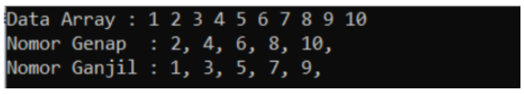
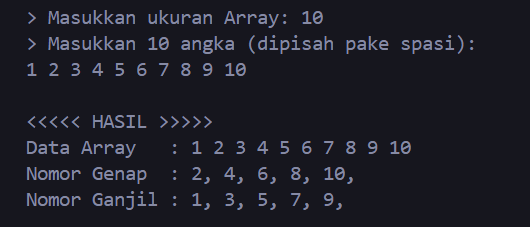
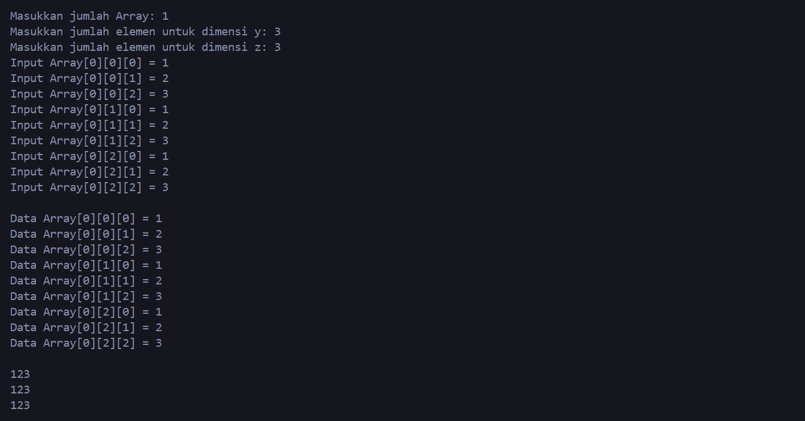
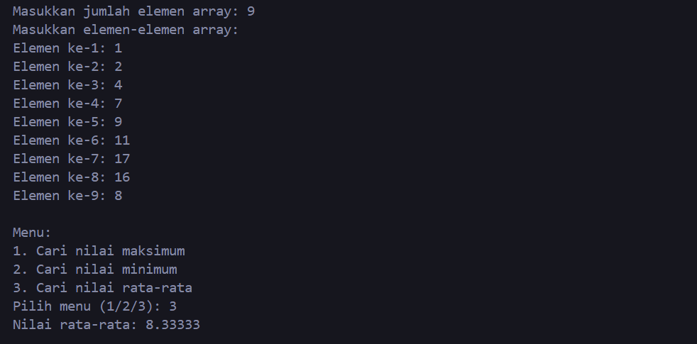

# <h1 align="center">Laporan Praktikum Modul 2 - ARRAY</h1>
<p align="center">Dheva Dewa Septiantoni - 2311102324</p>

## Dasar Teori

A. Pengertian Array
Array atau larik sendiri di definisikan sebagai pemesanan alokasi memory yang berurutan. Definisi ini kurang cocok, karena terjadi ketidakakuratan antara struktur data dan representasinya, hampir selalu di implementasikan menggunakan memory berurutan tapi tidak selalu demikian. Semua elemem array bertipe sama. Array cocok untuk mengatur kumpulan data homogen yang ukuran atau jumlah maksimum elemennya diketahui sejak awal. Homogen adalah semua elemen array tertentu harus memiliki tipe data yang sama.Struktur array adalah kumpulan elemen-elemen data yang digabungkan menjadi suatu kesatuan yang memiliki tipe homogen (sama). Array diawali dari angka 0.

B. Karakteristik Array :
    1. Mempunyai batasan dari pemesanan alokasi memori (bersifat statis).
    2. Mempunyai tipe data sama (bersifat homogen).
    3. Dapat diakses secara acak.
C. Deklarasi Array :
Ada tiga hal yang harus diketahui dalam pendeklarasian, yaitu :

    1. Type data array.
    2. Nama variable array.
    3. Subkrip / index array.
    D. Penggunaan Array
Pada dasarnya penggunaan array sangat luas tidak hanya digunakan pada bahasa pemrogaman. Contoh penggunaan array sebagai berikut :

    1. Array digunakan untuk suatu database, contoh : tabel.
    2. Array digunakan untuk operasi matematika seperti vektor.
    3. Digunakan dalam bentuk struktur data lain, contohnya list.
E. Bentuk-Bentuk Array
1. Array Satu Dimensi
    Array satu dimensi adalah kumpulan elemen identik yang hanya terdiri dari satu baris atau kolom alamat penyimpanan data (indeks). Elemen ini memiliki tipe data yang sama, namun isi elemen tersebut dapat berbeda. Bentuk umum : Tipe_data namaArray[n] = {elemen0, elemen1, elemen2,…..,n}; n = jumlah elemen contoh pada progam : int ukur[5] = {39, 40. 41, 38, 40}; · int adalah tipe data yang berupa bilangan bulat. · Ukur adalah nama variabel array. · [5] adalah ukuran untuk menyatakan jumlah maksimal elemen array.

2. Array Dua Dimensi
    Array dua dimensi sering digambarkan sebagai matriks, yang merupakan perpanjangan dari array satu dimensi. Jika larik satu dimensi terdiri dari tepat satu baris dan kira-kira kolom elemen, maka larik dua dimensi terdiri dari beberapa baris dan kolom yang terdiri dari elemen bertipe sama. sehingga dapat digambarkan sebagai berikut : Bentuk umum : Tipe_data namaArray [m][n] = {{a,b,…z},{1,2,…,n-1}}; contoh : int lulus[4][3]; · Nilai 4 untuk menyatakan banyaknya baris dan 3 untuk menyatakan banyaknya kolom. Mendeklarasikan array dua dimensi sama dengan mendeklarasikan array satu dimensi, hanya saja array dua dimensi berisi dua elemen dalam tanda kurung siku yang mungkin tidak sama. Elemen dari array dua dimensi diakses dengan menulis kedua indeks elemen dalam tanda kurung ().

3. Array Multidimensi
    Array ini mirip dengan array dua dimensi, namun bisa lebih besar. Dalam praktiknya, array multidimensi tidak terlalu sering digunakan, namun array ini dapat memainkan peran penting ketika dibutuhkan sejumlah besar dimensi. Bentuk umum pendeklarasian array multidimensi : Tipe_datanamaArray[ukuran1][ukuran2]…[ukuranN]; Sebagai contoh : int data_huruf[2][8][8];

## Guided 

### 1. Program Input Array Tiga Dimens

```C++
#include <iostream>
using namespace std;
// PROGRAM INPUT ARRAY 3 DIMENSI
int main() {
    // Deklarasi array
    int arr[2][3][3];
    // Input elemen
    for (int x = 0; x < 2; x++) {
        for (int y = 0; y < 3; y++) {
            for (int z = 0; z < 3; z++) {
                cout << "Input Array[" << x << "][" << y << "][" << z << "] = ";
                cin >> arr[x][y][z];
                }
            }
        cout << endl;
    }
    // Output Array
    for (int x = 0; x < 2; x++) {
        for (int y = 0; y < 3; y++) {
            for (int z = 0; z < 3; z++) {
                cout << "Data Array[" << x << "][" << y << "][" << z << "] = " << arr[x][y][z] << endl;
                }
            }
        }
    cout << endl;
    // Tampilan array
    for (int x = 0; x < 2; x++) {
        for (int y = 0; y < 3; y++) {
            for (int z = 0; z < 3; z++) {
            cout << arr[x][y][z] << ends;
            }cout << endl;
        }cout << endl;
    }
}
```
Program ini adalah untuk mengilustrasikan bagaimana array tiga dimensi dapat didefinisikan, diisi dengan nilai yang dimasukkan oleh pengguna, dan kemudian ditampilkan kembali ke layar. Program ini menunjukkan penggunaan dasar dari konsep array tiga dimensi dan penggunaan loop bersarang dalam C++.

### 2. Program Mencari Nilai Maksimal pada Array

```C++
#include <iostream>
using namespace std;
int main() {
    int maks, a, i = 1, lokasi;
    cout << "Masukkan panjang array: ";
    cin >> a;
    int array[a];
    cout << "Masukkan " << a << " angka\n";
    for (i = 0; i < a; i++) {
        cout << "Array ke-" << (i) << ": ";
        cin >> array[i]; }
    maks = array[0];
    for (i = 0; i < a; i++) {
        if (array[i] > maks) {
            maks = array[i];
            lokasi = i;
        }
    }
    cout << "Nilai maksimum adalah " << maks << " berada di Array ke " << lokasi << endl;
}
```
program ini adalah untuk mengajarkan cara menggunakan array dalam C++, mencari nilai maksimum, dan menampilkan hasilnya. Program ini merupakan contoh sederhana dari pencarian nilai maksimum dalam sebuah array menggunakan loop.

## Unguided 

### 1. Buatlah program untuk menampilkan Output seperti berikut dengan data yang diinputkan oleh user!

```C++
//DHEVA DEWA SEPTIANTOI
//2311102324
#include <iostream>
using namespace std;

int main() {
    int Arr324; // Ukuran Array yang dimasukkan oleh pengguna
    cout << "> Masukkan ukuran Array: ";
    cin >> Arr324;

    // Alokasi dinamis array
    int *dheva324 = new int[Arr324]; // Array untuk menyimpan angka genap
    int *ronaldo324 = new int[Arr324]; // Array untuk menyimpan angka ganjil
    int Genap324 = 0; // Jumlah angka genap
    int Ganjil324 = 0; // Jumlah angka ganjil

    // Meminta pengguna memasukkan angka
    cout << "> Masukkan " << Arr324 << " angka (dipisah pake spasi):\n";
    for (int i = 0; i < Arr324; ++i) {
        if (!(cin >> dheva324[i])) {
            cout << "Input tidak mencukupi atau tidak valid." << endl;
            return 1;
        }
        // Memisahkan angka genap dan ganjil
        if (dheva324[i] % 2 == 0) {
            Genap324++;
        } else {
            ronaldo324[Ganjil324] = dheva324[i];
            Ganjil324++;
        }
    }

    cout << "\n<<<<< HASIL >>>>>" << endl;

    // Menampilkan data array yang sudah diinput oleh user
    cout << "Data Array   : ";
    for (int i = 0; i < Arr324; ++i) // Melakukan perulangan untuk menampilkan data array
        cout << dheva324[i] << " ";
    cout << endl;

    // Menampilkan angka genap
    cout << "Nomor Genap  : ";
    for (int i = 0; i < Arr324; ++i) {
        if (dheva324[i] % 2 == 0)
            cout << dheva324[i] << ", ";
    }
    cout << endl;

    // Menampilkan angka ganjil
    cout << "Nomor Ganjil : ";
    for (int i = 0; i < Ganjil324; ++i) { 
        cout << ronaldo324[i] << ", ";
    }
    cout << endl;

    // Dealokasi memori setelah selesai digunakan
    delete[] dheva324;
    delete[] ronaldo324;

    return 0;
}
```
#### Output:

Setelah menerima input, program akan memisahkan angka-angka tersebut menjadi dua kelompok: angka genap dan angka ganjil. Kemudian, program akan menampilkan data array yang dimasukkan pengguna, angka-angka genap yang ditemukan, dan angka-angka ganjil yang ditemukan.

Program meminta pengguna untuk memasukkan ukuran array (`Arr324`). Program melakukan alokasi memori dinamis untuk dua array, yaitu `dheva324` untuk menyimpan angka genap dan `ronaldo324` untuk menyimpan angka ganjil. Program meminta pengguna untuk memasukkan sejumlah angka sebanyak ukuran array yang telah ditentukan. Angka-angka ini dipisahkan oleh spasi. Selama memasukkan angka, program memeriksa apakah input yang dimasukkan valid. Jika tidak, program akan mencetak pesan kesalahan dan menghentikan program. Setiap angka yang dimasukkan akan diperiksa apakah genap atau ganjil. Jika genap, akan dimasukkan ke dalam array `dheva324` dan variabel `Genap324` akan bertambah satu. Jika ganjil, akan dimasukkan ke dalam array `ronaldo324` dan variabel `Ganjil324` akan bertambah satu.
Setelah semua angka dimasukkan, program mencetak hasilnya.
   1. Data array yang dimasukkan pengguna.
   2. Angka-angka genap yang ditemukan.
   3. Angka-angka ganjil yang ditemukan.
Terakhir, program akan dealokasi memori yang digunakan oleh kedua array dinamis.

### 2. Buatlah program Input array tiga dimensi (seperti pada guided) tetapi jumlah atau ukuran elemennya diinputkan oleh user!

```C++
//DHEVA DEWA SEPTIANTOI
//2311102324
#include <iostream>
using namespace std;

int main() {
    int x_size, y_size, z_size;

    // Meminta pengguna untuk memasukkan ukuran array
    cout << "Masukkan jumlah elemen untuk dimensi x: ";
    cin >> x_size;
    cout << "Masukkan jumlah elemen untuk dimensi y: ";
    cin >> y_size;
    cout << "Masukkan jumlah elemen untuk dimensi z: ";
    cin >> z_size;

    // Deklarasi array
    int arr[x_size][y_size][z_size];

    // Input elemen
    for (int x = 0; x < x_size; x++) {
        for (int y = 0; y < y_size; y++) {
            for (int z = 0; z < z_size; z++) {
                cout << "Input Array[" << x << "][" << y << "][" << z << "] = ";
                cin >> arr[x][y][z];
            }
        }
        cout << endl;
    }

    // Output Array
    for (int x = 0; x < x_size; x++) {
        for (int y = 0; y < y_size; y++) {
            for (int z = 0; z < z_size; z++) {
                cout << "Data Array[" << x << "][" << y << "][" << z << "] = " << arr[x][y][z] << endl;
            }
        }
    }
    cout << endl;

    // Tampilan array
    for (int x = 0; x < x_size; x++) {
        for (int y = 0; y < y_size; y++) {
            for (int z = 0; z < z_size; z++) {
                cout << arr[x][y][z] << ends;
            }
            cout << endl;
        }
        cout << endl;
    }

    return 0;
}
```
#### Output:

Program meminta pengguna untuk memasukkan ukuran array tiga dimensi (`x_size`, `y_size`, `z_size`). Program mendeklarasikan array tiga dimensi dengan ukuran yang telah dimasukkan pengguna menggunakan `int arr[x_size][y_size][z_size];`. Selanjutnya, program meminta pengguna untuk memasukkan elemen-elemen array. Ini dilakukan dengan menggunakan tiga perulangan bersarang (`for`) untuk mengiterasi melalui setiap dimensi array. Pada setiap iterasi, program meminta pengguna untuk memasukkan nilai elemen array pada indeks yang sesuai. Setelah semua elemen array dimasukkan, program menampilkan data array yang dimasukkan pengguna. Ini dilakukan dengan menggunakan tiga perulangan bersarang untuk mengakses setiap elemen array dan mencetak nilai elemen beserta indeksnya. Terakhir, program menampilkan tampilan array dengan memisahkan setiap elemen dengan spasi. Ini juga dilakukan dengan menggunakan tiga perulangan bersarang.

Program ini memungkinkan pengguna untuk memasukkan dan menampilkan array tiga dimensi dengan ukuran yang ditentukan pengguna sendiri.

### 3. Buatlah program menu untuk mencari nilai Maksimum, Minimum dan Nilai rata– rata dari suatu array dengan input yang dimasukan oleh user!

```C++
//DHEVA DEWA SEPTIANTOI
//2311102324
#include <iostream>
using namespace std;

int main() {
    int n;

    // Meminta pengguna untuk memasukkan ukuran array
    cout << "Masukkan jumlah elemen array: ";
    cin >> n;

    // Meminta pengguna untuk memasukkan elemen-elemen array
    int arr[n];
    cout << "Masukkan elemen-elemen array:\n";
    for (int i = 0; i < n; ++i) {
        cout << "Elemen ke-" << i+1 << ": ";
        cin >> arr[i];
    }

    // Menampilkan menu
    cout << "\nMenu:\n";
    cout << "1. Cari nilai maksimum\n";
    cout << "2. Cari nilai minimum\n";
    cout << "3. Cari nilai rata-rata\n";
    cout << "Pilih menu (1/2/3): ";
    
    int choice;
    cin >> choice;

    // Menghitung nilai maksimum
    if (choice == 1) {
        int max = arr[0];
        for (int i = 1; i < n; ++i) {
            if (arr[i] > max) {
                max = arr[i];
            }
        }
        cout << "Nilai maksimum: " << max << endl;
    }
    // Menghitung nilai minimum
    else if (choice == 2) {
        int min = arr[0];
        for (int i = 1; i < n; ++i) {
            if (arr[i] < min) {
                min = arr[i];
            }
        }
        cout << "Nilai minimum: " << min << endl;
    }
    // Menghitung nilai rata-rata
    else if (choice == 3) {
        int total = 0;
        for (int i = 0; i < n; ++i) {
            total += arr[i];
        }
        double average = static_cast<double>(total) / n;
        cout << "Nilai rata-rata: " << average << endl;
    } else {
        cout << "Pilihan tidak valid" << endl;
    }

    return 0;
}
```
#### Output:

Program meminta pengguna untuk memasukkan jumlah elemen array (n). Program mendeklarasikan array arr dengan ukuran yang ditentukan oleh pengguna (n). Selanjutnya, program meminta pengguna untuk memasukkan elemen-elemen array satu per satu melalui loop for. Setiap elemen array diminta secara berurutan dan disimpan dalam array arr. Setelah semua elemen array dimasukkan, program menampilkan menu pilihan dengan tiga opsi: mencari nilai maksimum, mencari nilai minimum, atau mencari nilai rata-rata. Pengguna diminta untuk memilih salah satu opsi dengan memasukkan angka 1, 2, atau 3. Berdasarkan pilihan pengguna, program melakukan perhitungan yang sesuai:
    1. Jika pilihan pengguna adalah 1, program mencari nilai maksimum dari elemen-elemen array dengan menggunakan loop for dan membandingkan setiap elemen dengan elemen maksimum yang ditemukan sebelumnya.
    2. Jika pilihan pengguna adalah 2, program mencari nilai minimum dari elemen-elemen array dengan menggunakan loop for dan membandingkan setiap elemen dengan elemen minimum yang ditemukan sebelumnya.
    3. Jika pilihan pengguna adalah 3, program menghitung nilai rata-rata dari elemen-elemen array dengan menjumlahkan semua elemen dan membaginya dengan jumlah elemen.
Program mencetak hasil perhitungan sesuai dengan pilihan pengguna.
Jika pengguna memasukkan pilihan yang tidak valid (selain dari 1, 2, atau 3), program mencetak pesan "Pilihan tidak valid".

Ini adalah program sederhana yang memungkinkan pengguna untuk melakukan operasi dasar pada array, seperti mencari nilai maksimum, minimum, dan rata-rata dari elemen-elemen array yang dimasukkan.


## Kesimpulan
Array merupakan struktur data yang paling dasar, terdiri dari beberapa jenis, yaitu Array Satu Dimensi, Array Dua Dimensi, Array Tiga Dimensi, Array Empat imensi, dan Array Multidimensi. Setiap jenis array memiliki cara penulisannya dan cara mengakses elemennya. Contoh program untuk input array tiga dimensi dan mencari nilai maksimal pada array. Selain itu, terdapat tugas unguided untuk membuat program menampilkan output tertentu, input array tiga dimensi dengan ukuran elemen yang diinputkan oleh user, dan membuat program menu untuk mencari nilai maksimum, minimum, dan rata-rata dari suatu array dengan input dari user.

## Referensi
[1] lestari, K. (2019, March 29). STUKTUR DATA STATIS ARRAY. https://doi.org/10.31219/osf.io/mx6cp