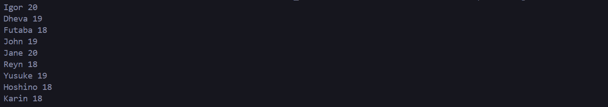
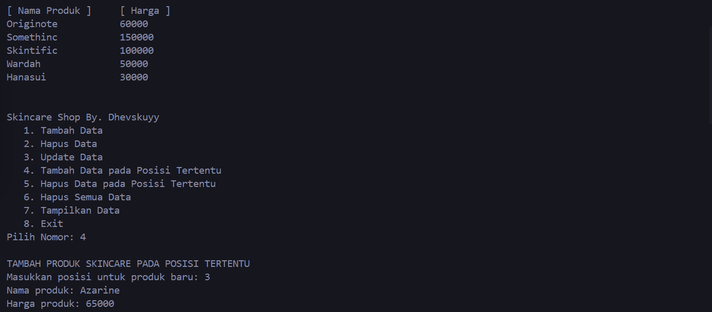
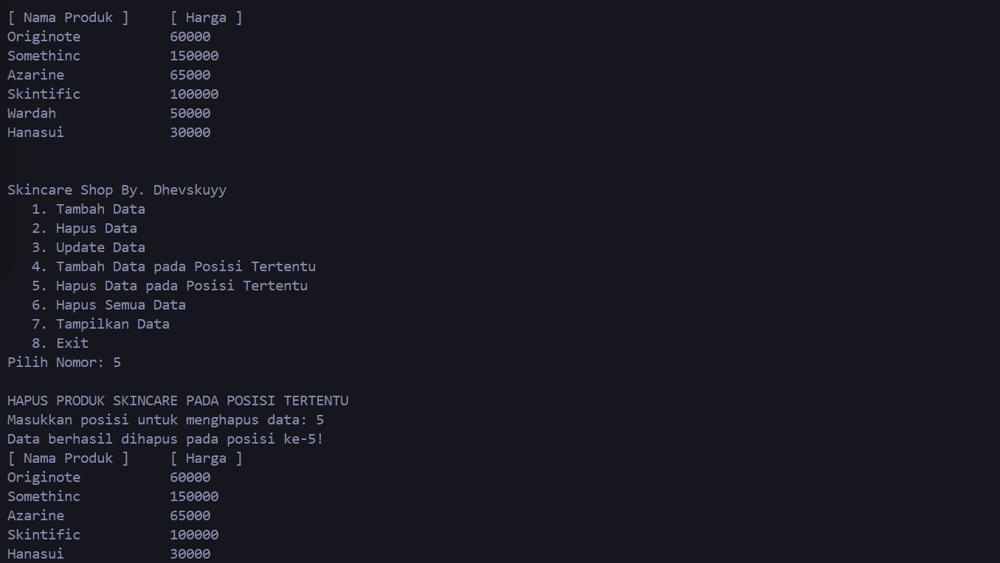
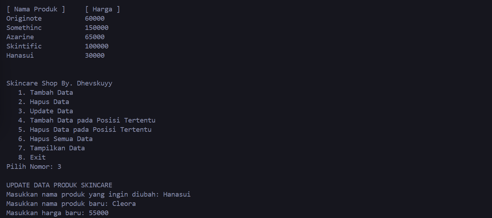
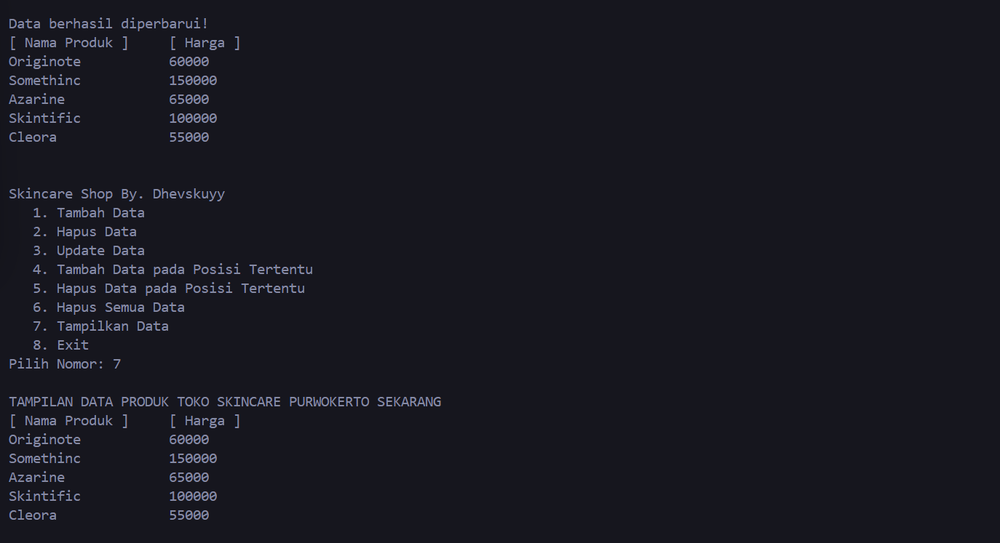

# <h1 align="center">LAPORAN PRAKTIKUM MODUL 3 : SINGLE AND DOUBLE LINKED LIST</h1>
<p align="center">DHEVA DEWA SEPTIANTONI - 2311102324</p>

# Dasar Teori

## SINGLE AND DOUBLE LINKED LIST

### LINKED LIST

Linked List adalah salah satu bentuk struktur data, berisi kumpulan data (node) yang tersusun secara sekuensial, saling sambung-menyambung, dinamis dan terbatas.
- Linked List sering disebut juga Senarai Berantai
- Linked List saling terhubung dengan bantuan variabel pointer
- Masing-masing data dalam Linked List disebut dengan node (simpul) yang menempati alokasi memori secara dinamis dan biasanya berupa struct yang terdiri dari beberapa field.

### SINGLE LINKED LIST

Single Linked List (SLL) adalah linked list unidirectional yang hanya memiliki satu arah. Single Linked List adalah sebuah LINKED LIST yang menggunakan sebuah variabel pointer saja untuk menyimpan banyak data dengan metode LINKED LIST, suatu daftar isi yang saling berhubungan. Single Linked List (SLL) adalah linked list unidirectional yang hanya memiliki satu arah. Pengguna hanya dapat melintasinya dalam satu arah, yaitu dari simpul kepala ke simpul ekor. SLL memiliki beberapa karakteristik, seperti memiliki memori tambahan untuk menyimpan link (tautan), memiliki simpul pertama yang disebut head atau simpul kepala, dan memiliki simpul akhir yang menunjuk ke simpul kepala. SLL dapat digunakan untuk membuat file system, adjacency list, dan hash table.

### DOUBLE LINKED LIST

Double Linked List (DLL) adalah linked list bidirectional yang memiliki dua arah. Pengguna bisa melintasinya secara dua arah. Double Linked List hampir sama dengan penggunaan Single Linked List. Hanya saja Double Linked List menerapkan dan memiliki tambahan sebuah pointer baru, yaitu prev (pointer previous), yang digunakan untuk menggeser mundur selain tetap mempertahankan pointer next. DLL ini memiliki simpul yang menunjuk ke simpul sebelumnya. Pointer ini memungkinkan Pengguna untuk melintas ke simpul sebelumnya dan ke simpul setelahnya. DLL lebih efisien dalam kasus dimana Pengguna membutuhkan akses ke simpul sebelumnya dan ke simpul setelahnya.

## Guided 

### 1. [Program Single Linked List]

```C++
#include <iostream>

using namespace std;
// PROGRAM SINGLE LINKED LIST NON-CIRCULAR
// Deklarasi Struct Node
struct Node
{
    int data;
    Node *next;
};
Node *head;
Node *tail;
// Inisialisasi Node
void init()
{
    head = NULL;
    tail = NULL;
}
// Pengecekan
bool isEmpty()
{
    if (head == NULL)
        return true;
    else
        return false;
}
// Tambah Depan
void insertDepan(int nilai)
{
    // Buat Node baru
    Node *baru = new Node;
    baru->data = nilai;
    baru->next = NULL;
    if (isEmpty() == true)
    {
        head = tail = baru;
        tail->next = NULL;
    }
    else
    {
        baru->next = head;
        head = baru;
    }
}
// Tambah Belakang
void insertBelakang(int nilai)
{
    // Buat Node baru
    Node *baru = new Node;
    baru->data = nilai;
    baru->next = NULL;
    if (isEmpty() == true)
    {
        head = tail = baru;
        tail->next = NULL;
    }
    else
    {
        tail->next = baru;
        tail = baru;
    }
}
// Hitung Jumlah List
int hitungList()
{
    Node *hitung;
    hitung = head;
    int jumlah = 0;
    while (hitung != NULL)
    {
        jumlah++;
        hitung = hitung->next;
    }
    return jumlah;
}
// Tambah Tengah
void insertTengah(int data, int posisi)
{
    if (posisi < 1 || posisi > hitungList())
    {
        cout << "Posisi diluar jangkauan" << endl;
    }
    else if (posisi == 1)
    {
        cout << "Posisi bukan posisi tengah" << endl;
    }
    else
    {
        Node *baru, *bantu;
        baru = new Node();
        baru->data = data;
        // tranversing
        bantu = head;
        int nomor = 1;
        while (nomor < posisi - 1)
        {
            bantu = bantu->next;
            nomor++;
        }
        baru->next = bantu->next;
        bantu->next = baru;
    }
}
// Hapus Depan
void hapusDepan()
{
    Node *hapus;
    if (isEmpty() == false)
    {
        if (head->next != NULL)
        {
            hapus = head;
            head = head->next;
            delete hapus;
        }
        else
        {
            head = tail = NULL;
        }
    }
    else
    {
        cout << "List kosong!" << endl;
    }
}
// Hapus Belakang
void hapusBelakang()
{
    Node *hapus;
    Node *bantu;
    if (isEmpty() == false)
    {
        if (head != tail)
        {
            hapus = tail;
            bantu = head;
            while (bantu->next != tail)
            {
                bantu = bantu->next;
            }
            tail = bantu;
            tail->next = NULL;
            delete hapus;
        }
        else
        {
            head = tail = NULL;
        }
    }
    else
    {
        cout << "List kosong!" << endl;
    }
}
// Hapus Tengah
void hapusTengah(int posisi)
{
    Node *hapus, *bantu, *bantu2;
    if (posisi < 1 || posisi > hitungList())
    {
        cout << "Posisi di luar jangkauan" << endl;
    }
    else if (posisi == 1)
    {
        cout << "Posisi bukan posisi tengah" << endl;
    }
    else
    {
        int nomor = 1;
        bantu = head;
        while (nomor <= posisi)
        {
            if (nomor == posisi - 1)
            {
                bantu2 = bantu;
            }
            if (nomor == posisi)
            {
                hapus = bantu;
            }
            bantu = bantu->next;
            nomor++;
        }
        bantu2->next = bantu;
        delete hapus;
    }
}
// Ubah Depan
void ubahDepan(int data)
{
    if (isEmpty() == false)
    {
        head->data = data;
    }
    else
    {
        cout << "List masih kosong!" << endl;
    }
}
// Ubah Tengah
void ubahTengah(int data, int posisi)
{
    Node *bantu;
    if (isEmpty() == false)
    {
        if (posisi < 1 || posisi > hitungList())
        {
            cout << "Posisi di luar jangkauan" << endl;
        }
        else if (posisi == 1)
        {
            cout << "Posisi bukan posisi tengah" << endl;
        }
        else
        {
            bantu = head;
            int nomor = 1;
            while (nomor < posisi)
            {
                bantu = bantu->next;
                nomor++;
            }
            bantu->data = data;
        }
    }
    else
    {
        cout << "List masih kosong!" << endl;
    }
}
// Ubah Belakang
void ubahBelakang(int data)
{
    if (isEmpty() == false)
    {
        tail->data = data;
    }
    else
    {
        cout << "List masih kosong!" << endl;
    }
}
// Hapus List
void clearList()
{
    Node *bantu, *hapus;
    bantu = head;
    while (bantu != NULL)
    {
        hapus = bantu;
        bantu = bantu->next;
        delete hapus;
    }
    head = tail = NULL;
    cout << "List berhasil terhapus!" << endl;
}
// Tampilkan List
void tampil()
{
    Node *bantu;
    bantu = head;
    if (isEmpty() == false)
    {
        while (bantu != NULL)
        {
            cout << bantu->data << ends;
            bantu = bantu->next;
        }
        cout << endl;
    }
    else
    {
        cout << "List masih kosong!" << endl;
    }
}
int main()
{
    init();
    insertDepan(3);
    tampil();
    insertBelakang(5);
    tampil();
    insertDepan(2);
    tampil();
    insertDepan(1);
    tampil();
    hapusDepan();
    tampil();
    hapusBelakang();
    tampil();
    insertTengah(7, 2);
    tampil();
    hapusTengah(2);
    tampil();
    ubahDepan(1);
    tampil();
    ubahBelakang(8);
    tampil();
    ubahTengah(11, 2);
    tampil();

    return 0;
}

```

Kode di atas digunakan untuk mengimplementasikan program Single Linked List Non-Circular yang dapat digunakan untuk menangani operasi data yang berhubungan dengan linked list. Program ini menampilkan isi, menghitung jumlah, serta mengelola data dalam linked list secara efisien. Program ini juga memiliki bagian utama yang menggunakan fungsi untuk menambah, menghapus, mengubah, dan mengosongkan node dalam linked list. Program ini menggunakan struct Node untuk mengelola data dan tautan ke node berikutnya. Fungsi yang tersedia dalam program: `init()` Fungsi ini digunakan untuk menginisialisasi linked list. Dengan memanggil fungsi ini, kita mengatur head dan tail menjadi NULL. `isEmpty()` Fungsi ini digunakan untuk mengecek apakah linked list masih kosong atau tidak. `insertDepan(int nilai)` Fungsi ini digunakan untuk menambah data baru di depan linked list. `insertBelakang(int nilai)` Fungsi ini digunakan untuk menambah data baru di belakang linked list. `hitungList()` Fungsi ini digunakan untuk menghitung jumlah data yang ada dalam linked list. `insertTengah(int data, int posisi)` Fungsi ini digunakan untuk menambah data baru di posisi tertentu dalam linked list. `hapusDepan()` Fungsi ini digunakan untuk menghapus data terakhir dari linked list. `hapusBelakang()` Fungsi ini digunakan untuk menghapus data pertama dari linked list. `hapusTengah(int posisi)` Fungsi ini digunakan untuk menghapus data yang berada di posisi tertentu dalam linked list. `ubahDepan(int data)` Fungsi ini digunakan untuk mengubah data pertama dalam linked list menjadi data yang diberikan. `ubahTengah(int data, int posisi)` Fungsi ini digunakan untuk mengubah data yang berada di posisi tertentu dalam linked list menjadi data yang diberikan. `ubahBelakang(int data)` Fungsi ini digunakan untuk mengubah data terakhir dalam linked list menjadi data yang diberikan. `clearList()` Fungsi ini digunakan untuk menghapus semua data dalam linked list.`tampil()` Fungsi ini digunakan untuk menampilkan semua data dalam linked list. Hasil output akan berjalan sesuai codingan.

### 2. [Program Double Linked List]

```C++
#include <iostream>
using namespace std;
class Node
{
public:
    int data;
    Node *prev;
    Node *next;
};
class DoublyLinkedList
{
public:
    Node *head;
    Node *tail;
    DoublyLinkedList()
    {
        head = nullptr;
        tail = nullptr;
    }
    void push(int data)
    {
        Node *newNode = new Node;
        newNode->data = data;
        newNode->prev = nullptr;
        newNode->next = head;
        if (head != nullptr)
        {
            head->prev = newNode;
        }
        else
        {
            tail = newNode;
        }
        head = newNode;
    }
    void pop()
    {
        if (head == nullptr)
        {
            return;
        }
        Node *temp = head;
        head = head->next;
        if (head != nullptr)
        {
            head->prev = nullptr;
        }
        else
        {
            tail = nullptr;
        }
        delete temp;
    }
    bool update(int oldData, int newData)
    {
        Node *current = head;
        while (current != nullptr)
        {
            if (current->data == oldData)
            {
                current->data = newData;
                return true;
            }
            current = current->next;
        }
        return false;
    }
    void deleteAll()
    {
        Node *current = head;
        while (current != nullptr)
        {
            Node *temp = current;
            current = current->next;
            delete temp;
        }
        head = nullptr;
        tail = nullptr;
    }
    void display()
    {
        Node *current = head;
        while (current != nullptr)
        {
            cout << current->data << " ";
            current = current->next;
        }
        cout << endl;
    }
};
int main()
{
    DoublyLinkedList list;
    while (true)
    {
        cout << "1. Add data" << endl;
        cout << "2. Delete data" << endl;
        cout << "3. Update data" << endl;
        cout << "4. Clear data" << endl;
        cout << "5. Display data" << endl;
        cout << "6. Exit" << endl;
        int choice;
        cout << "Enter your choice: ";
        cin >> choice;
        switch (choice)
        {
        case 1:
        {
            int data;
            cout << "Enter data to add: ";
            cin >> data;
            list.push(data);
            break;
        }
        case 2:
        {
            list.pop();
            break;
        }
        case 3:
        {
            int oldData, newData;
            cout << "Enter old data: ";
            cin >> oldData;
            cout << "Enter new data: ";
            cin >> newData;
            bool updated = list.update(oldData, newData);
            if (!updated)
            {
                cout << "Data not found" << endl;
            }
            break;
        }
        case 4:
        {
            list.deleteAll();
            break;
        }
        case 5:
        {
            list.display();
            break;
        }
        case 6:
        {
            return 0;
        }
        default:
        {
            cout << "Invalid choice" << endl;
            break;
        }
        }
    }
    return 0;
}

```

Kode di atas digunakan untuk mengimplementasikan program Double Linked List yang mengelola data berupa angka. Program ini Hampir sama pada guided 1 atau hampir sama dengan Single Linked List. Program ini menggunakan class Node untuk mengelola data dan tautan ke node berikutnya, dan tautan ke node sebelumnya. Fungsi yang tersedia dalam program: `push(int data)` Fungsi ini digunakan untuk menambah data baru di akhir Double Linked List. `pop()` Fungsi ini digunakan untuk menghapus data terakhir dari Double Linked List. `update(int oldData, int newData)` Fungsi ini digunakan untuk mengubah data yang sesuai dengan oldData menjadi newData. `deleteAll()` Fungsi ini digunakan untuk menghapus semua data dari Double Linked List. `display()` Fungsi ini digunakan untuk menampilkan semua data yang ada dalam Double Linked List.
Program ini juga menampilkan menu pilihan untuk mengelola data, yaitu:
1. Add data
2. Delete data
3. Update data
4. Clear data
5. Display data
6. Exit
Hasil outputnya adalah pilihan pengguna. Pengguna dapat memilih opsi yang diinginkan dan program akan melakukan operasi yang sesuai dengan opsi yang dipilih.

## Unguided 

### 1. [Buatlah program menu Single Linked List Non-Circular untuk menyimpan Nama dan usia mahasiswa, dengan menggunakan inputan dari user. Lakukan operasi berikut: 
a. Masukkan data sesuai urutan berikut. (Gunakan insert depan, belakang atau tengah). Data pertama yang dimasukkan adalah nama dan usia anda. 
b. Hapus data Akechi. 
c. Tambahkan data berikut diantara John dan Jane : Futaba 18. 
d. Tambahkan data berikut diawal : Igor 20. 
e. Ubah data Michael menjadi : Reyn 18. 
f. Tampilkan seluruh data]

```C++
// DHEVA DEWA SEPTIANTONI
// 2311102324
#include <iostream>
using namespace std;

struct Node {
    string nama;
    int usia;
    Node* next;
};

Node* head = NULL;

void insertDepan(string nama, int usia) {
    Node* baru = new Node;
    baru->nama = nama;
    baru->usia = usia;
    baru->next = head;
    head = baru;
}

void insertBelakang(string nama, int usia) {
    Node* baru = new Node;
    baru->nama = nama;
    baru->usia = usia;
    baru->next = NULL;
    if (head == NULL) {
        head = baru;
    }
    else {
        Node* temp = head;
        while (temp->next != NULL) {
            temp = temp->next;
        }
        temp->next = baru;
    }
}

void insertTengah(string nama, int usia, int posisi) {
    Node* baru = new Node;
    baru->nama = nama;
    baru->usia = usia;
    Node* bantu = head;
    for (int i = 1; i < posisi - 1; i++) {
        if (bantu != NULL) {
            bantu = bantu->next;
        }
    }
    if (bantu != NULL) {
        baru->next = bantu->next;
        bantu->next = baru;
    }
}

void hapusData(string nama) {
    Node* hapus = head;
    Node* prev = NULL;
    while (hapus != NULL && hapus->nama != nama) {
        prev = hapus;
        hapus = hapus->next;
    }
    if (hapus == NULL) {
        cout << "Data tidak ditemukan" << endl;
        return;
    }
    if (prev == NULL) {
        head = hapus->next;
    }
    else {
        prev->next = hapus->next;
    }
    delete hapus;
}

void ubahData(string nama, string newNama, int newUsia) {
    Node* temp = head;
    while (temp != NULL && temp->nama != nama) {
        temp = temp->next;
    }
    if (temp != NULL) {
        temp->nama = newNama;
        temp->usia = newUsia;
    }
}

void tampilkanData() {
    Node* temp = head;
    while (temp != NULL) {
        cout << temp->nama << " " << temp->usia << endl;
        temp = temp->next;
    }
}

int main() {
    insertDepan("Dheva", 19);
    insertBelakang("John", 19);
    insertBelakang("Jane", 20);
    insertBelakang("Michael", 18);
    insertBelakang("Yusuke", 19);
    insertBelakang("Akechi", 20);
    insertBelakang("Hoshino", 18);
    insertBelakang("Karin", 18);

    hapusData("Akechi");
    insertTengah("Futaba", 18, 2);
    insertDepan("Igor", 20);
    ubahData("Michael", "Reyn", 18);
    tampilkanData();

    return 0;
}
```
#### Output:


1. Program dimulai dengan mendefinisikan sebuah struct bernama Node, yang memiliki dua data member: nama bertipe string untuk menyimpan nama individu, dan usia bertipe int untuk menyimpan usia individu. Struct Node juga memiliki pointer next yang menunjukkan ke node berikutnya dalam linked list.
2. Kemudian, program mendefinisikan sebuah pointer global head yang menunjukkan ke node pertama dalam linked list. Pada awalnya, head diatur sebagai NULL karena linked list masih kosong.
3. Program kemudian mendefinisikan serangkaian fungsi untuk melakukan operasi-operasi pada linked list:
- insertDepan(string nama, int usia): Fungsi ini digunakan untuk menyisipkan data baru di depan linked list.
- insertBelakang(string nama, int usia): Fungsi ini digunakan untuk menyisipkan data baru di belakang linked list.
- insertTengah(string nama, int usia, int posisi): Fungsi ini digunakan untuk menyisipkan data baru pada posisi tertentu dalam linked list.
- hapusData(string nama): Fungsi ini digunakan untuk menghapus data dari linked list berdasarkan nama.
- ubahData(string nama, string newNama, int newUsia): Fungsi ini digunakan untuk mengubah data (nama dan usia) dari linked list berdasarkan nama.
- tampilkanData(): Fungsi ini digunakan untuk menampilkan semua data yang tersimpan dalam linked list.
4. Pada fungsi main(), beberapa operasi dilakukan untuk menguji fungsi-fungsi yang telah didefinisikan:
- Data individu ditambahkan ke linked list menggunakan insertDepan() dan insertBelakang().
- Salah satu data individu dihapus menggunakan hapusData().
- Data individu baru disisipkan ke dalam posisi tertentu menggunakan insertTengah().
- Data individu diubah menggunakan ubahData().
- Seluruh data individu yang tersimpan ditampilkan menggunakan tampilkanData().


### 2. [Modifikasi Guided Double Linked List dilakukan dengan penambahanoperasi untuk menambah data, menghapus, dan update di tengah / di urutan tertentu yang diminta. Selain itu, buatlah agar tampilannya menampilkan Nama produk dan harga.  Nama Produk Harga Originote 60.000, Somethinc 150.000, Skintific 100.000, Wardah 50.000, Hanasui 30.000. Case: 
1. Tambahkan produk Azarine dengan harga 65000 diantara Somethinc dan Skintific. 
2. Hapus produk wardah. 
3. Update produk Hanasui menjadi Cleora dengan harga 55.000. 
4. Tampilkan menu seperti dibawah ini. Toko Skincare Purwokerto. 
    1. Tambah Data, 
    2. Hapus Data, 
    3. Update Data, 
    4. Tambah Data Urutan Tertentu, 
    5. Hapus Data Urutan Tertentu, 
    6. Hapus Seluruh Data, 
    7. Tampilkan Data, 
    8. Exit. Pada menu 
    7. tampilan akhirnya akan menjadi seperti dibawah ini :

```C++
// DHEVA DEWA SEPTIANTONI
// 2311102324
#include <iostream>
#include <iomanip> 
using namespace std;

// Deklarasi Struct Node
class Node {
public:
    string produk_324;
    int harga_324;
    Node* prev_324;
    Node* next_324;
};

// Deklarasi Class DoublyLinkedList
class DoublyLinkedList {
public:
    Node* head_324;
    Node* tail_324;

    // Constructor
    DoublyLinkedList() {
        head_324 = nullptr;
        tail_324 = nullptr;
    }

    // Prosedur untuk menambahkan data di depan
    void Push(int harga_324, string produk_324) {
        Node* newNode_324 = new Node;
        newNode_324->harga_324 = harga_324;
        newNode_324->produk_324 = produk_324;
        newNode_324->prev_324 = nullptr;
        newNode_324->next_324 = head_324;

        if (head_324 != nullptr) {
            head_324->prev_324 = newNode_324;
        }
        else {
            tail_324 = newNode_324;
        }

        head_324 = newNode_324;
    }

    // Prosedur untuk menambahkan data pada posisi tertentu
    void PushPosition(int posisi_324, int harga_324, string produk_324) {
        if (posisi_324 < 1) {
            cout << "Posisi tidak valid!" << endl;
            return;
        }

        Node* newNode_324 = new Node;
        newNode_324->harga_324 = harga_324;
        newNode_324->produk_324 = produk_324;
        newNode_324->prev_324 = nullptr;
        newNode_324->next_324 = nullptr;

        if (posisi_324 == 1) {
            newNode_324->next_324 = head_324;
            if (head_324 != nullptr)
                head_324->prev_324 = newNode_324;
            else
                tail_324 = newNode_324;
            head_324 = newNode_324;
            return;
        }

        Node* saatIni_324 = head_324;
        for (int i = 1; i < posisi_324 - 1 && saatIni_324 != nullptr; ++i)
            saatIni_324 = saatIni_324->next_324;

        if (saatIni_324 == nullptr) {
            cout << "Posisi tidak valid!" << endl;
            delete newNode_324;
            return;
        }

        newNode_324->next_324 = saatIni_324->next_324;
        newNode_324->prev_324 = saatIni_324;
        if (saatIni_324->next_324 != nullptr)
            saatIni_324->next_324->prev_324 = newNode_324;
        else
            tail_324 = newNode_324;
        saatIni_324->next_324 = newNode_324;
    }

    // Prosedur untuk menghapus data di depan
    void Pop() {
        if (head_324 == nullptr) {
            cout << "Tidak ada data yang bisa dihapus!" << endl;
            return;
        }

        Node* temp_324 = head_324;
        head_324 = head_324->next_324;

        if (head_324 != nullptr) {
            head_324->prev_324 = nullptr;
        }
        else {
            tail_324 = nullptr;
        }

        delete temp_324;
    }

    // Prosedur untuk menghapus data pada posisi tertentu
    void PopPosition(int posisi_324) {
        if (head_324 == nullptr) {
            cout << "Tidak ada data yang bisa dihapus!" << endl;
            return;
        }

        Node* temp_324 = head_324;
        for (int i = 1; i < posisi_324 && temp_324 != nullptr; ++i) {
            temp_324 = temp_324->next_324;
        }

        if (temp_324 == nullptr) {
            cout << "Posisi tidak valid!" << endl;
            return;
        }

        if (temp_324->prev_324 != nullptr) {
            temp_324->prev_324->next_324 = temp_324->next_324;
        } else {
            head_324 = temp_324->next_324;
        }

        if (temp_324->next_324 != nullptr) {
            temp_324->next_324->prev_324 = temp_324->prev_324;
        } else {
            tail_324 = temp_324->prev_324;
        }

        delete temp_324;
    }

    // Fungsi untuk mengupdate data
    bool Update(string oldProduk_324, string newProduk_324, int newharga_324) {
        Node* saatIni_324 = head_324;

        while (saatIni_324 != nullptr) {
            if (saatIni_324->produk_324 == oldProduk_324) {
                saatIni_324->produk_324 = newProduk_324;
                saatIni_324->harga_324 = newharga_324;
                return true;
            }
            saatIni_324 = saatIni_324->next_324;
        }

        return false;
    }

    // Prosedur untuk menghapus semua data
    void DeleteAll() {
        Node* saatIni_324 = head_324;

        while (saatIni_324 != nullptr) {
            Node* temp_324 = saatIni_324;
            saatIni_324 = saatIni_324->next_324;
            delete temp_324;
        }

        head_324 = nullptr;
        tail_324 = nullptr;
    }

    // Prosedur untuk menampilkan data
    void Display_324() {
        Node* saatIni_324 = head_324;

        cout << left << setw(20) << "[ Nama Produk ]" << setw(10) << "[ Harga ]" << endl;

        while (saatIni_324 != nullptr) {
            cout << setw(20) << saatIni_324->produk_324 << setw(10) << saatIni_324->harga_324 << endl;
            saatIni_324 = saatIni_324->next_324;
        }

        cout << endl;
    }
};

int main() {
    DoublyLinkedList list;
    // Inisialisasi data awal
    list.Push(30000, "Hanasui");
    list.Push(50000, "Wardah");
    list.Push(100000, "Skintific");
    list.Push(150000, "Somethinc");
    list.Push(60000, "Originote");
    list.Display_324(); 

    // Loop untuk menu interaktif
    while (true) {
        cout << "\nSkincare Shop By. Dhevskuyy" << endl;
        cout << "   1. Tambah Data" << endl;
        cout << "   2. Hapus Data" << endl;
        cout << "   3. Update Data" << endl;
        cout << "   4. Tambah Data pada Posisi Tertentu" << endl;
        cout << "   5. Hapus Data pada Posisi Tertentu" << endl;
        cout << "   6. Hapus Semua Data" << endl;
        cout << "   7. Tampilkan Data" << endl;
        cout << "   8. Exit" << endl;

        int pilihan_324;
        cout << "Pilih Nomor: ";
        cin >> pilihan_324;
        switch (pilihan_324) {
                        case 1: {
                int harga_324;
                string produk_324;

                cout << "\nTAMBAH PRODUK SKINCARE" << endl;
                cout << "Nama produk: ";
                cin.ignore();
                getline(cin, produk_324);
                cout << "Harga produk: ";
                cin >> harga_324;
                list.Push(harga_324, produk_324);
                cout << "Produk berhasil ditambahkan!" << endl;
                list.Display_324(); 
                break;
            }

            case 2: {
                list.Pop();
                cout << "PRODUK PALING ATAS BERHASIL DIHAPUS!" << endl;
                list.Display_324(); 
                break;
            }

            case 3: {
                string oldProduk_324, newProduk_324;
                int newharga_324;

                cout << "\nUPDATE DATA PRODUK SKINCARE" << endl;
                cout << "Masukkan nama produk yang ingin diubah: ";
                cin.ignore();
                getline(cin, oldProduk_324);
                cout << "Masukkan nama produk baru: ";
                getline(cin, newProduk_324);
                cout << "Masukkan harga baru: ";
                cin >> newharga_324;

                bool update_324 = list.Update(oldProduk_324, newProduk_324, newharga_324);
                if (update_324) {
                    cout << "Data berhasil diperbarui!" << endl;
                } else {
                    cout << "Data tidak ditemukan!" << endl;
                }
                list.Display_324(); 
                break;
            }

            case 4: {
                int posisi_324, harga_324;
                string produk_324;

                cout << "\nTAMBAH PRODUK SKINCARE PADA POSISI TERTENTU" << endl;
                cout << "Masukkan posisi untuk produk baru: ";
                cin >> posisi_324;
                cout << "Nama produk: ";
                cin.ignore();
                getline(cin, produk_324);
                cout << "Harga produk: ";
                cin >> harga_324;
                list.PushPosition(posisi_324, harga_324, produk_324);
                cout << "Produk berhasil ditambahkan pada posisi ke-" << posisi_324 << "!" << endl;
                list.Display_324(); 
                break;
            }

            case 5: {
                int posisi_324;

                cout << "\nHAPUS PRODUK SKINCARE PADA POSISI TERTENTU" << endl;
                cout << "Masukkan posisi untuk menghapus data: ";
                cin >> posisi_324;
                list.PopPosition(posisi_324);
                cout << "Data berhasil dihapus pada posisi ke-" << posisi_324 << "!" << endl;
                list.Display_324(); 
                break;
            }

            case 6: {
                list.DeleteAll();
                cout << "SEMUA DATA BERHASIL DI HAPUS!" << endl;
                list.Display_324(); 
                break;
            }

            case 7: {
                cout << "\nTAMPILAN DATA PRODUK TOKO SKINCARE PURWOKERTO SEKARANG" << endl;
                list.Display_324(); 
                break;
            }

            case 8: {
                cout << "Terimakasih telah menggunakan program ini!" << endl;
                return 0;
            }

            default: {
                cout << "Pilihan anda tidak valid!" << endl;
                break;
            }
        }
    }

    return 0;
}

```
#### Output:





### Struktur Data 'Node'
- Setiap Node memiliki dua atribut: produk_324 untuk menyimpan nama produk dan harga_324 untuk menyimpan harga produk.
- Selain itu, setiap Node memiliki dua pointer: prev_324 yang menunjuk ke Node sebelumnya dan next_324 yang menunjuk ke Node berikutnya dalam linked list.

### Kelas DoublyLinkedList
- Kelas ini memiliki dua pointer anggota: head_324 yang menunjuk ke node pertama dan tail_324 yang menunjuk ke node terakhir dalam linked list.
- Konstruktor kelas ini menginisialisasi head_324 dan tail_324 menjadi nullptr.

### Operasi-operasi yang Didukung
    1. Push: Menambahkan data produk baru di depan linked list.
    2. PushPosition: Menambahkan data produk baru pada posisi tertentu dalam linked list.
    3. Pop: Menghapus data produk paling atas dari linked list.
    4. PopPosition: Menghapus data produk pada posisi tertentu dalam linked list.
    5. Update: Mengubah data produk berdasarkan nama produk yang lama.
    6. DeleteAll: Menghapus semua data produk dari linked list.
    7. Display_324: Menampilkan semua data produk yang tersimpan dalam linked list.

### Fungsi main()
- Pada awalnya, program menambahkan beberapa data produk ke dalam linked list menggunakan metode Push.
- Kemudian, program masuk ke dalam sebuah loop untuk menu interaktif yang memungkinkan pengguna untuk menambah, menghapus, memperbarui, dan menampilkan data produk skincare.
- Setiap opsi yang dipilih oleh pengguna akan memanggil metode yang sesuai dari kelas DoublyLinkedList untuk melakukan operasi tersebut.
- Program akan terus berjalan hingga pengguna memilih opsi "Exit" (opsi nomor 8).

## Kesimpulan
Kesimpulannya, pada modul 3 ini Linked List terdapat dua jenis, yaitu Single Linked List dan Double Linked List. Dengan mempertimbangkan kelebihan dan kekurangan masing-masing, pemilihan antara Single Linked List dan Double Linked List sangat tergantung pada kebutuhan dan karakteristik dari aplikasi yang sedang dibangun.

Single Linked List cocok digunakan ketika:
- Akses data dilakukan secara linear, seperti iterasi dari awal hingga akhir.
- Membutuhkan penggunaan memori yang lebih efisien.
- Operasi yang umumnya dilakukan adalah penambahan atau penghapusan node dari akhir atau awal list.

Double Linked List lebih cocok digunakan ketika:
- Akses data seringkali memerlukan navigasi maju dan mundur, seperti saat penghapusan atau penambahan pada posisi tertentu.
- Kebutuhan akan fleksibilitas dalam traversal data. 
- Efisiensi operasi seperti penghapusan, penambahan, atau pembaruan data lebih penting daripada penggunaan memori.

Dalam prakteknya, terkadang kombinasi dari kedua jenis linked list ini juga digunakan untuk memenuhi kebutuhan spesifik. Misalnya, dapat menggunakan Single Linked List untuk keperluan umum, sementara menggunakan Double Linked List untuk operasi-operasi yang memerlukan navigasi maju dan mundur. Pemilihan jenis linked list haruslah didasarkan pada analisis mendalam terhadap karakteristik aplikasi dan kebutuhan fungsionalnya, serta mempertimbangkan faktor-faktor seperti performa, efisiensi memori, dan kompleksitas implementasi.

## Referensi
[1] DS Malik. C++ programming academia.edu. 2023. https://d1wqtxts1xzle7.cloudfront.net/44550466/malik98092_0538798092_01.01_toc-libre.pdf?1460150743=&response-content-disposition=inline%3B+filename%3DLicensed_to_iChapters_User.pdf&Expires=1711417840&Signature=QUWLkxNCREaUZERtTrNMyVuArAiqfL8gW59W~ig-gMmJ1R2emo2yfmdrdD5Pi7aVTVYCFWPxLAk2r83lsQNM-oALR8mOiDroa1fXQQZoUN5Hy4F~TVXpM1sjheUpOcFfH6A46ps3ldcZPWNPoDZtSXk7dxhUf5~0jmJe1X5yFtSyvfhLDQEQybrF~KOpLZew5gbro5aMP2J2NzRjCAbU-FKWDTs4jiQehla8qeQ0h7bsMPVOIX-EMTouUAu1PAzaa2OD41WS3M38pNFDC9YuN2evzzLSHzJzvJsJTgy9vfDgIraZE8T7j6xnfa8nQMOpDBlfjdUL4hTBOi9enkuwgg__&Key-Pair-Id=APKAJLOHF5GGSLRBV4ZA

[2] Agung Kurniman Putra. Single Linked List. Umitra Bandar Lampung. 2019. https://web.archive.org/web/20220428114131/https://files.osf.io/v1/resources/u6qf7/providers/osfstorage/5cc20527e68786001813664e?format=pdf&action=download&direct&version=1

[3] Anugrah Ananda Nauli Siregar. PENGERTIAN LINKED OBJECT. Umitra Bandar Lampung. 2019. https://www.academia.edu/99621929/Pengertian_Linked_Object