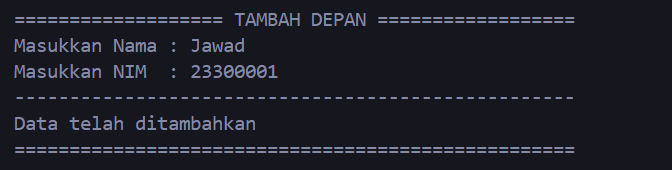

# <h1 align="center">Laporan Praktikum Modul Linked List Circular dan Non Circular</h1>
<p align="center">Azaria Nanda Putri - 2311102147</p>

## Dasar Teori
Linked list adalah kumpulan elemen yang terhubung melalui pointer. Setiap elemen memiliki pointer yang menyimpan alamat memori, bisa berupa data atau pointer lain. Elemen pertama disebut head, dan jika kosong, head menunjuk ke NULL. Elemen terakhir disebut tail dengan pointer yang menunjuk ke NULL. Linked list memungkinkan penyimpanan data dengan alokasi memori dinamis, dan mudah dalam penambahan serta penghapusan elemen, namun ia memiliki kelemahan dalam akses acak yang lambat dan kebutuhan ruang ekstra untuk pointer. Linked list sering digunakan untuk data yang sering mengalami perubahan dan membutuhkan fleksibilitas dalam operasi penambahan atau penghapusan. Selain itu, linked list juga sering digunakan dalam implementasi struktur data lain seperti stack, queue, dan graph.

- Ada dua jenis linked list: single linked list dan double linked list. Dalam single linked list, operasi umum meliputi penambahan dan penghapusan simpul di awal atau akhir, serta pencarian dan pengambilan nilai pada simpul tertentu. Karena hanya memerlukan satu pointer per simpul, single linked list lebih efisien dalam penggunaan memori dibandingkan double linked list dan circular linked list. Circular linked list memiliki penunjuk next pada node terakhir yang selalu merujuk ke node pertama. Sementara dalam double linked list, struktur data ini memiliki tambahan pointer prev pada setiap simpul, yang menunjuk ke simpul sebelumnya. Dengan fitur ini, operasi penghapusan dan penambahan pada simpul dapat dilakukan secara efisien. Namun, double linked list menggunakan lebih banyak memori dan memerlukan waktu eksekusi lebih lama dibandingkan single linked list dalam operasi penambahan dan penghapusan. 

### Terdapat beberapa jenis linked list, yaitu:
- Single linked list Non Circular <br/>
   Single linked list Non Circular adalah jenis struktur data linked list yang terdiri dari sejumlah node yang setiap node hanya memiliki satu pointer, yaitu pointer yang digunakan untuk menunjuk ke node selanjutnya dalam urutan linked list, kecuali untuk node terakhir yang disebut sebagai tail. Pada node tail atau node terakhir ini, pointer yang dimilikinya menunjuk ke NULL, menandakan akhir dari linked list tersebut.

- Double Linked List Non Circular <br/>
   Double Linked List Non Circular, saat berada pada node yang berfungsi sebagai head atau node pertama dalam linked list, nilai dari pointer prev pada node tersebut akan diatur menjadi NULL. Hal ini dikarenakan node head tidak memiliki node sebelumnya. Sedangkan untuk node yang berfungsi sebagai tail atau node terakhir dalam linked list, nilai dari pointer next pada node tersebut akan diatur untuk menunjuk ke NULL, menandakan akhir dari linked list tersebut.

- Single Circluar Linked List <br/>
   Single Circular Linked List adalah suatu jenis linked list di mana setiap node memiliki sebuah field pointer yang menunjuk ke node berikutnya dalam urutan, tetapi dengan satu keistimewaan. Keistimewaan tersebut adalah pointer next dari node terakhir akan kembali menunjuk ke node pertama atau head, sehingga membentuk suatu lingkaran atau sirkuit. Dengan kata lain, dalam Single Circular Linked List, node tail atau node terakhir akan selalu menunjuk kembali ke node head atau node pertama, menghasilkan suatu struktur data yang berputar atau bersirkulasi.

- Double Circluar Linked List <br/>
  Double Circular Linked List adalah jenis linked list di mana field pointer-nya terdiri dari dua buah pointer yang bergerak ke dua arah, yaitu prev dan next. Selain itu, pointer next pada Double Circular Linked List akan menunjuk kembali pada elemen tersebut sendiri, menciptakan sebuah pola sirkular. Dengan kata lain, baik pointer next maupun pointer prev pada Double Circular Linked List akan membentuk sebuah loop yang menghubungkan setiap elemen dalam struktur data ini secara berputar.


## Guided 

### 1. Latihan Single Linked List Non Circular

```C++
#include <iostream>

using namespace std;

// PROGRAM SINGLE LINKED LIST NON-CIRCULAR

// Deklarasi struct node
struct Node
{
    int data;
    Node *next;
};

Node *head; // Deklarasi head
Node *tail; // Deklarasi tail

// Inisialisasi Node
void init()
{
    head = NULL;
    tail = NULL;
}

// Pengecekkan apakah linked list kosong
bool isEmpty()
{
    if (head == NULL)
    {
        return true;
    }
    else
    {
        return false;
    }
}
    // Tambah depan
    void insertDepan(int nilai)
    {

        // buat node baru
        Node *baru = new Node();
        baru->data = nilai;
        baru->next = NULL;
        if (isEmpty() == true)
        {
            head = tail = baru;
            head->next = NULL;
        }
        else
        {
            baru->next = head;
            head = baru;
        }
    }

    // Tambah belakang
    void insertBelakang(int nilai)
    {
        // buat node baru
        Node *baru = new Node();
        baru->data = nilai;
        baru->next = NULL;
        if (isEmpty() == true)
        {
            head = tail = baru;
            head->next = NULL;
        }
        else
        {
            tail->next = baru;
            tail = baru;
        }
    }

    // Hitung jumlah list
    int hitungList()
    {
        Node *hitung;
        hitung = head;
        int jumlah = 0;
        while (hitung != NULL)
        {
            jumlah++;
            hitung = hitung->next;
        }
        return jumlah;
    }

    // Tambah tengah
    void insertTengah(int data, int posisi)
    {
        if (posisi < 1 || posisi > hitungList())
        {
            cout << "Posisi di luar jangkauan" << endl;
        }
        else if (posisi == 1)
        {
            cout << "Posisi bukan posisi tengah" << endl;
        }
        else
        {
            Node *baru, *bantu;
            baru = new Node();
            baru->data = data;

            // tranversing
            bantu = head;
            int nomor = 1;
            while (nomor < posisi - 1)
            {
                bantu = bantu->next;
                nomor++;
            }

            baru->next = bantu->next;
            bantu->next = baru;
        }
    }

    // Hapus depan
    void hapusDepan()
    {
        Node *hapus;
        if (isEmpty() == false)
        {
            if (head->next != NULL)
            {
                hapus = head;
                head = head->next;
                delete hapus;
            }
            else
            {
                head = tail = NULL;
            }
        }
        else
        {
            cout << "Linked list masih kosong" << endl;
        }
    }

    // Hapus belakang
    void hapusBelakang()
    {
        Node *hapus;
        Node *bantu;
        if (isEmpty() == false)
        {
            if (head != tail)
            {
                hapus = tail;
                bantu = head;
                while (bantu->next != tail)
                {
                    bantu = bantu->next;
                }
                tail = bantu;
                tail->next = NULL;
                delete hapus;
            }
            else
            {
                head = tail = NULL;
            }
        }
        else
        {
            cout << "Linked list masih kosong" << endl;
        }
    }
    // Hapus tengah
    void hapusTengah(int posisi)
    {
        Node *hapus, *bantu, *sebelum;
        if (posisi < 1 || posisi > hitungList())
        {
            cout << "Posisi di luar jangkauan" << endl;
        }
        else if (posisi == 1)
        {
            cout << "Posisi bukan posisi tengah" << endl;
        }
        else
        {
            int nomor = 1;
            bantu = head;
            while (nomor <= posisi)
            {
                if (nomor == posisi - 1)
                {
                    sebelum = bantu;
                }
                if (nomor == posisi)
                {
                    hapus = bantu;
                }
                bantu = bantu->next;
                nomor++;
            }
            sebelum->next = bantu;
            delete hapus;
        }
    }

    // ubah depan
    void ubahDepan(int data)
    {
        if (isEmpty() == 0)
        {
            head->data = data;
        }
        else
        {
            cout << "Linked list masih kosong" << endl;
        }
    }

    // ubah tengah
    void ubahTengah(int data, int posisi)
    {
        Node *bantu;
        if (isEmpty() == 0)
        {
            if (posisi < 1 || posisi > hitungList())
            {
                cout << "Posisi di luar jangkauan" << endl;
            }
            else if (posisi == 1)
            {
                cout << "Posisi bukan posisi tengah" << endl;
            }
            else
            {
                int nomor = 1;
                bantu = head;
                while (nomor < posisi)
                {
                    bantu = bantu->next;
                    nomor++;
                }
                bantu->data = data;
            }
        }
        else
        {
            cout << "Linked list masih kosong" << endl;
        }
    }

    // ubah belakang
    void ubahBelakang(int data)
    {
        if (isEmpty() == 0)
        {
            tail->data = data;
        }
        else
        {
            cout << "Linked list masih kosong" << endl;
        }
    }

    // Hapus list
    void clearList()
    {
        Node *bantu, *hapus;
        bantu = head;
        while (bantu != NULL)
        {
            hapus = bantu;
            bantu = bantu->next;
            delete hapus;
        }
        head = tail = NULL;
        cout << "List berhasil terhapus!" << endl;
    }

    // Tampilkan list
    void tampilList()
    {
        Node *bantu;
        bantu = head;
        if (isEmpty() == false)
        {
            while (bantu != NULL)
            {
                cout << bantu->data << " ";
                bantu = bantu->next;
            }
            cout << endl;
        }
        else
        {
            cout << "Linked list masih kosong" << endl;
        }
    }

    int main()
    {
        init();
        insertDepan(3);
        tampilList();
        insertBelakang(5);
        tampilList();
        insertDepan(2);
        tampilList();
        insertDepan(1);
        tampilList();
        hapusDepan();
        tampilList();
        hapusBelakang();
        tampilList();
        insertTengah(7, 2);
        tampilList();
        hapusTengah(2);
        tampilList();
        ubahDepan(1);
        tampilList();
        ubahBelakang(8);
        tampilList();
        ubahTengah(11, 2);
        tampilList();

        return 0;
    }
```
Kode di atas digunakan uProgram di atas adalah program untuk mengelola data dalam bentuk single linked list non-circular menggunakan bahasa C++. Pertama-tama, kita mendefinisikan struct Node yang berisi data dan pointer next. Lalu, kita mulai dengan head dan tail yang diinisialisasi sebagai NULL. Selanjutnya, kita buat beberapa fungsi untuk menambahkan data di awal, akhir, dan di tengah list. Selain itu, ada fungsi untuk menghitung panjang list, menghapus data di berbagai posisi, mengubah data di berbagai posisi, menghapus semua data, dan menampilkan data.

### 2. Latihan Single Linked List Circular
```c++
#include <iostream>

using namespace std;

// Deklarasi Struct Node


struct Node
{
    string data;
    Node* next;
};

Node* head, * tail, * baru, * bantu, * hapus;

//Inisialisasi node head & tail
void init(){
    head = NULL;
    tail = head;
}

//Pengecekan isi list
int isEmpty(){
    if (head == NULL){
        return 1; // true
    } else {
        return 0; // false
    }
}

//Buat Node Baru
void buatNode(string data){
    baru = new Node;
    baru->data = data;
    baru->next = NULL;
}

//Hitung List
int hitungList(){
    bantu = head;
    int jumlah = 0;
    while (bantu != NULL) {
        jumlah++;
        bantu = bantu->next;
    }
    return jumlah;
}

//Tambah Depan
void insertDepan(string data){
    // Buat Node baru
    buatNode(data);

    if (isEmpty() == 1){
        head = baru;
        tail = head;
        baru->next = head;
    } else {
        while (tail->next != head){
            tail = tail->next;
        }
        baru->next = head;
        head = baru;
        tail->next = head;
    }
}

//Tambah Belakang
void insertBelakang(string data){
    // Buat Node baru
    buatNode(data);

    if (isEmpty() == 1){
        head = baru;
        tail = head;
        baru->next = head;
    } else {
        while (tail->next != head){
            tail = tail->next;
        }
        tail->next = baru;
        baru->next = head;
    }
}

//Tambah Tengah
void insertTengah(string data, int posisi){
    if (isEmpty() == 1){
        head = baru;
        tail = head;
        baru->next = head;
    } else {
        baru->data = data;
        // transversing
        int nomor = 1;
        bantu = head;
        while (nomor < posisi - 1){
            bantu = bantu->next;
            nomor++;
        }
        baru->next = bantu->next;
        bantu->next = baru;
    }
}

//Hapus Depan
void hapusDepan(){
    if (isEmpty() == 0){
        hapus = head;
        tail = head;
        if (hapus->next == head){
            head = NULL;
            tail = NULL;
            delete hapus;
        } else {
            while (tail->next != hapus){
                tail = tail->next;
            }
            head = head->next;
            tail->next = head;
            hapus->next = NULL;
            delete hapus;
        }
    } else {
        cout << "List masih kosong!" << endl;
    }
}

//Hapus Belakang
void hapusBelakang(){
    if (isEmpty() == 0){
        hapus = head;
        tail = head;
        if (hapus->next == head){
            head = NULL;
            tail = NULL;
            delete hapus;
        } else {
            while (hapus->next != head){
                hapus = hapus->next;
            }
            while (tail->next != hapus){
                tail = tail->next;
            }
            tail->next = head;
            hapus->next = NULL;
            delete hapus;
        }
    } else {
        cout << "List masih kosong!" << endl;
    }
}

// Hapus Tengah
void hapusTengah(int posisi){
    if (isEmpty() == 0){
        // transversing
        int nomor = 1;
        bantu = head;
        while (nomor < posisi - 1){
            bantu = bantu->next;
            nomor++;
        }
        hapus = bantu->next;
        bantu->next = hapus->next;
        delete hapus;
    } else {
        cout << "List masih kosong!" << endl;
    }
}

//Hapus List
void clearList(){
    if (head != NULL){
        hapus = head->next;
        while (hapus != head){
            bantu = hapus->next;
            delete hapus;
            hapus = bantu;
        }
        delete head;
        head = NULL;
    }
    cout << "List berhasil terhapus!" << endl;
}

//Tampilkan List
void tampil(){
    if (isEmpty() == 0){
        tail = head;
        do {
            cout << tail->data << ends;
            tail = tail->next;
        } while (tail != head);
        cout << endl;
    } else {
        cout << "List masih kosong!" << endl;
    }
}

int main(){
    init();
    insertDepan("Ayam");
    tampil();
    insertDepan("Bebek");
    tampil();
    insertBelakang("Cicak");
    tampil();
    insertBelakang("Domba");
    tampil();
    hapusBelakang();
    tampil();
    hapusDepan();
    tampil();
    insertTengah("Sapi", 2);
    tampil();
    hapusTengah(2);
    tampil();
    
    return 0;
}
```
Kode tersebut adalah sebuah program yang menggunakan single linked list circular. Dalam program ini, kita memiliki sebuah struktur (struct) yang dinamakan Node yang berisi informasi data dalam bentuk string dan pointer yang menunjuk ke node berikutnya. Kemudian, mendeklarasikan struktur Node dengan informasi string data dan pointer next. Dan mendeklarasikan beberapa variabel seperti head, tail, baru, bantu, dan hapus yang semuanya bertipe pointer Node. selanjutnya, kita membuat beberapa fungsi untuk menambahkan data ke dalam list, baik di bagian depan, belakang, maupun di tengah list. Selain itu, ada juga fungsi untuk menghapus data dari list, menghitung jumlah data, menampilkan seluruh data, dan menghapus semua data dalam list.  Kemudian kita panggil fungsi-fungsi tersebut di dalam fungsi main. Tampilan output program di atas adalah: <br/>
-Ayam <br/>
-Bebek Ayam <br/>
-Bebek Ayam Cicak <br/>
-Bebek Ayam Cicak Domba <br/>
-Bebek Ayam Cicak <br/>
-Ayam Cicak <br/>
-Ayam Sapi Cicak <br/>
-Ayam Cicak <br/>

## Unguided 

Buatlah program menu Linked List Non Circular untuk menyimpan Nama dan NIM mahasiswa, dengan menggunakan input dari user. Setelah membuat menu tersebut, masukkan data sesuai urutan berikut, lalu tampilkan data yang telah dimasukkan. <br/>

1. Masukkan data sesuai urutan berikut. (Gunakan insert depan, belakang atau tengah). Data kedua yang dimasukkan adalah nama dan NIM anda.<br/>
<br/>
2. Tambahkan data berikut diantara Farrel dan Denis: Wati 2330004 <br/>
3. Hapus data Denis <br/>
4. Tambahkan data berikut di awal: Owi 2330000<br/>
5. Tambahkan data berikut di akhir: David 23300100<br/>
6. Ubah data Udin menjadi data berikut: Idin 23300045<br/>
7. Ubah data terkahir menjadi berikut: Lucy 23300101<br/>
8. Hapus data awal<br/>
9. Ubah data awal menjadi berikut: Bagas 2330002<br/>
10. Hapus data akhir <br/>
11. Tampilkan seluruh data <br/>

```C++
// DHEVA DEWA SEPTIANTONI
// 2311102324

// Program menu Linked List Non Circular untuk menyimpan Nama dan NIM mahasiswa
#include <iostream>
#include <iomanip> //untuk mengatur format output, seperti mengatur presisi desimal, lebar bidang, dan tata letak output

using namespace std;

// Deklarasi Struct Node
struct Node
{
    string Nama_324; // Menyimpan Nama
    string NIM_324;  // Menyimpan NIM
    Node *next_324;  // Ini adalah pointer ke struct Node untuk menyimpan referensi ke node berikutnya dalam linked list
};

Node *head_324; // Ini adalah pointer ke struct Node untuk menyimpan referensi ke node awal dari linked list
Node *tail_324; // Ini adalah pointer ke struct Node untuk menyimpan referensi ke node terakhir dari linked list

// Inisialisasi Node
void init_324()
{
    head_324 = NULL;
    tail_324 = NULL;
}
// Pengecekan apakah linked list kosong atau tidak
bool isEmpty_324()
{
    if (head_324 == NULL)
        return true;
    else
        return false;
}

// Tambah Node di depan linked list
void insertDepan_324(string Nama_324, string NIM_324)
{
    // Buat Node baru_324
    Node *baru_324 = new Node; // Jika Linked List masih kosong, baru_324 akan menjadi node awal dan node terakhir dalam linked list
    baru_324->Nama_324 = Nama_324;
    baru_324->NIM_324 = NIM_324;
    baru_324->next_324 = NULL;
    if (isEmpty_324() == true)
    {
        head_324 = tail_324 = baru_324;
        tail_324->next_324 = NULL;
    }
    else
    {
        baru_324->next_324 = head_324;
        head_324 = baru_324;
    }
}

// Tambah Node di belakang linked list
void insertBelakang_324(string Nama_324, string NIM_324)
{
    // Buat Node baru_324
    Node *baru_324 = new Node;
    baru_324->Nama_324 = Nama_324;
    baru_324->NIM_324 = NIM_324;
    baru_324->next_324 = NULL;
    if (isEmpty_324() == true)
    {
        head_324 = tail_324 = baru_324;
        tail_324->next_324 = NULL;
    }
    else
    {
        tail_324->next_324 = baru_324;
        tail_324 = baru_324;
    }
}

// Menghitung jumlah Node dalam linked list
int hitungList_324()
{
    Node *hitung_324; // Untuk menghitung data
    hitung_324 = head_324;
    int jumlah_324 = 0; // Untuk mengetahui jumlah data
    while (hitung_324 != NULL)
    {
        jumlah_324++;
        hitung_324 = hitung_324->next_324;
    }
    return jumlah_324;
}

// Tambah Node di posisi tertentu dalam linked list
void insertTengah_324(string Nama_324, string NIM_324, int posisiNama_324)
{
    if (posisiNama_324 < 1 || posisiNama_324 > hitungList_324()) // posisiNama_324 untuk mencari posisi nama
    {
        cout << "Posisi diluar jangkauan" << endl;
    }
    else if (posisiNama_324 == 1)
    {
        cout << "Posisi bukan posisi_324 tengah" << endl;
    }
    else
    {
        Node *baru_324, *bantu_324; // Untuk membantu dalam menjalankan program
        baru_324 = new Node();
        baru_324->Nama_324 = Nama_324;
        baru_324->NIM_324 = NIM_324;

        // traversal
        bantu_324 = head_324;
        int nomor_324 = 1;
        while (nomor_324 < posisiNama_324 - 1) // nomor_324 untuk mengetahui nomor posisi
        {
            bantu_324 = bantu_324->next_324;
            nomor_324++;
        }

        baru_324->next_324 = bantu_324->next_324;
        bantu_324->next_324 = baru_324;
    }
}

// Hapus Node di depan linked list
void hapusDepan_324()
{
    Node *hapus_324; // Untuk menghapus data
    if (isEmpty_324() == false)
    {
        if (head_324->next_324 != NULL)
        {
            hapus_324 = head_324;
            head_324 = head_324->next_324;
            delete hapus_324;
        }
        else
        {
            head_324 = tail_324 = NULL;
        }
    }
    else
    {
        cout << "List masih kosong!" << endl;
    }
}

// Hapus Node di belakang linked list
void hapusBelakang_324()
{
    Node *hapus_324;
    Node *bantu_324;
    if (isEmpty_324() == false)
    {
        if (head_324 != tail_324)
        {
            hapus_324 = tail_324;
            bantu_324 = head_324;
            while (bantu_324->next_324 != tail_324)
            {
                bantu_324 = bantu_324->next_324;
            }
            tail_324 = bantu_324;
            tail_324->next_324 = NULL;
            delete hapus_324;
        }
        else
        {
            head_324 = tail_324 = NULL;
        }
    }
    else
    {
        cout << "List masih kosong!" << endl;
    }
}

// Hapus Node di posisi tertentu dalam linked list
void hapusTengah_324(int posisi_324)
{
    Node *bantu_324, *hapus_324, *sebelum_324;
    if (posisi_324 < 1 || posisi_324 > hitungList_324())
    {
        cout << "Posisi di luar jangkauan" << endl;
    }
    else if (posisi_324 == 1)
    {
        cout << "Posisi bukan posisi tengah" << endl;
    }
    else
    {
        int nomor_324 = 1;
        bantu_324 = head_324;
        while (nomor_324 <= posisi_324)
        {
            if (nomor_324 == posisi_324 - 1)
            {
                sebelum_324 = bantu_324;
            }
            if (nomor_324 == posisi_324)
            {
                hapus_324 = bantu_324;
            }
            bantu_324 = bantu_324->next_324;
            nomor_324++;
        }
        sebelum_324->next_324 = bantu_324;
        delete hapus_324;
    }
}

/// Ubah Node di depan linked list
void ubahDepan_324(string Nama_324, string NIM_324)
{
    if (isEmpty_324() == false)
    {
        head_324->Nama_324 = Nama_324;
        head_324->NIM_324 = NIM_324;
    }
    else
    {
        cout << "List masih kosong!" << endl;
    }
}

// Ubah Node di belakang linked list
void ubahBelakang_324(string Nama_324, string NIM_324)
{
    if (isEmpty_324() == false)
    {
        tail_324->Nama_324 = Nama_324;
        tail_324->NIM_324 = NIM_324;
    }
    else
    {
        cout << "List masih kosong!" << endl;
    }
}

// Ubah Node di posisi tertentu dalam linked list
void ubahTengah_324(string Nama_324, string NIM_324, int posisiNama_324)
{
    Node *bantu_324;
    if (isEmpty_324() == false)
    {
        if (posisiNama_324 < 1 || posisiNama_324 > hitungList_324())
        {
            cout << "Posisi di luar jangkauan" << endl;
        }
        else if (posisiNama_324 == 1)
        {
            cout << "Posisi bukan posisi tengah" << endl;
        }
        else
        {
            bantu_324 = head_324;
            int nomor_324 = 1;
            while (nomor_324 < posisiNama_324)
            {
                bantu_324 = bantu_324->next_324;
                nomor_324++;
            }
            bantu_324->Nama_324 = Nama_324;
            bantu_324->NIM_324 = NIM_324;
        }
    }
    else
    {
        cout << "List masih kosong!" << endl;
    }
}

// Menghapus seluruh Node dalam linked list
void clearList_324()
{
    Node *bantu_324, *hapus_324;
    bantu_324 = head_324;
    while (bantu_324 != NULL)
    {
        hapus_324 = bantu_324;
        bantu_324 = bantu_324->next_324;
        delete hapus_324;
    }
    head_324 = tail_324 = NULL;
    cout << "List berhasil terhapus!" << endl;
}

// Menampilkan seluruh data dalam linked list
void tampilList_324()
{
    Node *bantu_324;
    bantu_324 = head_324;
    if (isEmpty_324() == false)
    {
        cout << "--------------------------------------------\n";
        cout << "|              DATA MAHASISWA              |\n";
        cout << "============================================\n";
        cout << "|        NAMA        |         NIM         |\n";
        cout << "--------------------------------------------\n";
        while (bantu_324 != NULL)
        {
            cout << "| " << setw(19) << left << bantu_324->Nama_324;
            cout << "| " << setw(19) << left << bantu_324->NIM_324 << " |\n";
            bantu_324 = bantu_324->next_324;
        }
        cout << "--------------------------------------------\n";
        cout << endl;
    }
    else
    {
        cout << "List masih kosong!" << endl;
    }
}

int main()
{
    init_324();
    int Pilih_324, posisiNama_324;
    string Nama_324, NIM_324;

    // Program akan terus berjalan hingga pengguna memilih untuk keluar (Pilih_324 = 0)
    do
    {
        // Menu utama
        cout << "\nPROGRAM SINGLE LINKED LIST NON-CIRCULAR" << endl;
        cout << "1.  Tambah Depan\n";
        cout << "2.  Tambah Belakang\n";
        cout << "3.  Tambah Tengah\n";
        cout << "4.  Ubah Depan\n";
        cout << "5.  Ubah Belakang\n";
        cout << "6.  Ubah Tengah\n";
        cout << "7.  Hapus Depan\n";
        cout << "8.  Hapus Belakang\n";
        cout << "9.  Hapus Tengah\n";
        cout << "10. Hapus List\n";
        cout << "11. TAMPILKAN\n";
        cout << "0.  KELUAR\n";
        cout << "Pilih Operasi: ";
        cin >> Pilih_324;
        cout << endl;

        // Melakukan operasi berdasarkan pilihan pengguna
        switch (Pilih_324)
        {
        // Bentuk Macam-macam Pilihan Menu
        case 1:
            cout << "=================== TAMBAH DEPAN ==================\n";
            cout << "Masukkan Nama : ";
            cin >> Nama_324;
            cout << "Masukkan NIM  : ";
            cin >> NIM_324;
            insertDepan_324(Nama_324, NIM_324);
            cout << "---------------------------------------------------\n";
            cout << "Data telah ditambahkan\n";
            cout << "===================================================\n";
            break;
        case 2:
            cout << "================== TAMBAH BELAKANG ================\n";
            cout << "Masukkan Nama : ";
            cin >> Nama_324;
            cout << "Masukkan NIM  : ";
            cin >> NIM_324;
            insertBelakang_324(Nama_324, NIM_324);
            cout << "---------------------------------------------------\n";
            cout << "Data telah ditambahkan\n";
            cout << "===================================================\n";
            break;
        case 3:
            cout << "================== TAMBAH TENGAH ==================\n";
            cout << "Masukkan Nama   : ";
            cin >> Nama_324;
            cout << "Masukkan NIM    : ";
            cin >> NIM_324;
            cout << "Masukkan Posisi : ";
            cin >> posisiNama_324;
            insertTengah_324(Nama_324, NIM_324, posisiNama_324);
            cout << "---------------------------------------------------\n";
            cout << "Data telah ditambahkan pada posisi ke-" << posisiNama_324 << endl;
            cout << "===================================================\n";
            break;
        case 4:
            cout << "==================== UBAH DEPAN ===================\n";
            cout << "Masukkan Nama : ";
            cin >> Nama_324;
            cout << "Masukkan NIM  : ";
            cin >> NIM_324;
            ubahDepan_324(Nama_324, NIM_324);
            cout << "---------------------------------------------------\n";
            cout << "Data telah diubah\n";
            cout << "===================================================\n";
            break;
        case 5:
            cout << "=================== UBAH BELAKANG =================\n";
            cout << "Masukkan Nama : ";
            cin >> Nama_324;
            cout << "Masukkan NIM : ";
            cin >> NIM_324;
            ubahBelakang_324(Nama_324, NIM_324);
            cout << "---------------------------------------------------\n";
            cout << "Data telah diubah\n";
            cout << "===================================================\n";
            break;
        case 6:
            cout << "=================== UBAH TENGAH ===================\n";
            cout << "Masukkan Nama   : ";
            cin >> Nama_324;
            cout << "Masukkan NIM    : ";
            cin >> NIM_324;
            cout << "Masukkan Posisi : ";
            cin >> posisiNama_324;
            ubahTengah_324(Nama_324, NIM_324, posisiNama_324);
            cout << "---------------------------------------------------\n";
            cout << "Data telah diubah\n";
            cout << "===================================================\n";
            break;
        case 7:
            cout << "=================== HAPUS DEPAN ===================\n";
            hapusDepan_324();
            cout << "---------------------------------------------------\n";
            cout << "Data berhasil dihapus\n";
            cout << "===================================================\n";
            break;
        case 8:
            cout << "================== HAPUS BELAKANG =================\n";
            hapusBelakang_324();
            cout << "---------------------------------------------------\n";
            cout << "Data berhasil dihapus\n";
            cout << "===================================================\n";
            break;
        case 9:
            cout << "=================== HAPUS TENGAH ==================\n";
            cout << "Masukkan posisi  : ";
            cin >> posisiNama_324;
            hapusTengah_324(posisiNama_324);
            cout << "---------------------------------------------------\n";
            cout << "Data berhasil dihapus\n";
            cout << "===================================================\n";
            break;
        case 10:
            clearList_324();
            break;
        case 11:
            tampilList_324();
            break;
        case 0:
            cout << "Terima kasih!\n";
            break;
        default:
            cout << "Maaf, pilihan tidak tersedia!\n";
        }
    } while (Pilih_324 != 0);

    return 0;
}

```
#### Output:
### Unguided 1




### Unguided 2


### Unguided 3


Kode di atas adalah implementasi program dengan menggunakan single linked list non-circular. Program ini memungkinkan pengguna untuk melakukan operasi seperti menambah, mengubah, dan menghapus data dalam linked list serta melihat seluruh data yang ada. Struct Node digunakan untuk menyimpan informasi data dengan atribut Nama_147 dan NIM_147, serta pointer next untuk menunjuk ke node berikutnya. Program memiliki berbagai fungsi dasar seperti Inisialisasi_147() untuk inisialisasi, isEmpty_147() untuk memeriksa kekosongan linked list, dan fungsi lainnya untuk operasi tambah, hapus, ubah, dan tampil data. Di dalam fungsi main(), program menyediakan menu pilihan operasi untuk pengguna. Setelah memilih, program akan menjalankan fungsi yang sesuai dengan pilihan pengguna dan memberikan informasi hasil operasi melalui pesan pada layar.

Di dalam main program terdapat beberapa pilihan menu yang bisa dipilih oleh user, yaitu:
1. Tambah Depan <br/>
2. Tambah Belakang <br/>
3. Tambah Tengah <br/>
4. Ubah Depan <br/>
5. Ubah Belakang <br/>
6. Ubah Tengah <br/>
7. Hapus Depan <br/>
8. Hapus Belakang <br/>
9. Hapus Tengah <br/>
10. Hapus List <br/>
11. Tampilkan <br/>
0. Keluar<br/>

User dapat memilih menu yang diinginkan dengan memasukkan angka yang sesuai dengan menu yang diinginkan. User dapat memilih 0 apabila ingin keluar dari program.


## Kesimpulan
Linked list adalah kumpulan elemen yang saling terhubung melalui pointer, di mana setiap elemen terhubung dengan elemen lainnya melalui sebuah pointer. Pointer adalah variabel yang menyimpan alamat memori dari variabel lain, yang bisa berupa data atau pointer lainnya. Oleh karena itu, setiap elemen dalam linked list selalu mengandung pointer. Secara umum, linked list terdiri dari beberapa elemen, di mana salah satu elemen pertama memiliki karakteristik khusus dan tidak digunakan untuk menyimpan data. Elemen ini dikenal dengan sebutan elemen kepala atau Head. Berikut adalah contoh sederhana dari linked list dengan satu elemen kepala dan beberapa elemen lainnya.

linked list terbagi menjadi dua: single linked list dan double linked list. Dalam single linked list, operasi umum meliputi penambahan dan penghapusan simpul di awal atau akhir, serta pencarian dan pengambilan nilai pada simpul tertentu. Karena hanya memerlukan satu pointer per simpul, single linked list lebih efisien dalam penggunaan memori dibandingkan double linked list dan circular linked list. Circular linked list memiliki penunjuk next pada node terakhir yang selalu merujuk ke node pertama. Sementara dalam double linked list, struktur data ini memiliki tambahan pointer prev pada setiap simpul, yang menunjuk ke simpul sebelumnya. Dengan fitur ini, operasi penghapusan dan penambahan pada simpul dapat dilakukan secara efisien. Namun, double linked list menggunakan lebih banyak memori dan memerlukan waktu eksekusi lebih lama dibandingkan single linked list dalam operasi penambahan dan penghapusan. 


## Referensi
[1] Hussain Anwar," Cara Jitu Mahir C++ untuk Pemula". Jakarta: Elex media, 2020.<br/>
[2] Dr. Joseph Teguh Santoso., Struktur Data dan ALgoritma. Semarang: Yayasan Prima Agus Teknik, 2021.<br/>
[3] Rafsanjani, Malik Akbar Hashemi. "Implementasi Algoritma Pengurutan General Purpose dan Berbasis Komparasi untuk Data Berkategori dalam Waktu Linier Tanpa Paralelisasi" (2021).<br/>
[4] Nugraha, Muhammad. "Dasar Pemrograman Dengan C++, Materi Paling Dasar untuk Menjadi Programmer Berbagai Platform" (2021)<br/>
[5] Prof. Galih Satria. "Struktur data dan Algoritma pemrograman dalam C++ dan Phyton". Jakarta: Elex media (2019)<br/>