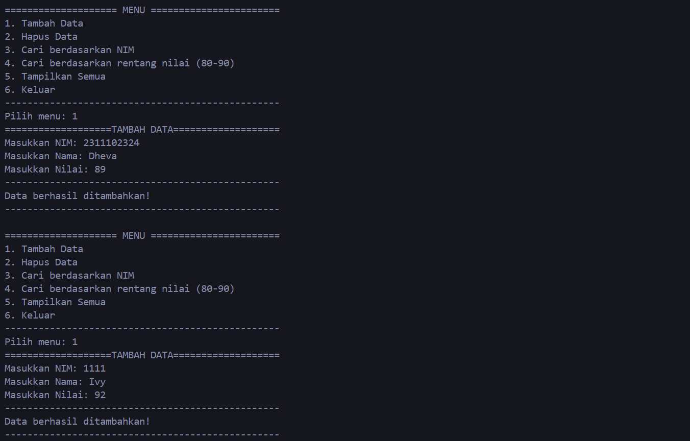
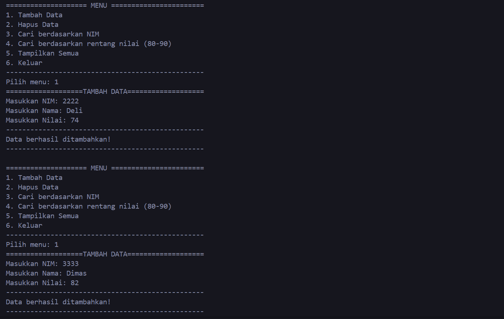
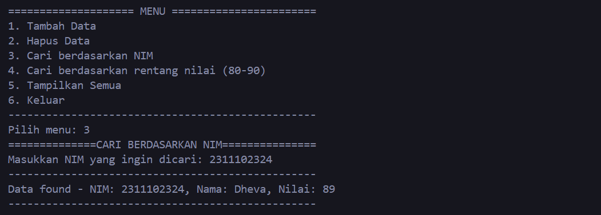
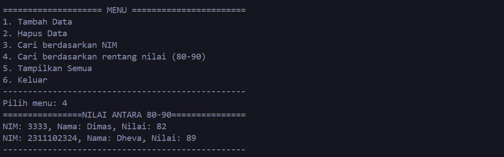
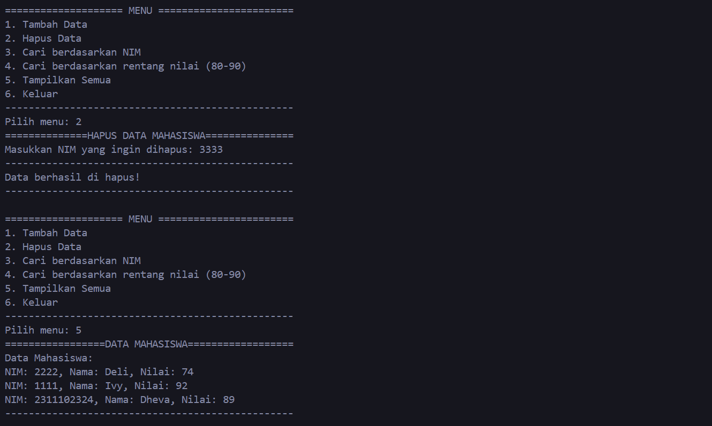

# <h1 align="center">Laporan Praktikum Modul Hash Table</h1>
<p align="center">Dheva Dewa Septiantoni - 2311102324</p>

## Dasar Teori
Hashing adalah cara untuk mengubah kunci atau string menjadi angka. Dalam dunia pemrograman, pengguna sering menggunakan teknik hashing ini untuk membuat struktur data bernama hash table. Hash table dapat dibayangkan seperti sebuah daftar di mana kita dapat menyimpan informasi yang berpasangan  dengan kunci dan nilai yang terkait. Kunci ini berperan penting karena dapat membantu menemukan nilai yang sesuai di dalam daftar. Untuk menentukan di mana tepatnya kunci tersebut disimpan menggunakan fungsi hash. Dengan bantuan fungsi hash ini, informasi bisa diakses dan ditemukan dengan cepat hanya dengan melihat indeks yang telah ditentukan sebelumnya. Hash table bekerja dengan memetakan kunci ke indeks array melalui fungsi hash, dan menyimpan data sesuai indeks tersebut. Saat mencari data, kunci diinput ke fungsi hash untuk menemukan posisi indeks data. 

#### Ada dua teknik utama yang sering digunakan untuk menangani masalah kolisi dalam hash table: 

Open Addressing dan Closed Addressing. Dalam Open Addressing, saat terjadi kolisi, sistem akan mencari lokasi alternatif untuk menyimpan data yang bertabrakan, dengan cara seperti Linear Probing, Quadratic Probing, atau Double Hashing. Sementara itu, Closed Addressing mengatasi kolisi dengan cara menempatkan data tambahan yang bertabrakan pada alamat yang sama, menggunakan pendekatan seperti Separate Chaining atau Cuckoo Hashing.

#### Kelebihan dan kekurangan dalam menggunakan Hash Table:
    
- Kelebihan Hash table meliputi efisiensi waktu operasi seperti insert, delete, dan search yang cepat dengan waktu rata-rata O(1). Selain itu, hash table ideal untuk data dengan frekuensi operasi yang tinggi dan menggunakan algoritma hashing untuk mempercepat pencarian data. Selain efisien dalam penggunaan memori dengan efisiensi tinggi, hash table juga memiliki teknik-teknik seperti open hashing, separate chaining, dan closed hashing untuk mengurangi kemungkinan collision dalam penyimpanan data.


- Kekurangan menggunakan Hash table memiliki kekurangan seperti kemungkinan collision yang memperlambat pencarian dan memakan lebih banyak memori, serta penggunaan memori yang lebih besar karena menggunakan array. Proses hashing dan pengelolaannya mengonsumsi lebih banyak prosesor, waktu, dan kompleksitas algoritma dibandingkan dengan data biasa, termasuk saat operasi penambahan, penghapusan, dan pengujian data.


## Guided 

### 1. Latihan Hash Table

```C++
#include <iostream>

using namespace std;

const int MAX_SIZE = 10;

// Fungsi Hash Sederhana
int hash_func(int key)
{
    return key % MAX_SIZE;
}

// Struktur Data Untuk Setiap Node
struct Node
{
    int key;
    int value;
    Node *next;
    Node(int key, int value) : key(key), value(value), next(nullptr) {}
};

// Class Hash Table
class HashTable
{
private:
    Node **table;

public:
    HashTable()
    {
        table = new Node *[MAX_SIZE]();
    }
    ~HashTable()
    {
        for (int i = 0; i < MAX_SIZE; i++)
        {
            Node *current = table[i];
            while (current != nullptr)
            {
                Node *temp = current;
                current = current->next;
                delete temp;
            }
        }
        delete[] table;
    }

    // Insertion
    void insert(int key, int value)
    {
        int index = hash_func(key);
        Node *current = table[index];
        while (current != nullptr)
        {
            if (current->key == key)
            {
                current->value = value;
                return;
            }
            current = current->next;
        }
        Node *node = new Node(key, value);
        node->next = table[index];
        table[index] = node;
    }

    // Searching
    int get(int key)
    {
        int index = hash_func(key);
        Node *current = table[index];
        while (current != nullptr)
        {
            if (current->key == key)
            {
                return current->value;
            }
            current = current->next;
        }
        return -1;
    }

    // Deletion
    void remove(int key)
    {
        int index = hash_func(key);
        Node *current = table[index];
        Node *prev = nullptr;
        while (current != nullptr)
        {
            if (current->key == key)
            {
                if (prev == nullptr)
                {
                    table[index] = current->next;
                }
                else
                {
                    prev->next = current->next;
                }
                delete current;
                return;
            }
            prev = current;
            current = current->next;
        }
    }

    // Traversal
    void traverse()
    {
        for (int i = 0; i < MAX_SIZE; i++)
        {
            Node *current = table[i];
            while (current != nullptr)
            {
                cout << current->key << " : " << current->value << endl;
                current = current->next;
            }
        }
    }
};

int main()
{
    HashTable ht;
    // Insertion
    ht.insert(1, 10);
    ht.insert(2, 20);
    ht.insert(3, 30);

    // Searching
    cout << "Get key 1: " << ht.get(1) << endl;
    cout << "Get key 4: " << ht.get(4) << endl;

    // Deletion
    ht.remove(4);

    // Traversal
    ht.traverse();

    return 0;
}
```
kode diatas adalah program C++ dengan hash map. Program ini merupakan contoh sederhana dari hash table yang digunakan untuk menyimpan pasangan kunci dan nilainya. Program ini menggunakan library iostream dan memiliki ukuran hash table sebesar 10 dengan MAX_SIZE. Fungsi hash_func bertugas untuk menghasilkan indeks hash dari kunci yang diberikan. Setiap Node dalam hash table dapat menyimpan data dan memiliki pointer yang menunjukkan ke node berikutnya. Class HashTable menyediakan fungsi-fungsi seperti insert, get, remove, dan traverse untuk mengatur data dalam hash table. Dalam bagian main, program membuat objek ht dari class HashTable untuk melakukan berbagai operasi tersebut.
Berikut merupakan hasil output dari program di atas adalah:</br>
Get key 1: 10 </br>
Get key 4: -1 </br>
3 : 30 </br>
2 : 20 </br>
1 : 10 </br>

### 2. Latihan Hash Table dengan Node
```c++
#include <iostream>
#include <string>
#include <vector>

using namespace std;
const int TABLE_SIZE = 11;

string name;
string phone_number;
class HashNode
{
public:
    string name;
    string phone_number;

    HashNode(string name, string phone_number)
    {
        this->name = name;
        this->phone_number = phone_number;
    }
};

class HashMap
{
private:
    vector<HashNode*> table[TABLE_SIZE];

public:
    int hashFunc(string key)
    {
        int hash_val = 0;
        for (char c : key)
        {
            hash_val += c;
        }
        return hash_val % TABLE_SIZE;
    }
    void insert(string name, string phone_number)
    {
        int hash_val = hashFunc(name);
        for (auto node : table[hash_val])
        {
            if (node->name == name)
            {
                node->phone_number = phone_number;
                return;
            }
        }
        table[hash_val].push_back(new HashNode(name, phone_number));
    }
    void remove(string name)
    {
        int hash_val = hashFunc(name);
        for (auto it = table[hash_val].begin(); it != table[hash_val].end(); it++)
        {
            if ((*it)->name == name)
            {
                table[hash_val].erase(it);
                return;
            }
        }
    }
    string searchByName(string name)
    {
        int hash_val = hashFunc(name);
        for (auto node : table[hash_val])
        {
            if (node->name == name)
            {
                return node->phone_number;
            }
        }
        return "";
    }
    void print()
    {
        for (int i = 0; i < TABLE_SIZE; i++)
        {
            cout << i << ": ";
            for (auto pair : table[i])
            {
                if (pair != nullptr)
                {
                    cout << "[" << pair->name << ", " << pair->phone_number << "]";
                }
            }
        }
    }
};

int main()
{
    HashMap employee_map;
    employee_map.insert("Mistah", "1234");
    employee_map.insert("Pastah", "5678");
    employee_map.insert("Ghana", "91011");
    cout << "Nomer Hp Mistah : " << employee_map.searchByName("Mistah") << endl;
    cout << "Phone Hp Pastah : " << employee_map.searchByName("Pastah") << endl;
    employee_map.remove("Mistah");
    cout << "Nomer Hp Mistah setelah dihapus : " << employee_map.searchByName("Mistah") << endl << endl;
    cout << "Hash Table : " << endl;
    employee_map.print();

    return 0;
}
```
Kode diatas adalah program C++ yang merupakan implementasi sederhana hash map untuk menyimpan nama dan nomor telepon. Program menggunakan tiga library: iostream, string, dan vector, dengan konstanta TABLE_SIZE bernilai 11. Ada dua class utama: HashNode untuk node hash map dan HashMap untuk operasi-operasi hash map seperti insert, remove, searchByName, dan print. Fungsi hashFunc menghitung hash dari string, sementara fungsi lainnya digunakan untuk mengelola data. Dalam main, program membuat objek employee_map dan melakukan operasi pada data, kemudian mencetak isi hash map.

## Unguided 

### 1. Soal Hash Table
Implementasikan hash table untuk menyimpan data mahasiswa. Setiap mahasiswa memiliki NIM dan nilai. Implementasikan fungsi untuk menambahkan data baru, menghapus data, mencari data berdasarkan NIM, dan mencari data berdasarkan nilai. Dengan ketentuan :
1. Setiap mahasiswa memiliki NIM dan nilai.
2. Program memiliki tampilan pilihan menu berisi poin C.
3. Implementasikan fungsi untuk menambahkan data baru, menghapus data, mencari data berdasarkan NIM, dan mencari data berdasarkan rentang nilai
(80 – 90).

```C++
#include <iostream>
#include <string>
using namespace std;

const int MAX_SIZE = 10;

// Struktur data untuk setiap node
struct Node
{
    string NIM;
    string nama;
    int nilai;
    Node *next;
    Node(string NIM, string nama, int nilai) : NIM(NIM), nama(nama), nilai(nilai), next(nullptr) {}
};

// Class hash table
class HashTable
{
private:
    Node **table;

public:
    HashTable()
    {
        table = new Node *[MAX_SIZE]();
    }

    ~HashTable()
    {
        for (int i = 0; i < MAX_SIZE; i++)
        {
            Node *current = table[i];
            while (current != nullptr)
            {
                Node *temp = current;
                current = current->next;
                delete temp;
            }
        }
        delete[] table;
    }

    // Fungsi hash sederhana
    int hash_func(string NIM)
    {
        int sum = 0;
        for (char c : NIM)
        {
            sum += c;
        }
        return sum % MAX_SIZE;
    }

    // Insertion
    void insert(string NIM, string nama, int nilai)
    {
        int index = hash_func(NIM);
        Node *newNode = new Node(NIM, nama, nilai);
        if (table[index] == nullptr)
        {
            table[index] = newNode;
        }
        else
        {
            Node *current = table[index];
            while (current->next != nullptr)
            {
                current = current->next;
            }
            current->next = newNode;
        }
    }

    // Deletion
    void remove(string NIM)
    {
        int index = hash_func(NIM);
        Node *current = table[index];
        Node *prev = nullptr;
        while (current != nullptr)
        {
            if (current->NIM == NIM)
            {
                if (prev == nullptr)
                {
                    table[index] = current->next;
                }
                else
                {
                    prev->next = current->next;
                }
                delete current;
                return;
            }
            prev = current;
            current = current->next;
        }
        cout << "Data not found for NIM: " << NIM << endl;
    }

    // Searching by NIM
    void searchByNIM(string NIM)
    {
        int index = hash_func(NIM);
        Node *current = table[index];
        while (current != nullptr)
        {
            if (current->NIM == NIM)
            {
                cout << "Data found - NIM: " << current->NIM << ", Nama: " << current->nama << ", Nilai: " << current->nilai << endl;
                return;
            }
            current = current->next;
        }
        cout << "Data not found for NIM: " << NIM << endl;
    }

    // Searching by range of values (80-90)
    void searchByRange()
    {
        for (int i = 0; i < MAX_SIZE; i++)
        {
            Node *current = table[i];
            while (current != nullptr)
            {
                if (current->nilai >= 80 && current->nilai <= 90)
                {
                    cout << "NIM: " << current->NIM << ", Nama: " << current->nama << ", Nilai: " << current->nilai << endl;
                }
                current = current->next;
            }
        }
    }

    void displayAllData()
    {
        cout << "Data Mahasiswa:\n";
        for (int i = 0; i < MAX_SIZE; i++)
        {
            Node *current = table[i];
            while (current != nullptr)
            {
                cout << "NIM: " << current->NIM << ", Nama: " << current->nama << ", Nilai: " << current->nilai << endl;
                current = current->next;
            }
        }
    }

    // Menampilkan menu pilihan
    void displayMenu()
    {
        cout << "==================== MENU =======================\n";
        cout << "1. Tambah Data\n";
        cout << "2. Hapus Data\n";
        cout << "3. Cari berdasarkan NIM\n";
        cout << "4. Cari berdasarkan rentang nilai (80-90)\n";
        cout << "5. Tampilkan Semua\n";
        cout << "6. Keluar\n";
        cout << "-------------------------------------------------\n";
    }
};

int main()
{
    HashTable hashTable;

    int choice;
    string NIM, nama;
    int nilai;

    do
    {
        hashTable.displayMenu();
        cout << "Pilih menu: ";
        cin >> choice;

        switch (choice)
        {
        case 1:
            cout << "===================TAMBAH DATA===================\n";
            cout << "Masukkan NIM: ";
            cin >> NIM;
            cout << "Masukkan Nama: ";
            cin >> nama;
            cout << "Masukkan Nilai: ";
            cin >> nilai;
            hashTable.insert(NIM, nama, nilai);
            cout << "-------------------------------------------------\n";
            cout << "Data berhasil ditambahkan!\n";
            cout << "-------------------------------------------------\n";
            cout << endl;
            break;
        case 2:
            cout << "==============HAPUS DATA MAHASISWA===============\n";
            cout << "Masukkan NIM yang ingin dihapus: ";
            cin >> NIM;
            hashTable.remove(NIM);
            cout << "-------------------------------------------------\n";
            cout << "Data berhasil di hapus!\n";
            cout << "-------------------------------------------------\n";
            cout << endl;
            break;
        case 3:
            cout << "==============CARI BERDASARKAN NIM===============\n";
            cout << "Masukkan NIM yang ingin dicari: ";
            cin >> NIM;
            cout << "-------------------------------------------------\n";
            hashTable.searchByNIM(NIM);
            cout << "-------------------------------------------------\n";
            cout << endl;
            break;
        case 4:
            cout << "================NILAI ANTARA 80-90===============\n";
            hashTable.searchByRange();
            cout << "-------------------------------------------------\n";
            cout << endl;
            break;
        case 5:
            cout << "=================DATA MAHASISWA==================\n";
            hashTable.displayAllData();
            cout << "-------------------------------------------------\n";
            cout << endl;
            break;
        case 6:
            cout << "Keluar dari program.\n";
            break;
        default:
            cout << "Pilihan tidak valid. Silakan pilih menu yang benar.\n";
        }
    } while (choice != 6);

    return 0;
}
```
## Output:

### Menambah Data Mahasiswa


### Mencari Data Nim Mahasiswa

### Mencari Data Rentang Nilai Mahasiswa

### Menghapus Data Mahasiswa, Menampilkan Data Mahasiswa, dan Keluar dari program.


Program ini adalah implementasi hash table untuk manajemen data mahasiswa dengan kapasitas hingga 100 mahasiswa. Fitur utamanya mencakup penambahan, penghapusan, dan pencarian data berdasarkan NIM atau rentang nilai. Program ini menggunakan struktur data hash table yang terdiri dari kelas Mahasiswa, HashNode, dan HashMap, yang dilengkapi dengan berbagai metode seperti insert, remove, searchByNIM, CariRentangNilai, dan print. Pengguna dapat interaktif memilih operasi yang diinginkan melalui menu yang disediakan hingga memilih untuk keluar.

## Kesimpulan

Hash table adalah struktur data yang memungkinkan penyimpanan dan akses data dengan efisiensi tinggi. Kelebihannya meliputi efisiensi waktu operasi seperti insert, delete, dan search yang cepat dengan waktu rata-rata O(1). Selain itu, hash table ideal untuk data dengan frekuensi operasi yang tinggi dan menggunakan algoritma hashing untuk mempercepat pencarian data. Selain efisien dalam penggunaan memori, hash table juga memiliki teknik-teknik seperti open hashing, separate chaining, dan closed hashing untuk mengurangi kemungkinan collision dalam penyimpanan data.

## Referensi
[1] Hussain Anwar," Cara Jitu Mahir C++ untuk Pemula". Jakarta: Elex media, 2020.<br/>
[2] Mulyana, A. (2023). E-Books Cara Mudah Mempelajari Algoritma dan Struktur Data.
[3] Rafsanjani, Malik Akbar Hashemi. "Implementasi Algoritma Pengurutan General Purpose dan Berbasis Komparasi untuk Data Berkategori dalam Waktu Linier Tanpa Paralelisasi" (2021).<br/>
[4] Nugraha, Muhammad. "Dasar Pemrograman Dengan C++, Materi Paling Dasar untuk Menjadi Programmer Berbagai Platform" (2021)<br/>
[5] Prof. Galih Satria. "Struktur data dan Algoritma pemrograman dalam C++ dan Phyton". Jakarta: Elex media (2019)<br/>