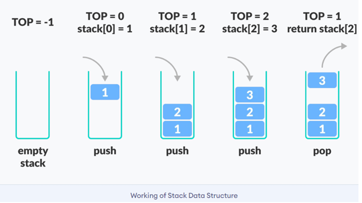
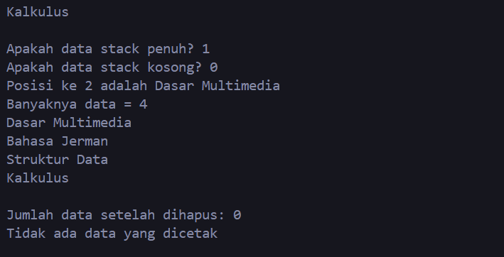
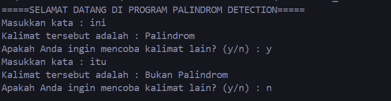
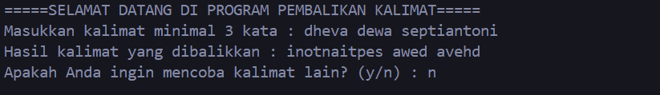

# <h1 align="center">LAPORAN PRAKTIKUM MODUL 6 : STACK</h1>
<p align="center">DHEVA DEWA SEPTIANTONI - 2311102324</p>

# Dasar Teori

## A. PENGERTIAN STACK
Stack adalah struktur data sederhana yang digunakan untuk menyimpan data (mirip dengan Linked Lists). Stack atau tumpukan merupakan struktur data LIFO (Last In First Out) dimana suatu struktur data yang terbentuk dari barisan hingga yang terurut dari satuan data. Pada stack, penambahan dan penghapusan elemennya hanya dapat dilakukan pada satu posisi, yaitu posisi terakhir stack dimasukkan yang disebut 'push' menjadi yang pertama dikeluarkan yang disebut 'pop'.

## B. PENGGUNAAN STACK
Penggunaan Stack sangat beragam seperti dalam penggunaan aritmatika, pemrograman rekursi, pemeriksaan tanda kurung, manajemen memori, dan pemprosesan pemanggilan sebuah fungsi. Contoh implementasi tumpukan(stack) adalah fitur tombol back(kembali) pada browser, dimana browser akan menyimpan semua URL yang telah dikunjungi sebelumnya dalam tumpukan(stack). Setiap kali mengunjungi halaman baru, halaman itu ditambahkan di atas tumpukan(stack). Dan Saat menekan tombol back(kembali), URL saat ini dihapus dari tumpukan, dan URL yang sebelumnya telah diakses.

## C. PROBLEM ATAU KONDISI YANG DIWASPADAI
Adapun dua Probem atau kondisi yang perlu diwaspadai dalam struktur data stack, yaitu underflow dan overflow :
1. Stack underflow terjadi saat kita mencoba mengambil buku dari tumpukan yang kosong, seperti mencoba mengambil buku dari tumpukan yang tidak memiliki buku sama sekali.
2. Stack overflow terjadi saat tumpukan sudah penuh dengan buku namun kita masih mencoba menambahkan buku baru ke dalamnya, seperti mencoba menambahkan buku baru ke tumpukan yang sudah terlalu tinggi untuk menampungnya.

## D. JENIS-JENIS OPERASI
Operasi yang umum digunakan pada stack :
- Push (Masukkan) : Menambahkan atau Memasukkan elemen ke dalam tumpukan posisi paling atas.
- Pop (Keluarkan) : Menghapus atau Mengeluarkan elemen dari posisi sangat atas tumpukan.
- Top (Atas) : Melihat elemen teratas pada tumpukan tanpa menghapusnya.
- IsEmpty (Kosong): Mengecek apakah tumpukan kosong ataupun tidak.
- IsFull (Penuh) : Mengecek apakah tumpukan penuh ataupun tidak (paling utama pada implementasi tumpukan dengan kapasitas terbatas).
- Size (Ukuran) : Mengembalikan jumlah elemen yang terdapat dalam tumpukan.
- Peek (Lihat) : Melihat elemen pada posisi tertentu dalam tumpukan tanpa menghapusnya.
- Clear (Membersihkan) :  Mengosongkan atau menghapus semua elemen dari tumpukan.
- Search (Cari): Mencari keberadaan elemen tertentu dalam tumpukan. 

## E. CONTOH ILLUSTRASI STACK



## Guided 

### 1. [Program Operasi Stack]

```C++
#include <iostream>
using namespace std;

// Array untuk menyimpan nama-nama buku
string arrayBuku[5];

// Maksimum data yang bisa disimpan dalam stack
int maksimal = 5;

// Pointer untuk menunjukkan posisi teratas dalam stack
int top = 0;

// Fungsi untuk mengecek apakah stack sudah penuh
bool isFull() {
    return (top == maksimal);
}

// Fungsi untuk mengecek apakah stack kosong
bool isEmpty() {
    return (top == 0);
}

// Fungsi untuk menambahkan data ke dalam stack
void pushArrayBuku(string data) {
    if (isFull()) {
        cout << "Data telah penuh" << endl;
    } else {
        arrayBuku[top] = data;
        top++;
    }
}

// Fungsi untuk menghapus data dari stack
void popArrayBuku() {
    if (isEmpty()) {
        cout << "Tidak ada data yang dihapus" << endl;
    } else {
        arrayBuku[top - 1] = "";
        top--;
    }
}

// Fungsi untuk melihat data pada posisi tertentu dalam stack
void peekArrayBuku(int posisi) {
    if (isEmpty()) {
        cout << "Tidak ada data yang bisa dilihat" << endl;
    } else {
        int index = top;
        for (int i = 1; i <= posisi; i++) {
            index--;
        }
        cout << "Posisi ke " << posisi << " adalah " << arrayBuku[index] << endl;
    }
}

// Fungsi untuk menghitung jumlah data dalam stack
int countStack() {
    return top;
}

// Fungsi untuk mengubah data pada posisi tertentu dalam stack
void changeArrayBuku(int posisi, string data) {
    if (posisi > top) {
        cout << "Posisi melebihi data yang ada" << endl;
    } else {
        int index = top;
        for (int i = 1; i <= posisi; i++) {
            index--;
        }
        arrayBuku[index] = data;
    }
}

// Fungsi untuk menghapus semua data dalam stack
void destroyArraybuku() {
    for (int i = top; i >= 0; i--) {
        arrayBuku[i] = "";
    }
    top = 0;
}

// Fungsi untuk mencetak semua data dalam stack
void cetakArrayBuku() {
    if (isEmpty()) {
        cout << "Tidak ada data yang dicetak" << endl;
    } else {
        for (int i = top - 1; i >= 0; i--) {
            cout << arrayBuku[i] << endl;
        }
    }
}

int main() {
    // Memasukkan beberapa data ke dalam stack buku
    pushArrayBuku("Kalkulus");
    pushArrayBuku("Struktur Data");
    pushArrayBuku("Matematika Diskrit");
    pushArrayBuku("Dasar Multimedia");
    pushArrayBuku("Inggris");

    // Mencetak semua data dalam stack buku
    cetakArrayBuku();
    cout << "\n";

    // Menampilkan apakah stack penuh atau kosong
    cout << "Apakah data stack penuh? " << isFull() << endl;
    cout << "Apakah data stack kosong? " << isEmpty() << endl;

    // Melihat data pada posisi tertentu dalam stack buku
    peekArrayBuku(2);
    
    // Menghapus data dari stack buku
    popArrayBuku();

    // Menampilkan jumlah data dalam stack buku
    cout << "Banyaknya data = " << countStack() << endl;

    // Mengubah data pada posisi tertentu dalam stack buku
    changeArrayBuku(2, "Bahasa Jerman");
    
    // Mencetak semua data dalam stack buku setelah perubahan
    cetakArrayBuku();
    cout << "\n";

    // Menghapus semua data dalam stack buku
    destroyArraybuku();
    cout << "Jumlah data setelah dihapus: " << top << endl;
    
    // Mencetak semua data dalam stack buku setelah dihapus
    cetakArrayBuku();

    return 0;
}

```

Kode di atas digunakan untuk mengimplementasikan program Stack menggunakan array dalam bahasa pemrograman C++. Program Dimulai dengan mendefinisikan array arrayBuku yang berukuran 5 dan beberapa variabel global seperti 'maksimal' atau dari maksimal elemen yang dapat ditampung, dan 'top' yang menandakan posisi teratas pada stack.
Ada beberapa fungsi utilitas yang digunakan dalam program tersebut, antara lain:
- 'isFull()' untuk memeriksa apakah stack sudah penuh.
- 'isEmpty()' untuk memeriksa apakah stack kosong.
- 'pushArrayBuku(string data)' untuk menambahkan data ke dalam stack.
- 'popArrayBuku()' untuk menghapus data dari stack.
- 'peekArrayBuku(int posisi)' untuk melihat data pada posisi tertentu di dalam stack.
- 'countStack()' untuk menghitung jumlah data dalam stack.
- 'changeArrayBuku(int posisi, string data)' untuk mengubah data pada posisi tertentu di dalam stack.
- 'destroyArraybuku()' untuk menghapus semua data dari stack.
- 'cetakArrayBuku()' untuk mencetak semua data dalam stack.

#### Hasil dari output program diatas seperti :



## Unguided 

### 1. [Buatlah program untuk menentukan apakah kalimat tersebut yang diinputkan dalam program stack adalah palindrom/tidak. Palindrom kalimat yang dibaca dari depan dan belakang sama. Jelaskan bagaimana cara kerja programnya.]


```C++
// DHEVA DEWA SEPTIANTONI
// 2311102324

// Program Stack untuk menentukan apakah kalimat tersebut Palindrom/tidak
#include <iostream>
#include <string> //library untuk menggunakan string
#include <stack>  //library untuk menggunakan stack

using namespace std;

// Fungsi untuk membersihkan Kata_324 dari spasi dan karakter non-alphanumeric
string BersihkanKata_324(string Kata_324)
{
    string KataBersih_324;
    for (char &c_324 : Kata_324)
    {
        if (isalpha(c_324))
        {                                     // Memeriksa apakah karakter adalah huruf
            KataBersih_324 += tolower(c_324); // Mengubah huruf menjadi huruf kecil atau bersih
        }
    }
    return KataBersih_324;
}

// Fungsi untuk memeriksa apakah sebuah string adalah palindrom
bool Palindrom_324(string Kata_324)
{
    stack<char> TumpukkanKata_324;
    int Length_324 = Kata_324.length();

    // Memasukkan setengah karakter pertama ke dalam tumpukan
    for (int i_324 = 0; i_324 < Length_324 / 2; i_324++)
    {
        TumpukkanKata_324.push(Kata_324[i_324]);
    }

    // Menentukan titik awal untuk membandingkan karakter kedua setengah
    int Mulai_324 = Length_324 / 2;
    if (Length_324 % 2 != 0)
    {
        Mulai_324++;
    }

    // Membandingkan karakter kedua setengah dengan karakter dalam tumpukan
    for (int i_324 = Mulai_324; i_324 < Length_324; i_324++)
    {
        if (TumpukkanKata_324.empty() || Kata_324[i_324] != TumpukkanKata_324.top())
        {
            return false;
        }
        TumpukkanKata_324.pop();
    }

    return true;
}

int main()
{
    char LanjutkanInputKata_324;
    cout << "=====SELAMAT DATANG DI PROGRAM PALINDROM DETECTION=====" << endl; // Judul Program

    do
    {
        // Memasukkan Kata_324 atau kalimat yang ingin dimasukkan
        string Kata_324;
        cout << "Masukkan kata : "; // User diminta untuk memasukan kata atau kalimat yang ingin dimasukkan
        getline(cin, Kata_324);

        // Membersihkan Kata_324 dari spasi, karakter non-alphanumeric, dan mengubah huruf menjadi huruf kecil
        string KataBersih_324 = BersihkanKata_324(Kata_324);

        // Memeriksa apakah Kata_324 adalah palindrom setelah dibersihkan
        if (Palindrom_324(KataBersih_324))
        {
            cout << "Kalimat tersebut adalah : Palindrom" << endl; // Hasil yang berarti kata atau kalimat tersebut Palindrom
        }
        else
        {
            cout << "Kalimat tersebut adalah : Bukan Palindrom" << endl; // Hasil yang berarti kata atau kalimat tersebut Bukan Palindrom
        }

        cout << "Apakah Anda ingin mencoba kalimat lain? (y/n) : "; // Menanyakan Kepada user apakah ingin mencoba kalimat lain atau tidak
        cin >> LanjutkanInputKata_324;
        cin.ignore(); // Untuk membersihkan buffer Kata_324 sebelumnya
    } while (LanjutkanInputKata_324 == 'y' || LanjutkanInputKata_324 == 'Y'); // Untuk melanjutkan input kata atau selesai

    return 0;
}


```
#### Output:



Kode di atas digunakan untuk implementasi dari struktur data stack untuk menentukan apakah sebuah kalimat adalah palindrom atau tidak dalam bahasa pemrograman C++. Palindrom adalah kata atau kalimat yang memiliki sifat bahwa jika dibalik, maka huruf-huruf dan kata-katanya tetap sama. Library yang digunakan Program menggunakan library standar C++, yaitu '<iostream>' untuk input/output, '<string>' untuk manipulasi string, dan <stack> untuk menggunakan struktur data stack.

Program ini memiliki dua fungsi utama yang digunakan, antara lain :
1. 'BersihkanKata_138' : Fungsi ini digunakan untuk membersihkan sebuah kalimat dari spasi dan karakter non-alphanumeric, serta mengubah huruf menjadi huruf kecil. Fungsi ini membantu dalam memproses kalimat agar dapat diperiksa sebagai palindrom. Ini penting karena dalam pengecekan palindrom, kita ingin membandingkan kata secara konsisten tanpa memperdulikan huruf besar atau kecil serta karakter non-alphanumeric.
2. 'Palindrom_138': Fungsi ini digunakan untuk memeriksa apakah sebuah kalimat adalah palindrom atau tidak. Fungsi ini menggunakan konsep tumpukkan (stack) untuk membandingkan setengah karakter pertama dengan setengah karakter kedua dari kalimat. Jika setengah karakter pertama dan setengah karakter kedua cocok, maka kalimat tersebut adalah palindrom.


  Contoh penggunaannya misal user memasukkan kalimat : ini, berarti kalimat tersebut termasuk palindrom, dan misal user memasukkan kalimat : telkom berarti kalimat tersebut bukan palindrom. Kemudian user diminta apakah ingin mencoba kalimat lain atau tidak. jika y berarti iya dan program lanjut, sedangkan jika n berarti tidak atau program selesai. Lebih jelasnya yang hasil programnya seperti gambar output diatas.


### 2. [Buatlah program untuk melakukan pembalikan terhadap kalimat menggunakan stack dengan minimal 3 kata. Jelaskan output program dan source codenya beserta operasi/fungsi yang dibuat?]

```C++
// 2311102324
// DHEVA DEWA SEPTIANTONI

// Program Stack untuk melakukan pembalikan terhadap kalimat
#include <iostream>
#include <string> //library untuk menggunakan string
#include <stack>  //library untuk struktur data stack

using namespace std;

int main()
{
    stack<char> CharStack_324;                                                // Inisialisasi stack untuk menyimpan karakter
    char LanjutkanInputKalimat_324;                                           // Untuk melanjutkan input kalimat
    cout << "=====SELAMAT DATANG DI PROGRAM PEMBALIKAN KALIMAT=====" << endl; // Judul Program

    do
    {
        string Kalimat_324, KalimatDibalik_324;
        cout << "Masukkan kalimat minimal 3 kata : "; // User diminta untuk memasukan kalimat yang ingin dimasukkan, dengan minimal 3 kata
        getline(cin, Kalimat_324);                         // Membaca input Kalimat_324 dari pengguna

        for (char c_324 : Kalimat_324)
        {
            CharStack_324.push(c_324); // Menambahkan setiap karakter ke dalam stack
        }

        while (!CharStack_324.empty())
        { // Untuk memeriksa apakah stack tersebut kosong atau tidak
            if (CharStack_324.top() == ' ')
            {
                KalimatDibalik_324 += ' '; // Menambahkan spasi ke Kalimat_324 terbalik jika karakter teratas adalah spasi
            }
            else
            {
                KalimatDibalik_324 += CharStack_324.top(); // Menambahkan karakter teratas dari stack ke Kalimat_324 terbalik
            }
            CharStack_324.pop(); // Menghapus karakter teratas dari stack
        }

        cout << "Hasil kalimat yang dibalikkan : " << KalimatDibalik_324 << endl; // Hasil kalimat yang dibalikan

        cout << "Apakah Anda ingin mencoba kalimat lain? (y/n) : "; // Menanyakan Kepada user apakah ingin mencoba kalimat lain atau tidak
        cin >> LanjutkanInputKalimat_324;
        cin.ignore(); // Untuk membersihkan Kalimat_324 buffer sebelumnya
    } while (LanjutkanInputKalimat_324 == 'y' || LanjutkanInputKalimat_324 == 'Y'); // Untuk melanjutkan input Kalimat_324 atau selesai

    return 0;
}


```
#### Output:


Kode di atas digunakan untuk implementasi dari struktur data stack yang digunakan untuk melakukan pembalikan terhadap sebuah kalimat. Pembalikan kalimat berarti mengubah urutan huruf-huruf dalam kalimat sehingga kalimat tersebut menjadi kalimat yang berbeda. Program ini menggunakan struktur data stack untuk memudahkan proses pembalikan. Library yang digunakan Program menggunakan library standar C++, yaitu '<iostream>' untuk input/output, '<string>' untuk manipulasi string, dan <stack> untuk menggunakan struktur data stack.

Program ini memiliki fungsi utama yang digunakan untuk melakukan pembalikan kalimat, antara lain :
1. 'Penggunaan Stack' : Program ini menggunakan stack untuk menyimpan karakter-karakter dari kalimat yang dimasukkan. Stack digunakan untuk memudahkan proses pembalikan karena stack dapat memungkinkan penggunaan First-In-First-Out (FIFO) dalam mengambil karakter-karakter dari kalimat.
2. 'Pembalikan Kalimat' : Program ini melakukan pembalikan kalimat dengan cara mengambil karakter-karakter dari stack dan menambahkannya ke dalam sebuah string baru. Jika karakter yang diambil adalah spasi, maka spasi juga ditambahkan ke dalam string baru. Jika tidak, maka karakter yang diambil ditambahkan ke dalam string baru.

  Contoh penggunaannya misal user memasukkan kalimat : Telkom Purwokerto, maka hasil yang dibalik menjadi : otrekowruP mokleT. Kemudian user diminta apakah ingin mencoba kalimat lain atau tidak. Jika y berarti iya dan program lanjut, sedangkan jika n berarti tidak atau program selesai. Lebih jelasnya yang hasil programnya seperti gambar output diatas.


## Kesimpulan
Kesimpulannya, pada modul 6 ini Stack atau tumpukan merupakan struktur data LIFO (Last In First Out) dimana suatu struktur data yang terbentuk dari barisan hingga yang terurut dari satuan data. Pada stack, penambahan dan penghapusan elemennya hanya dapat dilakukan pada satu posisi, yaitu posisi terakhir stack dimasukkan yang disebut 'push' menjadi yang pertama dikeluarkan yang disebut 'pop'.

Keunggulan atau Kelebihan Stack yaitu dapat melakukan seperti undo dan rendo, yang dimana program ini dapat melakukan pembalikan terhadap kata ataupun kalimat. Dengan menggunakan stack, program ini menunjukkan bagaimana struktur data sederhana dapat digunakan untuk menyelesaikan tugas-tugas tertentu dengan sangat efisien untuk digunakan dalam aplikasi yang membutuhkan operasi-operasi tersebut secara berulang.

Kekurangan Stack antara lain seperti Ukuran terbatas, Ukuran stack biasanya tetap dan terbatas, tergantung pada implementasi atau batasan memori dari sistem, jika stack sudah penuh dan operasi push dilakukan, maka akan terjadi overflow. Stack memiliki sifat LIFO yang tidak dapat diubah, artinya elemen yang dimasukkan terakhir akan menjadi elemen yang pertama kali diambil, Ini membuat stack kurang fleksibel untuk digunakan dalam beberapa situasi yang memerlukan akses acak atau pengubahan urutan data. Tidak dapat digunakan untuk semua kasus, dan Tidak mendukung operasi pencarian.

## Referensi
 [1] Dr. Joseph Teguh Santoso. Struktur Data dan ALgoritma. Semarang: Yayasan Prima Agus Teknik. 2021.

 [2] Muhammad Nugraha. Dasar Pemrograman Dengan C++ Materi Paling Dasar untuk Menjadi Programmer Berbagai Platform. Yogyakarta. 2021.

 [3] Mulyana A. E-Books Cara Mudah Mempelajari Algoritma dan Struktur Data. 2023.

 [4] Rafsanjani, Malik Akbar Hashemi. "Implementasi Algoritma Pengurutan General Purpose dan Berbasis Komparasi untuk Data Berkategori dalam Waktu Linier Tanpa Paralelisasi", 2021.