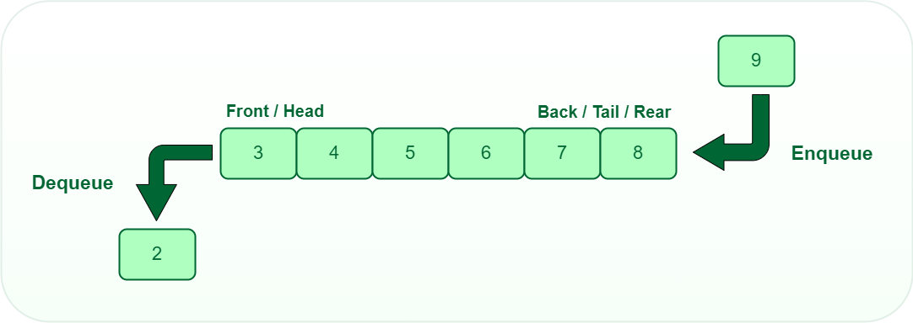
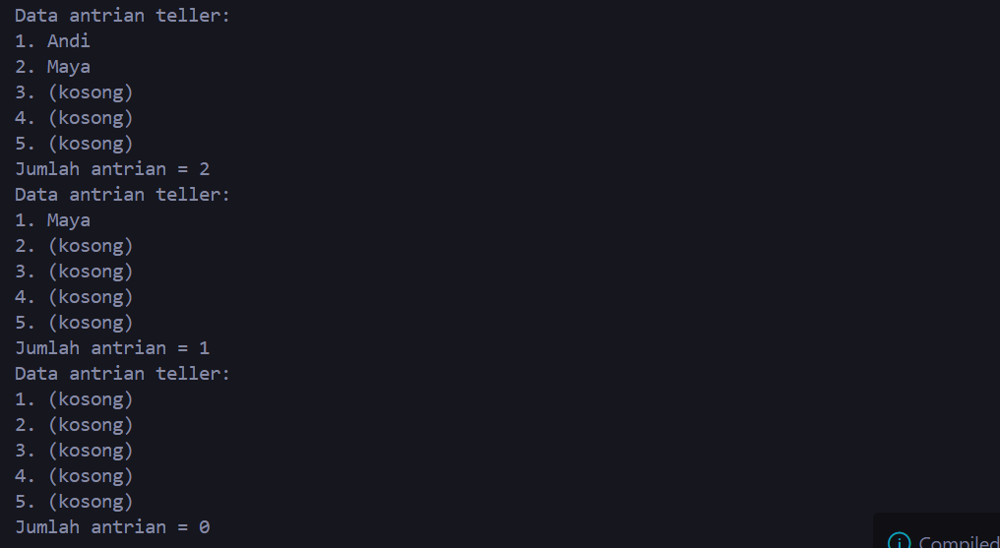
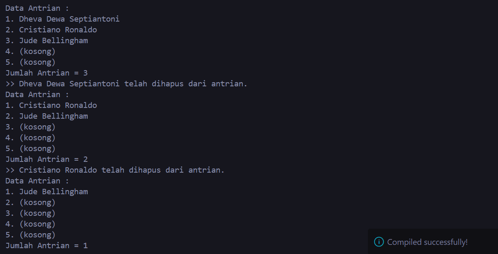
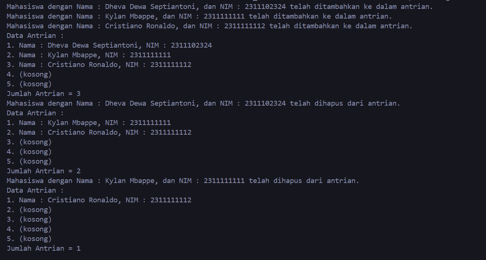

# <h1 align="center">LAPORAN PRAKTIKUM MODUL 7 : QUEUE</h1>
<p align="center">DHEVA DEWA SEPTIANTONI - 2311102324</p>

# Dasar Teori

## A. PENGERTIAN QUEUE
Queue adalah struktur data yang memungkinkan penyimpanan dan pengambilan data dengan prinsip FIFO (First-In First-Out). Artinya, data yang pertama dimasukkan ke dalam queue akan menjadi data yang pertama pula untuk dikeluarkan. Konsep ini serupa dengan antrian pada kehidupan sehari-hari di mana orang yang datang lebih dulu akan dilayani terlebih dahulu. Dalam implementasinya, queue dapat dibangun menggunakan array atau linked list. Struktur data queue memiliki dua pointer utama, yaitu front dan rear. Front mengarah ke elemen pertama dalam queue, sementara rear mengarah ke elemen terakhir.

## B. PERBEDAAN QUEUE DENGAN STRUKTUR DATA YANG LAIN
Perbedaan mendasar antara queue dan struktur data lainnya seperti stack terletak pada aturan penambahan dan penghapusan elemen. Pada stack, penambahan dan penghapusan elemen dilakukan di satu ujung saja. Namun, pada queue, operasi tersebut dilakukan pada ujung yang berbeda karena perubahan data selalu mengacu pada head. Oleh karena itu, hanya terdapat satu jenis operasi untuk menambah atau menghapus elemen, yaitu Enqueue dan Dequeue. Saat Enqueue, elemen ditambahkan setelah elemen terakhir dalam queue. Sedangkan saat Dequeue, head digeser untuk menunjuk pada elemen selanjutnya dalam antrian.

## C. JENIS-JENIS PADA OPERASI QUEUE
Operasi pada Queue melibatkan serangkaian fungsi yang memberikan kita kemampuan untuk berinteraksi dengan struktur data ini. Mari kita jabarkan beberapa operasi dasar yang dapat kita lakukan pada Queue:

### 1. Berdasarkan Implementasinya

#### Linear/Simple Queue: Elemen-elemen data disusun dalam barisan linear dan penambahan serta penghapusan elemen hanya terjadi pada dua ujung barisan. Contoh Linear Queue:

##### Enqueue (Tambahkan Elemen):
- Elemen pertama: 1
- Elemen kedua: 2
- Elemen ketiga: 3
- Elemen keempat: 4
- Elemen kelima: 5
##### Dequeue (Hapus Elemen):
- Elemen pertama: 1 (dihapus)
- Elemen yang tersisa: 2, 3, 4, 5
##### Enqueue (Tambahkan Elemen):
- Elemen pertama: 2 (sebelumnya)
- Elemen kedua: 6
- Elemen ketiga: 7
- Elemen keempat: 8
- Elemen kelima: 9
##### Dequeue (Hapus Elemen):
- Elemen pertama: 2 (dihapus)
- Elemen yang tersisa: 3, 4, 5, 6, 7, 8, 9

#### Circular Queue: Mirip dengan jenis linear, tetapi ujung-ujung barisan terhubung satu sama lain, menciptakan struktur antrean yang berputar. Contoh Circular Queue:

##### Enqueue (Tambahkan Elemen):
- Elemen pertama: 1
- Elemen kedua: 2
- Elemen ketiga: 3
- Elemen keempat: 4
- Elemen kelima: 5
##### Dequeue (Hapus Elemen):
- Elemen pertama: 1 (dihapus)
- Elemen yang tersisa: 2, 3, 4, 5
##### Enqueue (Tambahkan Elemen):
- Elemen pertama: 2 (sebelumnya)
- Elemen kedua: 6
- Elemen ketiga: 7
- Elemen keempat: 8
- Elemen kelima: 9
##### Dequeue (Hapus Elemen):
- Elemen pertama: 2 (dihapus)
- Elemen yang tersisa: 3, 4, 5, 6, 7, 8, 9
##### Enqueue (Tambahkan Elemen):
- Elemen pertama: 3 (sebelumnya)
- Elemen kedua: 10
- Elemen ketiga: 11
- Elemen keempat: 12
- Elemen kelima: 13
##### Dequeue (Hapus Elemen):
- Elemen pertama: 3 (dihapus)
- Elemen yang tersisa: 4, 5, 6, 7, 8, 9, 10, 11, 12, 13

### 2. Berdasarkan Penggunaan

#### Priority Queue: Setiap elemen memiliki prioritas tertentu. Elemen dengan prioritas tertinggi akan diambil terlebih dahulu.Elemen dengan prioritas rendah akan dihapus setelah elemen dengan prioritas tinggi. Contoh Priority Queue:

##### Enqueue (Tambahkan Elemen):
- Elemen pertama: 1 (prioritas tinggi)
- Elemen kedua: 3 (prioritas sedang)
- Elemen ketiga: 2 (prioritas rendah)
- Elemen keempat: 4 (prioritas tinggi)
- Elemen kelima: 5 (prioritas rendah)
##### Dequeue (Hapus Elemen):
- Elemen pertama: 1 (dihapus prioritas tinggi)
- Elemen yang tersisa: 3, 2, 4, 5

#### Double-ended Queue (Dequeue): Elemen dapat ditambahkan atau dihapus dari kedua ujung antrean Contoh Double Ended Queue (Dequeue):

##### Enqueue (Tambahkan Elemen):
- Elemen pertama: 1
- Elemen kedua: 2
- Elemen ketiga: 3
- Elemen keempat: 4
- Elemen kelima: 5
##### Dequeue (Hapus Elemen):
- Elemen pertama: 1 (dihapus urutan paling depan)
- Elemen yang tersisa: 2, 3, 4, 5
##### Dequeue (Hapus Elemen):
- Elemen pertama: 5 (dihapus urutan paling ujung belakang)
- Elemen yang tersisa: 2, 3, 4.

## D. PROSEDUR OPERASI PADA QUEUE:
- enqueue() :menambahkan data kedalam queue.
- dequeue() :mengeluarkan data dari queue.
- peek() :mengambil data dari queue tanpa menghapusnya.
- isEmpty() :mengecek apakah queue kosong atau tidak.
- isFull() :mengecek apakah queue penuh atau tidak.
- size() :menghitung jumlah elemen dalam queue. 

## E. CONTOH ILLUSTRASI QUEUE



## Guided 

### 1. [Program Operasi Queue]

```C++

#include <iostream>
using namespace std;
const int maksimalQueue = 5; // Maksimalantrian
int front = 0;               // Penandaantrian
int back = 0;                // Penanda
string queueTeller[5];       // Fungsipengecekan
bool isFull()
{ // Pengecekanantrianpenuhatautidak
    if (back == maksimalQueue)
    {
        return true; // =1
    }
    else
    {
        return false;
    }
}
bool isEmpty()
{ // Antriannyakosongatautidak
    if (back == 0)
    {
        return true;
    }
    else
    {
        return false;
    }
}
void enqueueAntrian(string data)
{ // Fungsimenambahkanantrian
    if (isFull())
    {
        cout << "Antrian penuh" << endl;
    }
    else
    {
        if (isEmpty())
        { // Kondisiketikaqueuekosong
            queueTeller[0] = data;
            front++;
            back++;
        }
        else
        { // Antrianya ada isi
            queueTeller[back] = data;
            back++;
        }
    }
}
void dequeueAntrian()
{ // Fungsi mengurangi antrian
    if (isEmpty())
    {
        cout << "Antrian kosong" << endl;
    }
    else
    {
        for (int i = 0; i < back; i++)
        {
            queueTeller[i] = queueTeller[i + 1];
        }
        back--;
    }
}
int countQueue()
{ // Fungsi menghitung banyak antrian
    return back;
}
void clearQueue()
{ // Fungsi menghapus semua antrian
    if (isEmpty())
    {
        cout << "Antrian kosong" << endl;
    }
    else
    {
        for (int i = 0; i < back; i++)
        {
            queueTeller[i] = "";
        }
        back = 0;
        front = 0;
    }
}
void viewQueue()
{ // Fungsi melihat antrian
    cout << "Data antrian teller:" << endl;
    for (int i = 0; i < maksimalQueue; i++)
    {
        if (queueTeller[i] != "")
        {
            cout << i + 1 << ". " << queueTeller[i] << endl;
        }
        else
        {
            cout << i + 1 << ". (kosong)" << endl;
        }
    }
}
int main()
{
    enqueueAntrian("Andi");
    enqueueAntrian("Maya");
    viewQueue();
    cout << "Jumlah antrian = " << countQueue() << endl;
    dequeueAntrian();
    viewQueue();
    cout << "Jumlah antrian = " << countQueue() << endl;
    clearQueue();
    viewQueue();
    cout << "Jumlah antrian = " << countQueue() << endl;
    return 0;
}

```

#### Hasil dari output program diatas seperti :



## Unguided 

### 1. [Ubahlah penerapan konsep queue pada bagian guided dari array menjadi linked list]

```C++

// NAMA : Dheva Dewa Septiantoni
// NIM : 2311102324

#include <iostream>
using namespace std;

const int maksimalQueue_324 = 5;

struct Node
{
    string data_324;
    Node *next_324;
};

class Queue
{
private:
    Node *front_324;
    Node *rear_324;

public:
    Queue()
    {
        front_324 = nullptr;
        rear_324 = nullptr;
    }

    void enqueue_324(const string &data_324)
    {
        Node *newNode_324 = new Node;
        newNode_324->data_324 = data_324;
        newNode_324->next_324 = nullptr;

        if (isEmpty_324())
        {
            front_324 = rear_324 = newNode_324;
        }
        else
        {
            rear_324->next_324 = newNode_324;
            rear_324 = newNode_324;
        }

        cout << ">> " << data_324 << " telah ditambahkan ke dalam antrian." << endl;
    }

    void dequeue_324()
    {
        if (isEmpty_324())
        {
            cout << "Antrian kosong." << endl;
            return;
        }

        Node *temp_324 = front_324;
        front_324 = front_324->next_324;

        cout << ">> " << temp_324->data_324 << " telah dihapus dari antrian." << endl;
        delete temp_324;

        if (front_324 == nullptr)
        {
            rear_324 = nullptr;
        }
    }

    void displayQueue_324()
    {
        if (isEmpty_324())
        {
            cout << "Data Antrian :" << endl;
            for (int i_324 = 0; i_324 < maksimalQueue_324; i_324++)
            {
                cout << i_324 + 1 << ". (kosong)" << endl;
            }
        }
        else
        {
            cout << "Data Antrian :" << endl;
            Node *current_324 = front_324;
            int i_324 = 1;
            while (current_324 != nullptr)
            {
                cout << i_324 << ". " << current_324->data_324 << endl;
                current_324 = current_324->next_324;
                i_324++;
            }
            for (; i_324 <= maksimalQueue_324; i_324++)
            {
                cout << i_324 << ". (kosong)" << endl;
            }
        }
    }

    bool isEmpty_324()
    {
        return front_324 == nullptr;
    }

    int countQueue_324()
    {
        int count = 0;
        Node *current_324 = front_324;
        while (current_324 != nullptr)
        {
            count++;
            current_324 = current_324->next_324;
        }
        return count;
    }

    void clearQueue_324()
    {
        while (!isEmpty_324())
        {
            dequeue_324();
        }
        cout << "Antrian telah dibersihkan." << endl;
    }
};

int main()
{
    Queue queue;
    queue.enqueue_324("Dheva Dewa Septiantoni");
    queue.enqueue_324("Cristiano Ronaldo");
    queue.enqueue_324("Jude Bellingham");
    queue.displayQueue_324();
    cout << "Jumlah Antrian = " << queue.countQueue_324() << endl;
    queue.dequeue_324();
    queue.displayQueue_324();
    cout << "Jumlah Antrian = " << queue.countQueue_324() << endl;
    queue.dequeue_324();
    queue.displayQueue_324();
    cout << "Jumlah Antrian = " << queue.countQueue_324() << endl;

    return 0;
}

```
#### Output:



Kode di atas digunakan untuk implementasi struktur data Queue atau antrian dengan menggunakan linked list di C++. Antrian diimplementasikan sebagai kelas yang disebut 'Queue', yang memiliki penunjuk depan dan penunjuk belakang untuk melacak elemen depan dan belakang antrian. Antrian dapat menyimpan string sebagai elemennya.
Kelas Queue memiliki beberapa metode untuk memanipulasi antrian:
- 'enqueue_138(const string& data_138)': menambahkan elemen ke bagian belakang antrian.
- 'dequeue_138()': menghapus elemen dari depan antrian.
- 'displayQueue_138()': menampilkan semua elemen dalam antrian.
- 'isEmpty_138()': memeriksa apakah antrian kosong.
- 'countQueue_138()': mengembalikan jumlah elemen dalam antrian.
- 'clearQueue_138()': menghapus semua elemen dari antrian.

  Fungsi ini 'main' mendemonstrasikan cara menggunakan 'Queue' kelas dengan membuat objek antrian, menambah dan menghapus elemen dari antrian, dan menampilkan antrian di berbagai tahapan. Program ini juga menggunakan metode 'isEmpty_138()', 'countQueue_138()', dan 'clearQueue_138()' untuk menunjukkan status antrian saat ini.

  Program ini dalam penggunaannya menggunakan output dari code otomatis. Lebih jelasnya yang hasil programnya seperti gambar output diatas.


### 2. [Dari nomor 1 buatlah konsep antri dengan atribut Nama mahasiswa dan NIM Mahasiswa]

```C++

//NAMA : Dheva Dewa Septiantoni
//NIM : 2311102324

#include <iostream>
#include <string>

using namespace std;

const int maksimalQueue_324 = 5;

struct Node {
    string Nama_324;
    string NIM_324;
    Node* next_324;
};

class Queue {
private:
    Node* front_324; 
    Node* rear_324; 

public: 
    Queue() { 
        front_324 = nullptr;
        rear_324 = nullptr;
    }

    void enqueue_324(const string& Nama_324, const string& NIM_324) {
        Node* newNode_324 = new Node;
        newNode_324->Nama_324 = Nama_324;
        newNode_324->NIM_324 = NIM_324;
        newNode_324->next_324 = nullptr;

        if (isEmpty_324()) {
            front_324 = rear_324 = newNode_324;
        } else {
            rear_324->next_324 = newNode_324;
            rear_324 = newNode_324;
        }

        cout << "Mahasiswa dengan Nama : " << newNode_324->Nama_324 << ", dan NIM : " << newNode_324->NIM_324 << " telah ditambahkan ke dalam antrian." << endl;
    }

    void dequeue_324() {
        if (isEmpty_324()) {
            cout << "Antrian kosong." << endl;
            return;
        }

        Node* temp_324 = front_324; 
        front_324 = front_324->next_324; 

        cout << "Mahasiswa dengan Nama : " << temp_324->Nama_324 << ", dan NIM : " << temp_324->NIM_324 << " telah dihapus dari antrian." << endl; // Tampilkan data mahasiswa yang dihapus dari antrian 
        delete temp_324; 

        if (front_324 == nullptr) {
            rear_324 = nullptr;
        }
    }

    void displayQueue_324() {
        if (isEmpty_324()) {
            cout << "Data Antrian :" << endl;
            for (int i_324 = 0; i_324 < maksimalQueue_324; i_324++) {
                cout << i_324 + 1 << ". (kosong)" << endl;
            }
        } else {
            cout << "Data Antrian :" << endl;
            Node* current_324 = front_324;
            int i_324 = 1;
            while (current_324!= nullptr) { 
                cout << i_324 << ". " << "Nama : " << current_324->Nama_324 << ", NIM : " << current_324->NIM_324 << endl;
                current_324 = current_324->next_324;
                i_324++;
            }
            for (; i_324 <= maksimalQueue_324; i_324++) { 
                cout << i_324 << ". (kosong)" << endl;
            }
        }
    }

    bool isEmpty_324() {
        return front_324 == nullptr;
    }

    int countQueue_324() {
        int count_324 = 0;
        Node* current_324 = front_324;
        while (current_324!= nullptr) { 
            count_324++;
            current_324 = current_324->next_324;
        }
        return count_324; 
    }

    void clearQueue_324() {
        while (!isEmpty_324()) { 
            dequeue_324();
        } 
        cout << "Antrian telah dibersihkan." << endl;
    }
};

int main() {
    Queue queue;
    queue.enqueue_324("Dheva Dewa Septiantoni", "2311102324");
    queue.enqueue_324("Kylan Mbappe", "2311111111");
    queue.enqueue_324("Cristiano Ronaldo", "2311111112");
    queue.displayQueue_324();
    cout << "Jumlah Antrian = " << queue.countQueue_324() << endl;
    queue.dequeue_324();
    queue.displayQueue_324();
    cout << "Jumlah Antrian = " << queue.countQueue_324() << endl;
    queue.dequeue_324();
    queue.displayQueue_324();
    cout << "Jumlah Antrian = " << queue.countQueue_324() << endl;

    return 0;
}

```
#### Output:


Kode di atas digunakan untuk implementasi dari struktur data Queue atau antrian pada C++. Dengan dirancang khusus untuk menyimpan data siswa dengan atribut nama dan nomor induk siswa (NIM). Antrian memiliki kapasitas maksimal 5 siswa. Program ini menggunakan implementasi daftar tertaut dari antrian, dengan penunjuk depan dan belakang untuk melacak elemen depan dan belakang antrian.
Kelas 'Queue' memiliki beberapa metode untuk memanipulasi antrian:
- 'enqueue_138': menambahkan siswa baru ke belakang antrian dengan nama dan ID siswa yang diberikan.
- 'dequeue_138': mengeluarkan siswa depan dari antrian dan mencetak nama dan ID siswanya.
- 'displayQueue_138': mencetak status antrian saat ini, menampilkan nama dan ID siswa setiap siswa dalam antrian.
- 'isEmpty_138': memeriksa apakah antrian kosong dan mengembalikan nilai boolean yang menunjukkan hasilnya.
- 'countQueue_138': mengembalikan jumlah siswa yang sedang dalam antrian.
- 'clearQueue_138': mengeluarkan semua siswa dari antrian dan mencetak pesan yang menunjukkan bahwa antrian telah dihapus.

  Fungsi ini 'main' mendemonstrasikan cara menggunakan 'Queue' kelas dengan membuat objek antrian, menambahkan beberapa siswa ke antrian, menampilkan antrian, dan mengeluarkan siswa dari antrian. Program ini juga menggunakan metode 'isEmpty_138', 'countQueue_138', dan 'clearQueue_138' untuk menunjukkan status antrian saat ini.

  Program ini dalam penggunaannya menggunakan output dari code otomatis. Lebih jelasnya yang hasil programnya seperti gambar output diatas.


## Kesimpulan
Kesimpulannya, pada modul 7 ini Queue atau antrian merupakan struktur data LIFO (Last In First Out) dimana suatu struktur data yang terbentuk dari barisan hingga yang terurut dari satuan data. Queue mirip dengan konsep antrian pada kehidupan sehari-hari, dimana konsumen yang datang lebih dulu akan dilayani terlebih dahulu. Implementasinya dapat menggunakan array atau linked list, dengan dua pointer utama, yaitu front dan rear. Berbeda dengan struktur data lain seperti stack, penambahan dan penghapusan elemen dalam queue terjadi pada ujung yang berbeda, yaitu front untuk Dequeue dan rear untuk Enqueue.

Keunggulan atau Kelebihan Queue yaitu Implementasi yang sederhana, dan sangat efisiensi dalam hal Waktu. Queue jika menggunakan linked list lebih fleksibel dan efisien untuk penambahan dan penghapusan elemen di tengah antrian. Ada banyak jenis-jenis operasi. Queue menggunakan Prinsip FIFO yaitu yang memastikan bahwa data diproses sesuai urutan penerimaannya, membuat antrian berguna dalam aplikasi di mana data perlu diproses dalam urutan tertentu.

Kekurangan Queue antara lain seperti Ukuran terbatas atau overhead memori, ketika menambahkan dan menghapus elemen di tengah antrian tidak efisien karena membutuhkan pergeseran elemen lain. Batasan kapasitas pada implementasi dengan array dan Performa yang buruk pada implementasi dengan array jika terdapat operasi dequeue yang sering dilakukan. Queue memiliki sifat LIFO yang tidak dapat diubah, Artinya elemen yang pertama kali masuk akan menjadi elemen yang pertama kali dikeluarkan, Ini membuat queue kurang fleksibel untuk digunakan dalam beberapa situasi yang memerlukan akses acak atau pengubahan urutan data. Tidak dapat digunakan untuk semua kasus, dan Tidak mendukung operasi pencarian.

## Referensi
 [1] Dr. Joseph Teguh Santoso. Struktur Data dan ALgoritma. Semarang: Yayasan Prima Agus Teknik. 2021.

 [2] Muhammad Nugraha. Dasar Pemrograman Dengan C++ Materi Paling Dasar untuk Menjadi Programmer Berbagai Platform. Yogyakarta. 2021.

 [3] Mulyana A. E-Books Cara Mudah Mempelajari Algoritma dan Struktur Data. 2023.

 [4] Rafsanjani, Malik Akbar Hashemi. "Implementasi Algoritma Pengurutan General Purpose dan Berbasis Komparasi untuk Data Berkategori dalam Waktu Linier Tanpa Paralelisasi", 2021.
