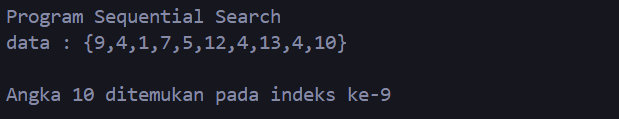
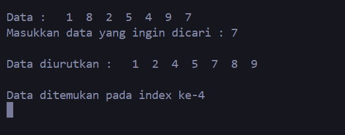
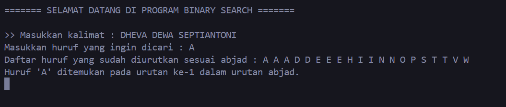
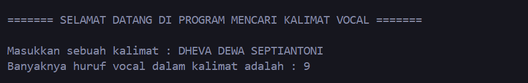
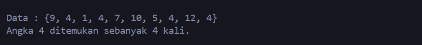

# <h1 align="center">LAPORAN PRAKTIKUM MODUL 8 : ALGORITMA SEARCHING</h1>
<p align="center">  DHEVA DEWA SEPTIANTONI - 2311102324</p>

# Dasar Teori

## A. PENGERTIAN ALGORITMA SEARCHING
Algoritma adalah sistematika yang sifatnya berurutan secara logis untuk menyelesaikan suatu permasalahan melalui perintah-perintah yang dibuat secara jelas. Sementara searching adalah proses mendapatkan informasi berdasarkan kunci tertentu dari sejumlah informasi yang telah disimpan. Jadi, Algoritma Searching adalah urutan langkah-langkah yang digunakan untuk menemukan data tertentu dalam kumpulan data. Algoritma Searching atau Pencarian merupakan proses yang sangat penting dalam pengolahan data. Proses pencarian dasar adalah menemukan nilai (data) tertentu didalam sekumpulan data yang bertipe sama. Searching (pencarian) pada struktur data mengacu pada proses algoritma dalam memeriksa, menemukan, mengambil posisi elemen tertentu (target) dari kumpulan elemen di sebuah data. Kumpulan elemen tersebut dapat berupa array, list, linked list, tree, dan lain sebagainya. Ada dua metode dalam algoritma pencarian, yaitu Binary Search dan Sequential Search.

## B. PENGERTIAN BINATY SEARCH
Binary search adalah algoritma pencarian untuk data terurut. Pencarian dilakukan dengan membandingkan data yang dicari dengan data di tengah. Jika sama, data ditemukan. Jika tidak, pencarian dilanjutkan pada bagian kiri atau kanan dari data tengah, tergantung pada perbandingan antara data yang dicari dengan data tengah. Proses ini diulang hingga data ditemukan atau tidak ada lagi yang bisa diperiksa. Singkatnya Binary Search adalah algoritma pencarian pada array/list dengan elemen terurut. Algoritma ini sering digabungkan dengan algoritma sorting karena data harus diurutkan terlebih dahulu. Konsep Binary Search :

- Data diambil dari posisi 1 sampai akhir (N).
- Data dibagi menjadi dua untuk mendapatkan posisi tengah.
- Data yang dicari dibandingkan dengan data di posisi tengah. Jika data yang dicari lebih besar dari data tengah, pencarian dilanjutkan di bagian kanan. Sedangkan jika data yang dicari lebih kecil, pencarian dilanjutkan di bagian kiri.
- Proses pembagian terus berlanjut hingga data ditemukan atau tidak ada lagi data yang bisa dibagi.
- Jika data sama dengan data tengah, pencarian berhenti karena data ditemukan.

Algoritma pencarian biner dapat dituliskan sebagai berikut :
1) L  0
2) R  N – 1
3) ketemu  false
4) Selama (L <= R) dan (tidak ketemu) kerjakan baris 5 sampai dengan 8
5) m  (L + R) / 2
6) Jika (Data[m] = x) maka ketemu  true
7) Jika (x < Data[m]) maka R  m – 1
8) Jika (x > Data[m]) maka L  m + 1
9) Jika (ketemu) maka m adalah indeks dari data yang dicari, jika tidak data
tidak ditemukan

Contoh Penjelasan dari Binary Search, yaitu:
Int A[5] = {11, 15, 21, 31, 33}

- Terdapat sebuah array yang menampung 5 elemen pada gambar di atas. Nilai yang akan dicari pada array tersebut adalah 11.
- Jadi karena konsep dari binary search ini adalah membagi array menjadi dua bagian, yaitu kanan dan kiri. maka pertama-tama kita cari nilai tengahnya dulu. Total elemen dibagi 2 yaitu 5/2 = 2.5 di bulatkan menjadi 2.
- Maka urutan ke-3 adalah nilai tengah, yaitu angka 21 pada indeks ke-2.
- Kemudian kita cek apakah 11 > 21 atau 11 < 21?
- Karena 11 lebih kecil dari 21, maka kemungkinan besar angka 11 berada sebelum 21 atau di sebelah kiri. Selanjutnya, kita cari ke kiri dan kita dapat mengabaikan elemen yang ada di kanan.
- Setelah itu, kita cari lagi nilai tengahnya di bagian kiri array lagi, yang tersisa adalah [11, 15, 21]. Nilai tengah dari bagian ini adalah 15 pada indeks ke-1.
- Kemudian kita cek apakah 11 > 15 atau 11 < 15?
- Ternyata 11 lebih kecil dari 15, maka selanjutnya kita cari ke kiri bagian ini, yaitu [11].
- Karena tersisa hanya satu elemen saja, maka elemen tersebut adalah nilai tengahnya. Setelah dicek ternyata elemen pada indeks ke-0 adalah elemen yang dicari, maka telah selesai untuk proses pencariannya.

  Jadi, nilai 11 ditemukan pada indeks ke-0 dari array. Proses ini menunjukkan bagaimana binary search efisien dalam menemukan nilai dalam array yang terurut.

## C. PENGERTIAN SEQUENTIAL SEARCH
Sequential Search adalah algoritma pencarian untuk data yang acak atau tidak terurut. Ini adalah teknik paling sederhana, di mana setiap elemen array dibaca satu per satu dari indeks terkecil hingga terbesar, atau sebaliknya. Konsepnya adalah :

- Membandingkan setiap elemen array satu per satu.
- Pencarian dimulai dari indeks pertama hingga terakhir.
- Pencarian berhenti saat data ditemukan. Jika tidak ditemukan hingga akhir array, pencarian berhenti.
- Perulangan terjadi sebanyak jumlah elemen dalam array (N).

Algoritma Sequential Search adalah sebagai berikut :

- i ← 0
- ketemu ← false
- Selama (tidak ketemu) dan (i < N), lakukan:
- Jika (Data[i] = x) maka ketemu ← true, jika tidak, i ← i + 1
- Jika (ketemu) maka i adalah indeks data yang dicari, jika tidak, data tidak ditemukan.

Contoh Penjelasan dari Sequential Search, yaitu:
Int A[8] = {9,1,5,2,7,6,11,3}

- Misal seperti pada gambar diatas nilai atau angka yang dicari adalah X = 7, maka elemen yang diperiksa adalah 9, 1, 5, 2, 7. (ditemukan) Jadi indeks larik yang dikembalikan berada di indeks ke-4 atau I = 4.
- Misal nilai yang dicari adalah X = 10, maka elemen yang diperiksa adalah 9, 1, 5, 2, 7, 6, 11, 3. (tidak ditemukan) Jadi indeks larik yang dikembalikan tidak ditemukan atau I = 0.

## D. PERBEDAAN BINARY SEARCH DAN SEQUENTIAL SEARCH
Perbedaan utama antara Binary Search dan Sequential Search terletak pada cara kerja, efisiensi, persyaratan data, dan penerapannya :

 Binary Search :
- Cara Kerjanya memeriksa setiap elemen secara berurutan dari awal hingga akhir atau sampai target ditemukan.
- Efisiensinya cenderung Kurang efisien untuk kumpulan data besar. Kompleksitas waktu rata-rata dan terburuk adalah O(n).
- Persyaratan Datanya tidak memerlukan data terurut.
- Penerapannya cocok untuk data kecil atau data yang tidak terurut.

 Sequential Search :
- Cara Kerjanya membagi kumpulan data menjadi dua bagian secara terus-menerus dan hanya memeriksa bagian yang relevan.
- Efisiensinya cenderung lebih efisien untuk kumpulan data besar. Kompleksitas waktu rata-rata dan terburuk adalah O(log n).
- Persyaratan Datanya memerlukan data yang sudah terurut.
- Penerapannya cocok untuk data besar yang sudah terurut.

## E. CONTOH KASUS BINARY SEARCH DAN SEQUENTIAL SEARCH
Contoh kasusnya Misalkan untuk mencari nama "DHEVA" dalam daftar mahasiswa ITTP (Institut Teknologi Telkom Purwokerto).

Binary Search :

Syarat : Daftar mahasiswa harus sudah diurutkan berdasarkan nama secara alfabetis.
Mulai dari Tengah : Pemeriksaan dimulai dari mahasiswa yang berada di tengah daftar.
Periksa dan Bandingkan : Nama mahasiswa di tengah daftar dibandingkan dengan nama "DHEVA".
Jika Cocok : Jika nama mahasiswa di tengah daftar adalah "DHEVA", pencarian berhenti dan informasi mahasiswa tersebut ditampilkan.
Jika "DHEVA" Lebih Awal : Jika nama "DHEVA" secara alfabetis seharusnya berada sebelum nama mahasiswa di tengah daftar, maka pencarian dilanjutkan hanya pada bagian awal daftar (sebelum mahasiswa di tengah). Jika "DHEVA" Lebih Akhir : Jika nama "DHEVA" secara alfabetis seharusnya berada setelah nama mahasiswa di tengah daftar, maka pencarian dilanjutkan hanya pada bagian akhir daftar (setelah mahasiswa di tengah).
Ulangi : Langkah 2 dan 3 diulangi dengan membagi bagian daftar yang relevan menjadi dua secara terus-menerus hingga nama "DHEVA" ditemukan atau hingga bagian daftar yang tersisa tidak memungkinkan lagi untuk dibagi.
Sequential Search :

Mulai dari Awal : Pemeriksaan dimulai dari mahasiswa pertama dalam daftar.
Periksa dan Bandingkan : Nama setiap mahasiswa diperiksa satu per satu dan dibandingkan dengan nama "DHEVA".
Jika Cocok : Jika nama mahasiswa saat ini adalah "DHEVA", pencarian berhenti dan informasi mahasiswa tersebut ditampilkan (misalnya, NIM, jurusan, dll.).
Jika Tidak Cocok : Jika nama mahasiswa saat ini bukan "DHEVA", lanjutkan ke mahasiswa berikutnya.
Ulangi : Langkah 2 diulangi hingga nama "DHEVA" ditemukan atau sampai semua mahasiswa dalam daftar telah diperiksa.
Tidak Ditemukan : Jika setelah memeriksa semua mahasiswa, nama "DHEVA" tidak ditemukan, maka dapat disimpulkan bahwa DHEVA tidak terdaftar sebagai mahasiswa ITTP.

 Catatan :
- Jika daftar mahasiswa ITTP tidak terlalu besar, Sequential Search mungkin sudah cukup efisien.
- Jika daftar mahasiswa ITTP sangat besar dan sudah terurut berdasarkan nama, Binary Search akan jauh lebih efisien daripada Sequential Search.


## Guided 

### 1. [Buatlah sebuah project dengan menggunakan sequential search sederhana untuk melakukan pencarian data.]

```C++
#include <iostream>

using namespace std;

int main(){
    int n = 10;
    int data[n] = {9,4,1,7,5,12,4,13,4,10};
    int cari = 10;
    bool ketemu = false;
    int i;

    for (i = 0; i < n; i++){
        if(data[i] == cari){
            ketemu = true;
            break;
        }
    }

    cout << "Program Sequential Search" << endl;
    cout << "data : {9,4,1,7,5,12,4,13,4,10}" << endl;

    if (ketemu){
        cout << "\nAngka " << cari << " ditemukan pada indeks ke-" << i << endl;
    }else{
        cout << "data tidak ditemukan" << endl;
    }

    return 0;
}
```

Kode di atas digunakan untuk mengimplementasikan program sederhana dari struktur data algoritma Sequential Search dalam bahasa C++. Sequential Search digunakan untuk mencari suatu nilai dalam sebuah array dengan memeriksa setiap elemen array satu per satu hingga nilai yang dicari ditemukan atau seluruh elemen telah diperiksa. Berikut adalah penjelasan langkah-langkah dalam program:

- n : ukuran dari array, yaitu 10.
- data : array yang berisi 10 elemen : {9, 4, 1, 7, 5, 12, 4, 13, 4, 10}.
- cari : nilai yang ingin dicari dalam array, yaitu 10.
- ketemu : variabel boolean yang digunakan untuk menandakan apakah nilai yang dicari ditemukan atau tidak, diinisialisasi dengan false.
- i : variabel untuk iterasi. Program menggunakan loop for untuk memeriksa setiap elemen dalam array data. Jika elemen pada indeks i sama dengan nilai cari, maka ketemu diubah menjadi true dan loop dihentikan menggunakan break. Setelah itu Program akan mencetak pesan "Program Sequential Search" dan isi array.
- Jika nilai cari ditemukan (ketemu bernilai true), program mencetak indeks di mana nilai tersebut ditemukan.
- Jika nilai cari tidak ditemukan, program mencetak pesan bahwa data tidak ditemukan

  Contoh programnya array yang berisi 10 elemen : {9, 4, 1, 7, 5, 12, 4, 13, 4, 10} dan nilai yang ingin dicari dalam array, yaitu angka 10. Jadi angka 10 ditemukan pada indeks ke-9. Lebih jelasnya yang hasil programnya seperti gambar output diatas.

#### Hasil dari output program diatas seperti :



### 2. [Buatlah sebuah project untuk melakukan pencarian data dengan menggunakan Binary Search.]

```C++
#include<iostream>
#include<conio.h>
#include<iomanip>

using namespace std;

int dataArray[7] = {1, 8, 2, 5, 4, 9, 7};
int cari;

void Selection_Sort(){
    int temp, min, i, j;
    for(i = 0; i < 7; i++){
        min = i;
        for(j = i + 1; j < 7; j++){
            if(dataArray[j] < dataArray[min]){
                min = j;
            }
        }
        temp = dataArray[i];
        dataArray[i] = dataArray[min];
        dataArray[min] = temp;
    }
}

void BinarySearch(){
    int awal, akhir, tengah;
    bool b_flag = false;
    awal = 0;
    akhir = 6;
    while(!b_flag && awal <= akhir){
        tengah = (awal + akhir)/2;
        if(dataArray[tengah] == cari){
            b_flag = true;
        } else if(dataArray[tengah] < cari){
            awal = tengah + 1;
        } else {
            akhir = tengah - 1;
        }
    }
    if(b_flag){
        cout << "\nData ditemukan pada index ke-" << tengah << endl;
    } else {
        cout << "\nData tidak ditemukan" << endl;
    }
}

int main(){
    cout << "BINARY SEARCH" << endl;
    cout << "\nData : ";
    for(int x = 0; x < 7; x++){
        cout << setw(3) << dataArray[x];
    }
    cout << endl;

    cout << "Masukkan data yang ingin dicari : ";
    cin >> cari;
    
    cout << "\nData diurutkan : ";
    Selection_Sort();

    for(int x = 0; x < 7; x++){
        cout << setw(3) << dataArray[x];
    }
    cout << endl;
    BinarySearch();
    _getche();
    return 0;
}
```

Kode di atas digunakan untuk mengimplementasikan dari algoritma Binary Search untuk mencari sebuah nilai dalam array yang telah diurutkan menggunakan algoritma Selection Sort. Berikut rincian programnya :

- 'dataArray[7] = {1, 8, 2, 5, 4, 9, 7}' : Array berisi data yang akan diurutkan dan dicari.
- 'cari' : Variabel untuk menyimpan data yang akan dicari oleh pengguna.
- Fungsi 'Selection_Sort' : Untuk mengurutkan 'dataArray' menggunakan algoritma Selection Sort. Fungsi ini melakukan iterasi melalui array, menemukan elemen terkecil di bagian array yang tidak disortir, dan menukarnya dengan elemen pertama yang tidak disortir. Proses ini diulangi hingga seluruh array diurutkan.
- Fungsi 'BinarySearch' mencari nilai cari dalam 'dataArray' menggunakan algoritma Binary Search. Jika nilainya ditemukan, ia akan mencetak indeks nilai dalam array. Jika nilainya tidak ditemukan, ia akan mencetak pesan yang menunjukkan bahwa nilainya tidak ditemukan.

  Program ini memanfaatkan dua algoritma yang berbeda, Selection Sort untuk mengurutkan data dan Binary Search untuk mencari data.
  Contoh programnya array yang berisi 7 elemen : = {1, 8, 2, 5, 4, 9, 7} dan nilai yang ingin dicari dalam array, yaitu angka 7. Kemudian angka diurutkan data nilainya, yaitu menjadi 1, 2, 4, 5, 7, 8, 9. Jadi, angka 7 ditemukan pada indeks ke-4. Lebih jelasnya yang hasil programnya seperti gambar output diatas.

#### Hasil dari output program diatas seperti :



## Unguided 

### 1. [Buatlah sebuah program untuk mencari sebuah huruf pada sebuah kalimat yang sudah di input dengan menggunakan Binary Search!]

```C++

// Program untuk mencari sebuah huruf pada sebuah kalimat yang sudah di input dengan menggunakan Binary Search
#include <iostream>
#include <conio.h> // Jika menggunakan Windows. Untuk sistem operasi lain, perlu mencari pengganti dari _getche()

using namespace std;

// Fungsi untuk melakukan pencarian binary pada array karakter
int binarySearch_324(char Array_324[], int Size_324, char Target_324)
{
    int Kiri_324 = 0;
    int Kanan_324 = Size_324 - 1;

    // Melakukan binary search selama Kiri_324 tidak melebihi Kanan_324
    while (Kiri_324 <= Kanan_324)
    {
        int Tengah_324 = Kiri_324 + (Kanan_324 - Kiri_324) / 2;

        // Jika huruf Target_324 berada di tengah array
        if (Array_324[Tengah_324] == Target_324)
            return Tengah_324;

        // Jika huruf Target_324 berada di sebelah kiri tengah array
        if (Array_324[Tengah_324] > Target_324)
            Kanan_324 = Tengah_324 - 1;

        // Jika huruf Target_324 berada di sebelah kanan tengah array
        else
            Kiri_324 = Tengah_324 + 1;
    }

    // Jika huruf Target_324 tidak ditemukan
    return -1;
}

// Fungsi untuk melakukan selection sort pada array karakter
void selectionSort_324(char Array_324[], int Size_324)
{
    for (int i_324 = 0; i_324 < Size_324 - 1; ++i_324)
    {
        int IndeksTengah_324 = i_324;
        for (int j_324 = i_324 + 1; j_324 < Size_324; ++j_324)
        {
            // Menemukan elemen terkecil dalam array yang belum diurutkan
            if (Array_324[j_324] < Array_324[IndeksTengah_324])
            {
                IndeksTengah_324 = j_324;
            }
        }
        // Menukar elemen terkecil yang ditemukan dengan elemen pertama yang belum diurutkan
        swap(Array_324[i_324], Array_324[IndeksTengah_324]);
    }
}

int main()
{
    string sentence_324; // Variabel untuk menyimpan kalimat yang dimasukkan oleh pengguna
    char Target_324;     // Variabel untuk menyimpan karakter yang akan dicari

    cout << "\n======= SELAMAT DATANG DI PROGRAM BINARY SEARCH =======" << endl; // Judul Program
    cout << "\n>> Masukkan kalimat : ";
    getline(cin, sentence_324); // Mengambil input kalimat dari pengguna

    // Membuat array untuk menyimpan karakter
    int PanjangSentence_324 = sentence_324.size(); // Menghitung panjang kalimat
    char KarakterArray_324[100];                   // Array untuk menyimpan karakter-karakter dari kalimat (mengabaikan spasi)
    int Size_324 = 0;                              // Variabel untuk melacak jumlah karakter non-spasi

    // Mengisi KarakterArray_324  dengan karakter-karakter dari kalimat
    for (int i_324 = 0; i_324 < PanjangSentence_324; ++i_324)
    {
        if (sentence_324[i_324] != ' ')
        {                                                      // Mengabaikan spasi
            KarakterArray_324[Size_324] = sentence_324[i_324]; // Menyimpan karakter ke KarakterArray_324
            ++Size_324;                                        // Menambah ukuran dari array yang telah diisi
        }
    }

    cout << "Masukkan huruf yang ingin dicari : ";
    cin >> Target_324;

    // Mengurutkan array karakter menggunakan selection sort
    selectionSort_324(KarakterArray_324, Size_324);

    // Menampilkan daftar huruf yang sudah diurutkan sesuai abjad
    cout << "Daftar huruf yang sudah diurutkan sesuai abjad : ";
    for (int i_324 = 0; i_324 < Size_324; ++i_324)
    {
        cout << KarakterArray_324[i_324] << " ";
    }

    // Mencari huruf dalam array yang telah diurutkan
    int Index_324 = binarySearch_324(KarakterArray_324, Size_324, Target_324);

    cout << endl;

    // Menampilkan hasil pencarian dan daftar huruf yang sudah diurutkan
    if (Index_324 != -1)
    {
        cout << "Huruf '" << Target_324 << "' ditemukan pada urutan ke-" << Index_324 << " dalam urutan abjad." << endl;
    }
    else
    {
        cout << "Huruf '" << Target_324 << "' tidak ditemukan dalam kalimat." << endl;
    }

    _getche(); // Menunggu pengguna menekan tombol sebelum program berakhir (hanya untuk Windows)
    return 0;  // Mengembalikan nilai 0 menandakan bahwa program berakhir dengan sukses)
}

```
#### Output:


Kode di atas digunakan untuk implementasi struktur data pencarian biner di C++ yang mencari karakter tertentu dalam array karakter yang diurutkan. Berikut rincian programnya:

- Deklarasi dan Inisialisasi Variabel :
  - `PanjangSentence_324`: Menyimpan panjang kalimat yang dimasukkan oleh pengguna.
  - `KarakterArray_324`: Array untuk menyimpan karakter-karakter non-spasi dari kalimat.
  - `Indeks_324`: Array untuk menyimpan indeks asli dari karakter-karakter non-spasi.
  - `Size_324`: Variabel yang melacak jumlah karakter non-spasi yang dimasukkan ke dalam `KarakterArray_324` dan `Indeks_324`.
  - `sentence_324`: variabel string untuk menyimpan kalimat yang dimasukkan oleh pengguna
  - `i_324`, `j_324`, `Kiri_324`, `Kanan_324`, `Tengah_324`, `IndeksTengah_324`: variabel integer untuk perulangan dan pencarian

- Loop untuk Mengisi `KarakterArray_324` dan `Indeks_324`:
  - Loop ini iterasi melalui setiap karakter dalam `sentence_324`.
  - Karakter non-spasi ditambahkan ke `KarakterArray_324`, dan indeks asli karakter tersebut disimpan di `Indeks_324`.

- Sort dan Search:
  - Setelah array `KarakterArray_324` dan `Indeks_324` diisi, `KarakterArray_324` diurutkan menggunakan fungsi `selectionSort_324`.
  - Setelah array diurutkan, `binarySearch_324` digunakan untuk mencari `Target_324` dalam `KarakterArray_324`.

- Hasil Pencarian :
  - Jika `Target_324` ditemukan, indeks asli karakter tersebut ditampilkan.
  - Jika tidak ditemukan, pesan bahwa karakter tidak ditemukan ditampilkan.
  - Menunggu Masukan Pengguna : Terakhir, program menunggu pengguna menekan tombol sebelum menghentikan penggunaan (yang khusus untuk Windows).`_getche()`

  Contoh Programnya user memasukkan kalimat nama sendiri, misalnya "DHEVA DEWA SEPTIANTONI", dan masukkan huruf yang ingin dicari 'A'. Jadi daftar huruf yang sudah diurutkan menjadi A A A A C D E I M O P R R T. Lebih jelasnya yang hasil programnya seperti gambar output diatas.


### 2. [Buatlah sebuah program yang dapat menghitung banyaknya huruf vocal dalam sebuah kalimat!]

```C++

// Program menghitung banyaknya huruf vocal dalam sebuah kalimat menggunakan Sequential Search
#include <iostream>
#include <cctype> // Untuk fungsi tolower

using namespace std;

// Fungsi untuk memeriksa apakah sebuah karakter adalah vocal
bool isVowel_324(char Karakter_324) {
    // Konversi karakter menjadi huruf kecil agar pemeriksaan tidak case-sensitive
    Karakter_324 = tolower(Karakter_324);
    // Periksa apakah karakter adalah salah satu dari 'a', 'e', 'i', 'o', 'u'
    return (Karakter_324 == 'a' || Karakter_324 == 'e' || Karakter_324 == 'i' || Karakter_324 == 'o' || Karakter_324 == 'u');
}

// Fungsi untuk menghitung banyaknya huruf vocal dalam sebuah kalimat
int countVowels_324(const string &Kalimat_324) {
    int Count_324 = 0; // Variabel untuk menghitung jumlah vocal
    // Loop melalui setiap karakter dalam string Kalimat_324
    for (char Karakter_324 : Kalimat_324) {
        // Periksa apakah karakter adalah vocal menggunakan fungsi isVowel_324
        if (isVowel_324(Karakter_324)) {
            Count_324++; // Tambahkan ke Count_324 jika karakter adalah vocal
        }
    }
    return Count_324; // Kembalikan jumlah vocal
}

int main() {
    string Kalimat_324; // Variabel untuk menyimpan kalimat yang dimasukkan oleh pengguna

    cout << "\n======= SELAMAT DATANG DI PROGRAM MENCARI KALIMAT VOCAL =======" << endl; // Nama Program
    cout << "\nMasukkan sebuah kalimat : ";
    getline(cin, Kalimat_324); // Membaca input kalimat dari pengguna

    // Menghitung jumlah huruf vocal dalam kalimat menggunakan fungsi countVowels_324
    int vowelCount_324 = countVowels_324(Kalimat_324);

    // Menampilkan hasil perhitungan jumlah huruf vocal
    cout << "Banyaknya huruf vocal dalam kalimat adalah : " << vowelCount_324 << endl;

    return 0; // Mengembalikan nilai 0 menandakan bahwa program berakhir dengan sukses
}

```
#### Output:


Kode di atas digunakan untuk implementasi dari struktur data algoritma Sequential Search yang digunakan untuk menghitung banyaknya huruf vokal pada sebuah kalimat yang sudah di input. Berikut rincian programnya :

- `Kalimat_324` : variabel string untuk menyimpan kalimat yang dimasukkan oleh pengguna
- `Karakter_324` : variabel char untuk menyimpan karakter pada setiap iterasi
- `Count_324` : variabel integer untuk menyimpan jumlah huruf vokal
- `i_324` : variabel integer untuk perulangan
- Fungsi `isVowel_324()` : Digunakan untuk memeriksa apakah sebuah karakter adalah huruf vokal atau tidak. Fungsi ini memeriksa apakah karakter tertentu adalah vokal. Ini mengubah karakter menjadi huruf kecil untuk membuat pemeriksaan tidak peka huruf besar-kecil dan kemudian memeriksa apakah karakter tersebut adalah salah satu vokal standar ('a', 'e', ​​'i', 'o', 'u'). `isVowel_324`.
- Fungsi `countVowels_324()` : Digunakan untuk menghitung banyaknya huruf vokal pada kalimat yang telah diinputkan. Fungsi menghitung jumlah vokal dalam kalimat tertentu. Ini mengulangi setiap karakter dalam kalimat dan menggunakan fungsi untuk memeriksa apakah karakter tersebut adalah vokal. Jika ya, itu akan menambah penghitung. Fungsi ini mengembalikan jumlah total vokal. `countVowels_324`,`isVowel_324`.
- Menghitung Vokal : Program memanggil fungsi dengan kalimat masukan dan menyimpan hasilnya dalam variabel. `countVowels_324`,`vowelCount_324`.


### 3. [Diketahui data = 9, 4, 1, 4, 7, 10, 5, 4, 12, 4. Hitunglah berapa banyak angka 4 dengan menggunakan algoritma Sequential Search!]

```C++

// Program Algoritma Sequential Search
#include <iostream>

using namespace std;

int main(){
    int n_324 = 10; // Jumlah elemen dalam array, yang berarti 10
    int Data_324 [n_324] = {9, 4, 1, 4, 7, 10, 5, 4, 12, 4}; // Array data yang akan dicari
    int Target_324 = 4; // Target yang akan dicari dalam array
    int Count_324 = 0; // Variabel untuk menghitung banyaknya kemunculan target dalam array

    // Melakukan pencarian sequential untuk menghitung banyaknya angka 4 dalam array
    for (int i_324 = 0; i_324 < n_324; i_324++) {
        if (Data_324 [i_324] == Target_324) {
            Count_324++; // Jika angka target ditemukan, tambahkan 1 ke variabel Count_324
        }
    }

    // Menampilkan hasil pencarian
    cout << "\n======= SELAMAT DATANG DI PROGRAM SEQUENTIAL SEARCH =======" << endl; // Judul Program
    cout << "\nData : {9, 4, 1, 4, 7, 10, 5, 4, 12, 4}" << endl; // Menampilkan data yang akan dicari
    cout << "Angka " << Target_324 << " ditemukan sebanyak " << Count_324 << " kali." << endl; // Menampilkan hasil pencarian

    return 0; // Mengembalikan nilai 0 menandakan bahwa program berakhir dengan sukses
}

```
#### Output:


Kode di atas digunakan untuk implementasi dari struktur data algoritma pencarian sequential search yang digunakan untuk menghitung banyaknya kemunculan angka 4 dalam sebuah array. Berikut adalah langkah-langkah dari algoritma pada program ini:

- `n_324` : variabel integer untuk menyimpan jumlah elemen dalam array
- `Data_324` : array integer yang akan dicari
- `Target_324` : variabel integer yang menyimpan angka target yang akan dicari
- `Count_324` : variabel integer untuk menghitung banyaknya kemunculan target dalam array
- `i_324` : variabel integer untuk perulangan

- Fungsi Utama : Fungsi ini merupakan titik masuk program. Ini pertama menginisialisasi array dengan nilai {9, 4, 1, 4, 7, 10, 5, 4, 12, 4} dan menetapkan nilai target ke 4. `mainData_324`.
- Pencarian Sekuensial : Program kemudian melakukan pencarian berurutan pada array untuk menemukan kemunculan nilai target 4. Hal ini dilakukan dengan mengulangi setiap elemen dalam array dan memeriksa apakah elemen saat ini cocok dengan nilai target. Jika ditemukan kecocokan, variabel akan bertambah.`Data_324`,`Count_324`
- Output : Setelah pencarian selesai, program mencetak pesan selamat datang dan kemudian menampilkan array dan hasil pencarian, yaitu hitungan kemunculan nilai target 4.`Data_324`.

 Contoh Programnya mencari banyaknya nilai 4 menggunakan Sequential Search dari array dengan nilai {9, 4, 1, 4, 7, 10, 5, 4, 12, 4}. Jadi hasilnya angka 4 ditemukan sebanyak 4 kali. Lebih jelasnya yang hasil programnya seperti gambar output diatas.


## Kesimpulan
Kesimpulannya, pada modul 8 ini Algoritma Searching merupakan struktur data dari urutan langkah-langkah yang digunakan untuk menemukan data tertentu dalam kumpulan data. Ada 2 macam yaitu Binary Search dan Sequential Search. Binary search adalah algoritma pencarian untuk data terurut. Pencarian dilakukan dengan membandingkan data yang dicari dengan data di tengah. Sedangkan Sequential Search adalah algoritma pencarian untuk data yang acak atau tidak terurut. Dengan Implementasi paling sederhana, di mana setiap elemen array dibaca satu per satu dari indeks terkecil hingga terbesar, atau sebaliknya.

Perbedaan utama antara Binary Search dan Sequential Search terletak pada cara kerja, efisiensi, persyaratan data, dan penerapannya :

 Binary Search :
- Cara Kerjanya memeriksa setiap elemen secara berurutan dari awal hingga akhir atau sampai target ditemukan.
- Efisiensinya cenderung Kurang efisien untuk kumpulan data besar. Kompleksitas waktu rata-rata dan terburuk adalah O(n).
- Persyaratan Datanya tidak memerlukan data terurut.
- Penerapannya cocok untuk data kecil atau data yang tidak terurut.

 Sequential Search :
- Cara Kerjanya membagi kumpulan data menjadi dua bagian secara terus-menerus dan hanya memeriksa bagian yang relevan.
- Efisiensinya cenderung lebih efisien untuk kumpulan data besar. Kompleksitas waktu rata-rata dan terburuk adalah O(log n).
- Persyaratan Datanya memerlukan data yang sudah terurut.
- Penerapannya cocok untuk data besar yang sudah terurut.

## Referensi
 [1] Kartiko Ardi Widodo, Suryo Adi Wibowo, dan Nurlaily Vendyansyah. "PENERAPAN SEQUENTIAL SEARCH UNTUK PENGELOLAAN DATA BARANG", Vol. 15 No. 1 Mei 2021.

 [2] Dr. Joseph Teguh Santoso. Struktur Data dan ALgoritma. Semarang: Yayasan Prima Agus Teknik. 2021.

 [3] Muhammad Nugraha. Dasar Pemrograman Dengan C++ Materi Paling Dasar untuk Menjadi Programmer Berbagai Platform. Yogyakarta. 2021.

 [4] Mulyana A. E-Books Cara Mudah Mempelajari Algoritma dan Struktur Data. 2023.