# <h1 align="center">LAPORAN PRAKTIKUM MODUL 9 : GRAPH DAN TREE</h1>
<p align="center">DHEVA DEWA SEPTIANTONI - 2311102324</p>

# Dasar Teori

## A. PENGERTIAN APA ITU GRAPH DAN TREE
Graph dan Tree adalah dua jenis yang berbeda, namun memiliki sebuah konsep yang hampir sama. Dua konsep ini adalah dasar dalam teori graf yang digunakan untuk mewakili hubungan antara entitas. Graph dan Tree adalah struktur data yang penting dalam pemrograman dan memiliki aplikasi yang luas dalam berbagai bidang.

## B. PENGERTIAN GRAPH(Lintasan)
Graph atau Graf atau lintasan adalah struktur data non-linier yang terdiri dari node atau verteks yang terhubung oleh edge. Setiap node dapat memiliki beberapa edge yang menghubungkannya dengan node lain, dan setiap edge dapat memiliki bobot atau label yang terkait dengannya. Graf dapat digunakan untuk merepresentasikan hubungan antara objek, seperti jaringan sosial, halaman web, atau struktur molekul. Secara matematis, Graph dinyatakan dengan :
G = (V, E)
- Graf G didefinisikan sebagai graph atau pasangan himpunan (V, E), ditulis dengannotasi G=(V, E), yang dalam hal ini V adalah himpunan tidak-kosong dari simpul-simpul(vertices atau node) dan E adalah himpunan sisi (edges atau arcs) yang menghubungkan sepasang simpul.
- Simpul pada graf dapat dinomori dengan huruf seperti a, b, c, d, dst atau bisa dengan bilangan asli 1, 2, 3, dst atau gabungan keduanya. Sedangkan sisi yang menghubungkan simpul a dan b dinyatakan dalam sepasang (a,b) atau dinyatakan dalam lambang e1, e2, e3, dst. 


## C. PENGERTIAN TREE(Pohon) :
Tree atau Pohon adalah jenis graf yang khusus, yang terhubung, tak berarah, dan tidak memiliki siklus. Ini terdiri dari satu set node tertaut yang terurut dalam grafik yang terhubung, dimana setiap node memiliki paling banyak satu simpul induk, dan nol atau lebih simpul anak dengan urutan tertentu. Tree atau Pohon digunakan untuk merepresentasikan hubungan hirarkis antara objek, seperti sistem file atau struktur organisasi.

Istilah Tree(Pohon) :
- Root (akar) adalah node dengan hirarki tertinggi.
- Parent adalah node yang berada satu level di atas node yang ditinjau (parent adalah node yang memiliki child).
- Sibling adalah node-node yang memiliki parent yang sama dengan node yang ditinjau.
- Child adalah node yang berada dibawah node parent.
- Leaf adalah node yang tidak memiliki child.
- Subtree adalah pohon yang terdiri dari sebuah simpul (node) dalam pohon utama beserta semua turunannya (descendants).
- Level atau aras adalah posisi atau kedalaman suatu simpul (node) dalam pohon, dimulai dari level 0 pada node root.
- Size adalah banyaknya node dalam suatu tree.
- Height adalah banyaknya tingkatan atau level dalam suatu tree.
- Degree adalah banyaknya child dalam suatu node.
- Descendant adalah seluruh node yang terletak setelah node tertentu dan terletak pada jalur yang sama.

Operasi pada Tree(Pohon) :
- Create; digunakan untuk membuat tree baru.
- Clear; digunakan untuk menghapus tree.
- isEmpty; digunakan untuk memeriksa apaah tree kosong atau tidak.
- insert (left or right); digunakan untuk menambah node child (kanan maupun kiri).
- Find; digunakan untuk mencari root, parent, left child, atau right child dari suatu node.
- Update; digunakan untuk mengubah isi dari node yang ditunjuk.
- Retrieve; digunakan untuk mengetahui isi dari node yang ditujuk.
- Charasteristic; digunakan untuk mengetahui karakteristik dari suatu tree, yakni size, height, dan average length-nya
- Traverse; digunakan untuk mengunjungi seluruh node dengan cara traversal. Terdapat 3 metode traverse, yaitu PreOrder (mencetak root - child kiri - child kanan), InOrder (mencetak child kiri - root - kanan), dan PostOrder (mencetak child kiri - child kanan - root).


## D. JENIS-JENIS GRAPH DAN TREE

### Graph atau Graf(Lintasan) :
 Jenis-jenis graf umum :
- Graf Sederhana: Graf ini tidak memiliki sisi ganda atau gelang. Setiap sisi hanya menghubungkan dua simpul dan setiap pasangan simpul terhubung oleh satu sisi saja.
- Graf Tak-Sederhana: Graf ini bisa memiliki sisi ganda atau gelang. Sisi ganda berarti ada lebih dari satu sisi yang menghubungkan sepasang simpul, sementara gelang adalah sisi yang menghubungkan simpul ke dirinya sendiri.
- Graf Teratur: Graf ini memiliki sifat di mana setiap simpul memiliki jumlah sisi yang sama. Misalnya, jika setiap simpul memiliki tiga sisi yang menghubungkannya dengan simpul lain, maka graf tersebut disebut graf 3-teratur.
- Graf Bipartisi: Graf ini dapat dibagi menjadi dua kelompok simpul, di mana tidak ada sisi yang menghubungkan simpul-simpul dalam kelompok yang sama. Sisi-sisi hanya menghubungkan simpul dari kelompok yang berbeda.

 Graf yang dibedakan berdasarkan arah tepinya :
- Graf Tak Berarah (Undirected graph): Graf ini tidak memiliki arah pada sisi-sisinya. Artinya, jika ada sisi yang menghubungkan dua simpul, kita bisa bergerak di antara kedua simpul tersebut dalam kedua arah.
- Graf Berarah (Directed Graph): Graf ini memiliki arah pada sisi-sisinya. Setiap sisi memiliki arah tertentu, sehingga kita hanya bisa bergerak dari satu simpul ke simpul lainnya sesuai arah yang ditentukan oleh sisi tersebut.

 Graf yang dikategorikan berdasarkan adanya bobot pada sisi-sisinya :
- Graf Berbobot (Weighted Graph): Graf ini memiliki bobot atau nilai pada setiap sisi yang menghubungkan simpul. Bobot ini bisa merepresentasikan jarak, biaya, atau nilai lainnya yang relevan dalam konteks penggunaan graf tersebut.
- Graf Tidak Berbobot (Unweighted Graph): Graf ini tidak memiliki bobot pada sisi-sisinya. Sisi-sisi hanya menunjukkan hubungan antar simpul tanpa memberikan informasi tambahan mengenai jarak atau biaya.

 Graf yang dikategorikan berdasarkan siklik dan asikliknya :
- Graf Siklik (Cyclic Graph): Terdapat jalur (path) yang membentuk siklus dalam graf.
- Graf Asiklik (Acyclic Graph): Tidak terdapat siklus dalam graf.

### Tree(Pohon) :
- Binary Tree: Setiap simpul memiliki maksimal dua anak.
- Binary Search Tree (BST): Binary tree yang terurut, memudahkan pencarian data.
- AVL Tree: Self-balancing binary search tree, menjaga keseimbangan untuk efisiensi pencarian.
- Red-Black Tree: Self-balancing binary search tree dengan aturan pewarnaan simpul.

## E. PERBEDAAN GRAPH DAN TREE
- Siklus, Graph oleh ada, sedangkan Tree tidak boleh ada.
- Jumlah sisi, Graph tidak tetap, sedangkan Tree Jumlah simpul - 1
- Koneksi, Graph dapat terputus, sedangkan Tree terhubung.
- Arah hubungan, Graph bisa berarah atau tak berarah, sedangkan Tree hanya bisa tak berarah .
- Hirarki, Graph tidak selalu ada, sedangkan Tree Selalu ada.

## F. PENERAPAN GRAPH DAN TREE
- Graf: Jaringan sosial, peta rute, diagram alir, analisis jaringan listrik, dll.
- Tree: Struktur direktori file, pohon keluarga, pengambilan keputusan (decision tree), struktur data heap, dll.

## G. IMPEMENTASI GRAPH DAN TREE
### Graph: Adjacency matrix, adjacency Linked List.
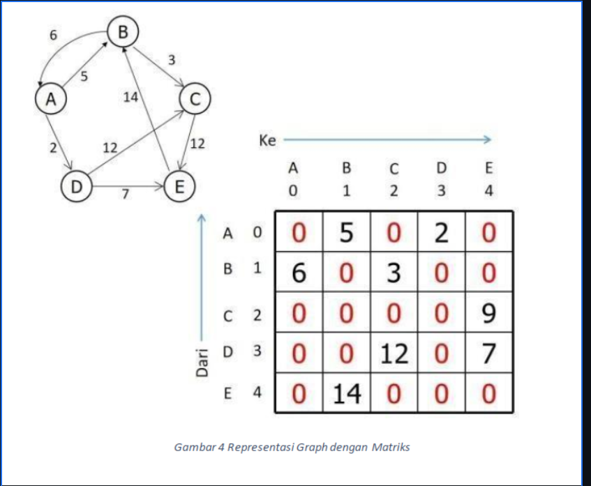
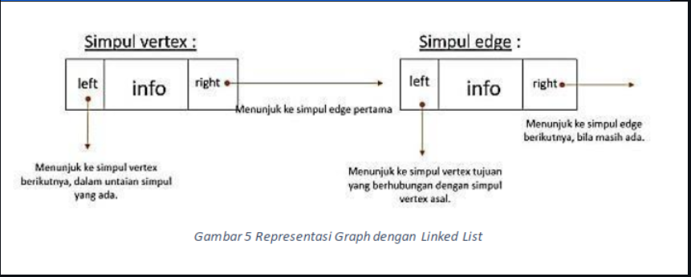
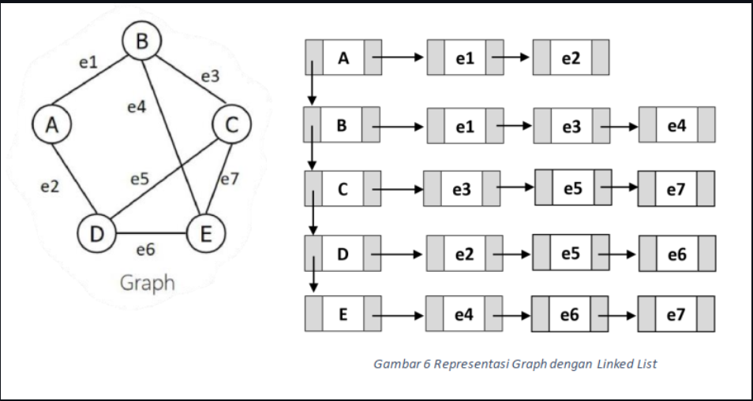

### Tree: Node dan Pointer, Array, Double Linked List.

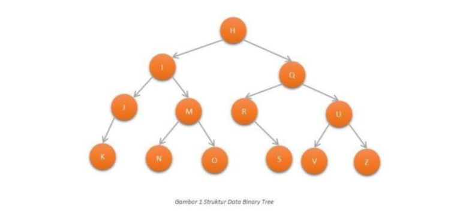

## H. KEKURANGAN DAN KELEBIHAN GRAPH DAN TREE
- Kekurangan Graph :
Graph menggunakan banyak pointer yang dapat rumit untuk ditangani, memiliki kompleksitas memori yang besar, dan operasi perkalian graph dapat sulit dilakukan.
- Kelebihan Graph :
Graph dapat dengan mudah menemukan jalur terpendek dan tetangga dari node, digunakan untuk mengimplementasikan algoritma seperti DFS dan BFS, membantu dalam mengatur data, dan memahami masalah yang kompleks.

- Kekurangan Tree :
Tree dapat memiliki kompleksitas memori yang besar jika memiliki banyak node, dan operasi pengurutan dapat rumit jika tree besar.
- Kelebihan Tree :
Tree digunakan dalam aplikasi seperti binary search tree (BST) untuk mencari data dengan efisiensi, membantu dalam mengatur data, dan memahami masalah yang kompleks.

## Guided 

### 1. [Program Graph]

```C++
#include <iostream>
#include <iomanip>

using namespace std;

string simpul[7] = {
    "Ciamis", "Bandung", "Bekasi", "Tasikmalaya", "Cianjur", "Purwokerto", "Yogyakarta" 
};
int busur[7][7] = {
    {0,7,8,0,0,0,0},
    {0,0,5,0,0,15,0},
    {0,6,0,0,5,0,0},
    {0,5,0,0,2,4,0},
    {23,0,0,10,0,0,8},
    {0,0,0,0,7,0,3},
    {0,0,0,0,9,4,0},
};
void tampilGraph(){
    for (int baris=0; baris<7; baris++){
        cout <<" "<<setiosflags(ios::left)<<setw(15)<<simpul[baris]<<" : ";
        for (int kolom = 0; kolom<7; kolom++){
            if(busur[baris][kolom] != 0){
                cout << " " << simpul[kolom]<< " ( " << busur[baris][kolom]<<" )";
            }
        } cout << endl;
    }
}
int main (){
    tampilGraph();
}
```

Kode di atas digunakan untuk mengimplementasikan program Graph berarah berbobot menggunakan matriks adjacensi dan array untuk simpul-simpulnya dalam bahasa C++. Graph ini menampilkan jaringan antar kota di Indonesia yang terdiri dari tujuh kota, yaitu Ciamis, Bandung, Bekasi, Tasikmalaya, Cianjur, Purwokerto, dan Yogyakarta. Masing-masing kota memiliki jarak yang berbeda dengan kota lainnya, yang ditampilkan dalam bentuk jaringan grafik.
Bagian dari program tersebut :
1. Deklarasi dan Inisialisasi Variabel:
   - `simpul[7]`: Array dari string yang berisi nama-nama simpul (node) dalam graf. Simpul-simpul ini adalah "Ciamis", "Bandung", "Bekasi", "Tasikmalaya", "Cianjur", "Purwokerto", dan "Yogyakarta".
   - `busur[7][7]`: Matriks 2D yang menyimpan bobot (weight) dari setiap busur (edge) antar simpul. Jika tidak ada busur antara dua simpul, nilai elemen matriksnya adalah 0.
2. Fungsi `tampilGraph()`:
   - Fungsi ini digunakan untuk menampilkan graf berdasarkan data dari `simpul` dan `busur`.
   - `for (int baris=0; baris<7; baris++)`: Looping ini digunakan untuk iterasi melalui setiap simpul sebagai baris dalam matriks `busur`.
   - `cout << setw(15) << simpul[baris] << " : ";`: Menampilkan nama simpul saat ini dengan lebar yang ditentukan (15 karakter) agar formatnya rapi.
   - `for (int kolom = 0; kolom<7; kolom++)`: Looping ini digunakan untuk iterasi melalui setiap kolom dalam matriks `busur` untuk simpul saat ini.
   - `if(busur[baris][kolom] != 0)`: Mengecek apakah ada busur dari simpul saat ini ke simpul lain (nilai tidak 0).
   - `cout << " " << simpul[kolom] << " ( " << busur[baris][kolom] << " )";`: Menampilkan simpul tujuan dan bobot dari busur tersebut.
   - `cout << endl;`: Baris baru untuk setiap simpul.

#### Hasil dari output program diatas adalah :
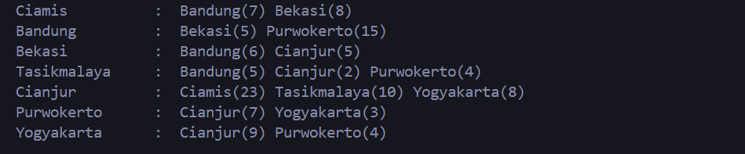


### 2. [Program Tree]

```C++
#include <iostream>
#include <iomanip>
using namespace std;

struct Pohon
{
    char data;
    Pohon *left, *right, *parent;
};
Pohon *root, *baru;
void init()
{
    root = NULL;
}
bool isEmpty()
{
    return root == NULL;
}
void buatNode(char data)
{
    if (isEmpty())
    {
        root = new Pohon();
        root->data = data;
        root->left = NULL;
        root->right = NULL;
        root->parent = NULL;
        cout << "\n Node " << data << " berhasil dibuat sebagai root."
             << endl;
    }
    else
    {
        cout << "\n Tree sudah ada!" << endl;
    }
}
Pohon *insertLeft(char data, Pohon *node)
{
    if (isEmpty())
    {
        cout << "\n Buat tree terlebih dahulu!" << endl;
        return NULL;
    }
    else
    {
        if (node->left != NULL)
        {
            cout << "\n Node " << node->data << " sudah ada child kiri !" << endl;
                return NULL;
        }
        else
        {
            Pohon *baru = new Pohon();
            baru->data = data;
            baru->left = NULL;
            baru->right = NULL;
            baru->parent = node;
            node->left = baru;
            cout << "\n Node " << data << " berhasil ditambahkan ke child kiri " << baru->parent->data << endl;
                return baru;
        }
    }
}
Pohon *insertRight(char data, Pohon *node)
{
    if (isEmpty())
    {
        cout << "\n Buat tree terlebih dahulu!" << endl;
        return NULL;
    }
    else
    {
        if (node->right != NULL)
        {
            cout << "\n Node " << node->data << " sudah ada child  kanan !" << endl;
                return NULL;
        }
        else
        {
            Pohon *baru = new Pohon();
            baru->data = data;
            baru->left = NULL;
            baru->right = NULL;
            baru->parent = node;
            node->right = baru;
            cout << "\n Node " << data << " berhasil ditambahkan ke child kanan " << baru->parent->data << endl;
                return baru;
        }
    }
}
void update(char data, Pohon *node)
{
    if (isEmpty())
    {
        cout << "\n Buat tree terlebih dahulu!" << endl;
    }
    else
    {
        if (!node)
        {
            cout << "\n Node yang ingin diganti tidak ada!!" << endl;
        }
        else
        {
            char temp = node->data;
            node->data = data;
            cout << "\n Node " << temp << " berhasil diubah menjadi "
                 << data << endl;
        }
    }
}
void retrieve(Pohon *node)
{
    if (isEmpty())
    {
        cout << "\n Buat tree terlebih dahulu!" << endl;
    }
    else
    {
        if (!node)
        {
            cout << "\n Node yang ditunjuk tidak ada!" << endl;
        }
        else
        {
            cout << "\n Data node : " << node->data << endl;
        }
    }
}
void find(Pohon *node)
{
    if (isEmpty())
    {
        cout << "\n Buat tree terlebih dahulu!" << endl;
    }
    else
    {
        if (!node)
        {
            cout << "\n Node yang ditunjuk tidak ada!" << endl;
        }
        else
        {
            cout << "\n Data Node : " << node->data << endl;
            cout << " Root : " << root->data << endl;
            if (!node->parent)
                cout << " Parent : (tidak punya parent)" << endl;
            else
                cout << " Parent : " << node->parent->data << endl;
            if (node->parent != NULL && node->parent->left != node &&
                node->parent->right == node)
                cout << " Sibling : " << node->parent->left->data << endl;
            else if (node->parent != NULL && node->parent->right != node && node->parent->left == node)
                cout << " Sibling : " << node->parent->right->data << endl;
            else
                cout << " Sibling : (tidak punya sibling)" << endl;
            if (!node->left)
                cout << " Child Kiri : (tidak punya Child kiri)" << endl;
            else
                cout << " Child Kiri : " << node->left->data << endl;
            if (!node->right)
                cout << " Child Kanan : (tidak punya Child kanan)" << endl;
            else
                cout << " Child Kanan : " << node->right->data << endl;
        }
    }
}
// Penelusuran (Traversal)
// preOrder
void preOrder(Pohon *node = root)
{
    if (isEmpty())
    {
        cout << "\n Buat tree terlebih dahulu!" << endl;
    }
    else
    {
        if (node != NULL)
        {
            cout << " " << node->data << ", ";
            preOrder(node->left);
            preOrder(node->right);
        }
    }
}
// inOrder
void inOrder(Pohon *node = root)
{
    if (isEmpty())
    {
        cout << "\n Buat tree terlebih dahulu!" << endl;
    }
    else
    {
        if (node != NULL)
        {
            inOrder(node->left);
            cout << " " << node->data << ", ";
            inOrder(node->right);
        }
    }
}
// postOrder
void postOrder(Pohon *node = root)
{
    if (isEmpty())
    {
        cout << "\n Buat tree terlebih dahulu!" << endl;
    }
    else
    {
        if (node != NULL)
        {
            postOrder(node->left);
            postOrder(node->right);
            cout << " " << node->data << ", ";
        }
    }
}
// Hapus Node Tree
void deleteTree(Pohon *node)
{
    if (isEmpty())
    {
        cout << "\n Buat tree terlebih dahulu!" << endl;
    }
    else
    {
        if (node != NULL)
        {
            if (node != root)
            {
                node->parent->left = NULL;
                node->parent->right = NULL;
            }
            deleteTree(node->left);
            deleteTree(node->right);
            if (node == root)
            {
                delete root;
                root = NULL;
            }
            else
            {
                delete node;
            }
        }
    }
}
// Hapus SubTree
void deleteSub(Pohon *node)
{
    if (isEmpty())
    {
        cout << "\n Buat tree terlebih dahulu!" << endl;
    }
    else
    {
        deleteTree(node->left);
        deleteTree(node->right);
        cout << "\n Node subtree " << node->data << " berhasil dihapus." << endl;
    }
}
// Hapus Tree
void clear()
{
    if (isEmpty())
    {
        cout << "\n Buat tree terlebih dahulu!!" << endl;
    }
    else
    {
        deleteTree(root);
        cout << "\n Pohon berhasil dihapus." << endl;
    }
}
// Cek Size Tree
int size(Pohon *node = root)
{
    if (isEmpty())
    {
        cout << "\n Buat tree terlebih dahulu!!" << endl;
        return 0;
    }
    else
    {
        if (!node)
        {
            return 0;
        }
        else
        {
            return 1 + size(node->left) + size(node->right);
        }
    }
}
// Cek Height Level Tree
int height(Pohon *node = root)
{
    if (isEmpty())
    {
        cout << "\n Buat tree terlebih dahulu!" << endl;
        return 0;
    }
    else
    {
        if (!node)
        {
            return 0;
        }
        else
        {
            int heightKiri = height(node->left);
            int heightKanan = height(node->right);
            if (heightKiri >= heightKanan)
            {
                return heightKiri + 1;
            }
            else
            {
                return heightKanan + 1;
            }
        }
    }
}
// Karakteristik Tree
void characteristic()
{
    cout << "\n Size Tree : " << size() << endl;
    cout << " Height Tree : " << height() << endl;
    cout << " Average Node of Tree : " << size() / height() << endl;
}
int main()
{
   buatNode('A');
    Pohon *nodeB, *nodeC, *nodeD, *nodeE, *nodeF, *nodeG, *nodeH, *nodeI, *nodeJ;

    nodeB = insertLeft('B', root);
    nodeC = insertRight('C', root);
    nodeD = insertLeft('D', nodeB);
    nodeE = insertRight('E', nodeB);
    nodeF = insertLeft('F', nodeC);
    nodeG = insertLeft('G', nodeE);
    nodeH = insertRight('H', nodeE);
    nodeI = insertLeft('I', nodeG);
    nodeJ = insertRight('J', nodeG);

    update('Z', nodeC);
    update('C', nodeC);
    retrieve(nodeC);
    find(nodeC);
    characteristic();

    cout << "\n PreOrder :" << endl;
    preOrder(root);
    cout << "\n" << endl;

    cout << " InOrder :" << endl;
    inOrder(root);
    cout << "\n" << endl;
    
    cout << " PostOrder :" << endl;
    postOrder(root);
    cout << "\n" << endl;
}
```

Kode di atas digunakan untuk mengimplementasikan dari Program Tree atau pohon biner berbasis objek dalam bahasa C++. Pohon biner adalah struktur data yang terdiri dari node-node yang terhubung dengan cara berurutan dan memiliki kiri dan kanan. Berikut adalah deskripsi dari bagian-bagian program tersebut :

1. Deklarasi dan Inisialisasi Struktur Data :
   - `struct Pohon`: Mendefinisikan struktur pohon biner dengan data `char` dan pointer `left`, `right`, dan `parent`.
   - `Pohon *root, *baru;`: Deklarasi pointer untuk root dan node baru.

2. Fungsi-fungsi Manipulasi Pohon :
   - `void init()`: Inisialisasi pohon, mengatur `root` ke NULL.
   - `bool isEmpty()`: Mengecek apakah pohon kosong.
   - `void buatNode(char data)`: Membuat node root jika pohon kosong.
   - `Pohon *insertLeft(char data, Pohon *node)`: Menambahkan node baru sebagai anak kiri dari `node` yang diberikan.
   - `Pohon *insertRight(char data, Pohon *node)`: Menambahkan node baru sebagai anak kanan dari `node` yang diberikan.
   - `void update(char data, Pohon *node)`: Mengubah data dari node yang diberikan.
   - `void retrieve(Pohon *node)`: Menampilkan data dari node yang diberikan.
   - `void find(Pohon *node)`: Menampilkan informasi dari node yang diberikan (data, root, parent, sibling, child kiri, dan child kanan).

3. Fungsi-fungsi Traversal Pohon :
   - `void preOrder(Pohon *node = root)`: Traversal pre-order (root, kiri, kanan).
   - `void inOrder(Pohon *node = root)`: Traversal in-order (kiri, root, kanan).
   - `void postOrder(Pohon *node = root)`: Traversal post-order (kiri, kanan, root).

4. Fungsi-fungsi Manipulasi dan Informasi Pohon :
   - `void deleteTree(Pohon *node)`: Menghapus seluruh pohon dari node yang diberikan.
   - `void deleteSub(Pohon *node)`: Menghapus subtree dari node yang diberikan.
   - `void clear()`: Menghapus seluruh pohon.
   - `int size(Pohon *node = root)`: Menghitung jumlah node dalam pohon.
   - `int height(Pohon *node = root)`: Menghitung tinggi pohon.
   - `void characteristic()`: Menampilkan karakteristik pohon (size, height, dan average node).

#### Hasil dari output program diatas adalah :
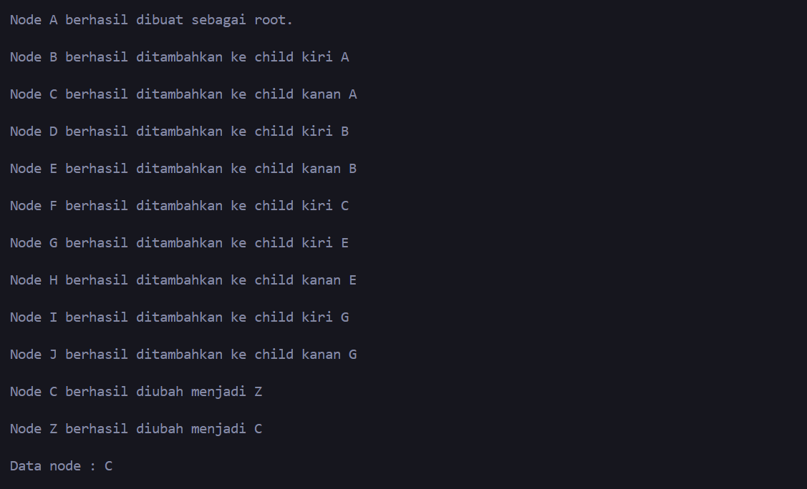
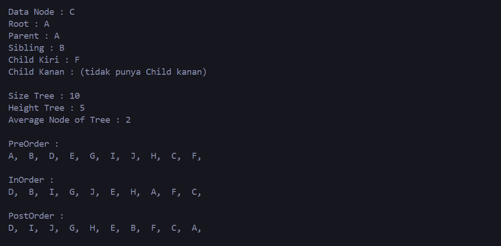


## Unguided 
Cantumkan NIM pada salah satu variabel di dalam program.
Contoh : int nama_22102003;

### 1. [Buatlah program graph dengan menggunakan inputan user untuk menghitung jarak dari sebuah kota ke kota lainnya.]
 Output Program :

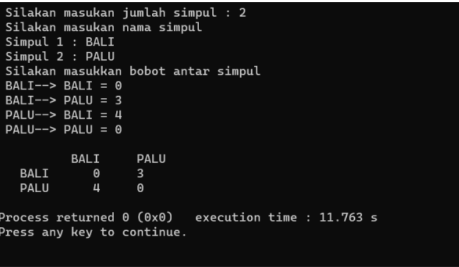

```C++

#include <iostream> // Library untuk operasi input dan output
#include <vector>   // Library untuk penggunaan kontainer vector
#include <string>   // Library untuk penggunaan tipe data string

using namespace std; // Menggunakan namespace std untuk mempermudah penulisan kode

int main()
{
    int JumlahSimpul_324; // Deklarasi variabel untuk menyimpan jumlah simpul

    // Menampilkan judul program
    cout << "\n>>>>>>> Program graph menghitung jarak dari sebuah kota <<<<<<<" << endl;
    // Meminta pengguna memasukkan jumlah simpul
    cout << "\nSilakan masukan jumlah simpul : ";
    cin >> JumlahSimpul_324; // Membaca input jumlah simpul dari pengguna

    // Mendeklarasikan vektor untuk menyimpan nama-nama simpul
    vector<string> NamaSimpul_324(JumlahSimpul_324);
    // Mendeklarasikan matriks untuk menyimpan bobot (jarak) antar simpul
    vector<vector<int>> bobot_324(JumlahSimpul_324, vector<int>(JumlahSimpul_324));

    // Meminta pengguna memasukkan nama-nama simpul
    cout << "Silakan masukan nama simpul" << endl;
    for (int i_324 = 0; i_324 < JumlahSimpul_324; ++i_324)
    {
        // Meminta input nama simpul dari pengguna
        cout << "Simpul " << i_324 + 1 << " : ";
        cin >> NamaSimpul_324[i_324]; // Membaca input nama simpul dan menyimpannya ke dalam vektor
    }

    // Meminta pengguna memasukkan bobot antar simpul
    cout << "Silakan masukkan bobot antar simpul" << endl;
    for (int i_324 = 0; i_324 < JumlahSimpul_324; ++i_324)
    {
        for (int j_324 = 0; j_324 < JumlahSimpul_324; ++j_324)
        {
            // Meminta input bobot (jarak) dari simpul i ke simpul j
            cout << NamaSimpul_324[i_324] << "--> " << NamaSimpul_324[j_324] << " = ";
            cin >> bobot_324[i_324][j_324]; // Membaca input bobot dan menyimpannya ke dalam matriks
        }
    }

    cout << endl; // Menambahkan baris baru untuk tampilan yang lebih rapi

    // Menampilkan tabel jarak antar simpul
    cout << "     "; // Menambahkan spasi untuk perataan tabel
    for (const string &Nama_324 : NamaSimpul_324)
    {
        cout << Nama_324 << "  "; // Menampilkan nama-nama simpul sebagai header kolom
    }
    cout << endl;

    for (int i_324 = 0; i_324 < JumlahSimpul_324; ++i_324)
    {
        cout << NamaSimpul_324[i_324] << "     "; // Menampilkan nama simpul sebagai header baris
        for (int j_324 = 0; j_324 < JumlahSimpul_324; ++j_324)
        {
            cout << bobot_324[i_324][j_324] << "  "; // Menampilkan bobot (jarak) antar simpul
        }
        cout << endl;
    }

    return 0; // Mengembalikan nilai 0 untuk menandakan program berakhir dengan sukses
}

```
#### Output:
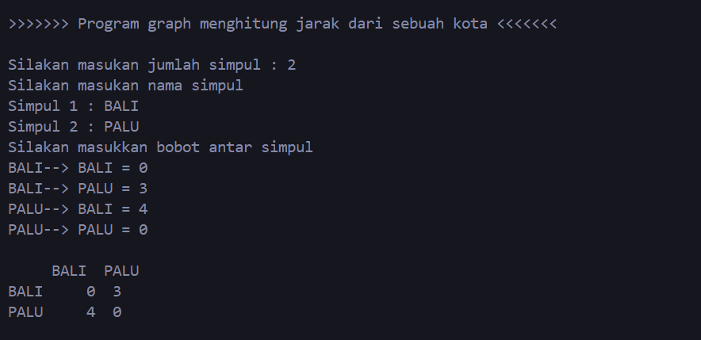

Kode di atas digunakan untuk implementasi program penerapan Graph sederhana dalam C++. Dengan menggunakan inputan user untuk menghitung
jarak dari sebuah kota ke kota lainnya.
Berikut rincian programnya:
- `int JumlahSimpul_324;`: Variabel untuk menyimpan jumlah simpul yang akan dimasukkan oleh pengguna.
- `NamaSimpul_324` adalah vektor yang berisi nama-nama simpul.
- `bobot_324` adalah matriks yang berisi bobot (jarak) antar simpul.
- `vector<string> NamaSimpul_324(JumlahSimpul_324);`: Vektor untuk menyimpan nama-nama simpul.
- `vector<vector<int>> bobot(JumlahSimpul_324, vector<int>(JumlahSimpul_24));`: Matriks untuk menyimpan bobot (jarak) antar simpul.

  Contoh Programnya user memasukkan input sendiri, dan itu sesuai yang diperintah pada modul. Lebih jelasnya yang hasil programnya seperti gambar output diatas.


### 2. [Modifikasi guided tree diatas dengan program menu menggunakan input data tree dari user dan berikan fungsi tambahan untuk menampilkan node child dan descendant dari node yang diinput kan!]

```C++

#include <iostream> // Library untuk operasi input dan output
#include <iomanip>  // Library untuk merapihkan,enu output
#include <queue>    // Library untuk menggunakan queue dalam BFS
using namespace std;

// Struktur Pohon
struct Pohon
{
    char Data_324;
    Pohon *Kiri_324, *Kanan_324, *Parent_324;
};
Pohon *Root_324, *Baru_324;

// Inisialisasi Root_324 tree
void init_324()
{
    Root_324 = NULL;
}

// Cek apakah tree kosong
bool isEmpty_324()
{
    return Root_324 == NULL;
}

// Buat Node_324 Baru_324 sebagai Root_324
void buatNode_324(char Data_324)
{
    if (isEmpty_324())
    {
        Root_324 = new Pohon();
        Root_324->Data_324 = Data_324;
        Root_324->Kiri_324 = NULL;
        Root_324->Kanan_324 = NULL;
        Root_324->Parent_324 = NULL;
        cout << "\n[324] Node " << Data_324 << " berhasil dibuat sebagai root." << endl;
    }
    else
    {
        cout << "\n[324] Tree sudah ada!" << endl;
    }
}

// Insert Node_324 ke kiri
Pohon *insertKiri_324(char Data_324, Pohon *Node_324)
{
    if (isEmpty_324())
    {
        cout << "\n[324] Buat tree terlebih dahulu!" << endl;
        return NULL;
    }
    else
    {
        if (Node_324->Kiri_324 != NULL)
        {
            cout << "\n[324] Node " << Node_324->Data_324 << " sudah ada child kiri!" << endl;
            return NULL;
        }
        else
        {
            Pohon *Baru_324 = new Pohon();
            Baru_324->Data_324 = Data_324;
            Baru_324->Kiri_324 = NULL;
            Baru_324->Kanan_324 = NULL;
            Baru_324->Parent_324 = Node_324;
            Node_324->Kiri_324 = Baru_324;
            cout << "\n[324] Node " << Data_324 << " berhasil ditambahkan ke child kiri " << Baru_324->Parent_324->Data_324 << endl;
            return Baru_324;
        }
    }
}

// Insert Node_324 ke kanan
Pohon *insertKanan_324(char Data_324, Pohon *Node_324)
{
    if (isEmpty_324())
    {
        cout << "\n[324] Buat tree terlebih dahulu!" << endl;
        return NULL;
    }
    else
    {
        if (Node_324->Kanan_324 != NULL)
        {
            cout << "\n[324] Node " << Node_324->Data_324 << " sudah ada child kanan!" << endl;
            return NULL;
        }
        else
        {
            Pohon *Baru_324 = new Pohon();
            Baru_324->Data_324 = Data_324;
            Baru_324->Kiri_324 = NULL;
            Baru_324->Kanan_324 = NULL;
            Baru_324->Parent_324 = Node_324;
            Node_324->Kanan_324 = Baru_324;
            cout << "\n[324] Node " << Data_324 << " berhasil ditambahkan ke child kanan " << Baru_324->Parent_324->Data_324 << endl;
            return Baru_324;
        }
    }
}

// Update Data_324 Node_324
void update_324(char Data_324, Pohon *Node_324)
{
    if (isEmpty_324())
    {
        cout << "\n[324] Buat tree terlebih dahulu!" << endl;
    }
    else
    {
        if (!Node_324)
        {
            cout << "\n[324] Node yang ingin diganti tidak ada!" << endl;
        }
        else
        {
            char temp = Node_324->Data_324;
            Node_324->Data_324 = Data_324;
            cout << "\n[324] Node " << temp << " berhasil diubah menjadi " << Data_324 << endl;
        }
    }
}

// Retrieve Data_324 Node_324
void retrieve_324(Pohon *Node_324)
{
    if (isEmpty_324())
    {
        cout << "\n[324] Buat tree terlebih dahulu!" << endl;
    }
    else
    {
        if (!Node_324)
        {
            cout << "\n[324] Node yang ditunjuk tidak ada!" << endl;
        }
        else
        {
            cout << "\n[324] Data Node : " << Node_324->Data_324 << endl;
        }
    }
}

// Find Node_324 dan menampilkan informasi lengkap
void find_324(Pohon *Node_324)
{
    if (isEmpty_324())
    {
        cout << "\n[324] Buat tree terlebih dahulu!" << endl;
    }
    else
    {
        if (!Node_324)
        {
            cout << "\n[324] Node yang ditunjuk tidak ada!" << endl;
        }
        else
        {
            cout << "\n[324] Data Node : " << Node_324->Data_324 << endl;
            cout << "[324] Root : " << Root_324->Data_324 << endl;
            if (!Node_324->Parent_324)
                cout << "[324] Parent : (tidak punya parent)" << endl;
            else
                cout << "[324] Parent : " << Node_324->Parent_324->Data_324 << endl;
            if (Node_324->Parent_324 != NULL && Node_324->Parent_324->Kiri_324 != Node_324 && Node_324->Parent_324->Kanan_324 == Node_324)
                cout << "[324] Sibling : " << Node_324->Parent_324->Kiri_324->Data_324 << endl;
            else if (Node_324->Parent_324 != NULL && Node_324->Parent_324->Kanan_324 != Node_324 && Node_324->Parent_324->Kiri_324 == Node_324)
                cout << "[324] Sibling : " << Node_324->Parent_324->Kanan_324->Data_324 << endl;
            else
                cout << "[324] Sibling : (tidak punya sibling)" << endl;
            if (!Node_324->Kiri_324)
                cout << "[324] Child Kiri : (tidak punya Child kiri)" << endl;
            else
                cout << "[324] Child Kiri : " << Node_324->Kiri_324->Data_324 << endl;
            if (!Node_324->Kanan_324)
                cout << "[324] Child Kanan : (tidak punya Child kanan)" << endl;
            else
                cout << "[324] Child Kanan : " << Node_324->Kanan_324->Data_324 << endl;
        }
    }
}

// Pre-order traversal
void preOrder_324(Pohon *Node_324 = Root_324)
{
    if (isEmpty_324())
    {
        cout << "\n[324] Buat tree terlebih dahulu!" << endl;
    }
    else
    {
        if (Node_324 != NULL)
        {
            cout << " " << Node_324->Data_324 << ", ";
            preOrder_324(Node_324->Kiri_324);
            preOrder_324(Node_324->Kanan_324);
        }
    }
}

// In-order traversal
void inOrder_324(Pohon *Node_324 = Root_324)
{
    if (isEmpty_324())
    {
        cout << "\n[324] Buat tree terlebih dahulu!" << endl;
    }
    else
    {
        if (Node_324 != NULL)
        {
            inOrder_324(Node_324->Kiri_324);
            cout << " " << Node_324->Data_324 << ", ";
            inOrder_324(Node_324->Kanan_324);
        }
    }
}

// Post-order traversal
void postOrder_324(Pohon *Node_324 = Root_324)
{
    if (isEmpty_324())
    {
        cout << "\n[324] Buat tree terlebih dahulu!" << endl;
    }
    else
    {
        if (Node_324 != NULL)
        {
            postOrder_324(Node_324->Kiri_324);
            postOrder_324(Node_324->Kanan_324);
            cout << " " << Node_324->Data_324 << ", ";
        }
    }
}

// Hapus tree secara rekursif
void deleteTree_324(Pohon *Node_324)
{
    if (isEmpty_324())
    {
        cout << "\n[324] Buat tree terlebih dahulu!" << endl;
    }
    else
    {
        if (Node_324 != NULL)
        {
            if (Node_324 != Root_324)
            {
                Node_324->Parent_324->Kiri_324 = NULL;
                Node_324->Parent_324->Kanan_324 = NULL;
            }
            deleteTree_324(Node_324->Kiri_324);
            deleteTree_324(Node_324->Kanan_324);
            if (Node_324 == Root_324)
            {
                delete Root_324;
                Root_324 = NULL;
            }
            else
            {
                delete Node_324;
            }
        }
    }
}

// Hapus subtree dari Node_324 tertentu
void deleteSub_324(Pohon *Node_324)
{
    if (isEmpty_324())
    {
        cout << "\n[324] Buat tree terlebih dahulu!" << endl;
    }
    else
    {
        deleteTree_324(Node_324->Kiri_324);
        deleteTree_324(Node_324->Kanan_324);
        cout << "\n[324] Node subtree " << Node_324->Data_324 << " berhasil dihapus." << endl;
    }
}

// Hapus seluruh tree
void clear_324()
{
    if (isEmpty_324())
    {
        cout << "\n[324] Buat tree terlebih dahulu!" << endl;
    }
    else
    {
        deleteTree_324(Root_324);
        cout << "\n[324] Pohon berhasil dihapus." << endl;
    }
}

// Hitung size_324 tree
int size_324(Pohon *Node_324 = Root_324)
{
    if (isEmpty_324())
    {
        cout << "\n[324] Buat tree terlebih dahulu!" << endl;
        return 0;
    }
    else
    {
        if (!Node_324)
        {
            return 0;
        }
        else
            return size_324(Node_324->Kiri_324) + size_324(Node_324->Kanan_324) + 1;
    }
}

// Hitung height_324 tree
int height_324(Pohon *Node_324 = Root_324)
{
    if (isEmpty_324())
    {
        cout << "\n[324] Buat tree terlebih dahulu!" << endl;
        return 0;
    }
    else
    {
        if (!Node_324)
        {
            return 0;
        }
        else
        {
            int heightKiri = height_324(Node_324->Kiri_324);
            int heightKanan = height_324(Node_324->Kanan_324);
            if (heightKiri >= heightKanan)
            {
                return heightKiri + 1;
            }
            else
            {
                return heightKanan + 1;
            }
        }
    }
}

// Tampilkan karakteristik tree
void characteristic_324()
{
    cout << "\n>> Ukuran Tree : " << size_324() << endl;
    cout << ">> Tinggi Tree : " << height_324() << endl;
    cout << ">> Rata-rata Node di Tree : " << size_324() / height_324() << endl;
}

// Tampilkan child dan descendant dari Node_324 tertentu
void showChilAndDescendant_324(Pohon *Node_324)
{
    if (isEmpty_324())
    {
        cout << "\n[324] Buat tree terlebih dahulu!" << endl;
    }
    else if (!Node_324)
    {
        cout << "\n[324] Node yang ditunjuk tidak ada!" << endl;
    }
    else
    {
        // Tampilkan child
        cout << "\n[324] Node : " << Node_324->Data_324 << endl;
        if (Node_324->Kiri_324)
            cout << "[324] Child Kiri : " << Node_324->Kiri_324->Data_324 << endl;
        else
            cout << "[324] Child Kiri : (tidak punya Child kiri)" << endl;
        if (Node_324->Kanan_324)
            cout << "[324] Child Kanan : " << Node_324->Kanan_324->Data_324 << endl;
        else
            cout << "[324] Child Kanan : (tidak punya Child kanan)" << endl;

        // Tampilkan descendant
        cout << "[324] Descendant : ";
        queue<Pohon *> q_324;
        q_324.push(Node_324);
        bool first = true;
        while (!q_324.empty())
        {
            Pohon *current = q_324.front();
            q_324.pop();
            if (!first)
                cout << current->Data_324 << ", ";
            first = false;
            if (current->Kiri_324)
                q_324.push(current->Kiri_324);
            if (current->Kanan_324)
                q_324.push(current->Kanan_324);
        }
        cout << endl;
    }
}

int main()
{
    int Pilihan_324;
    char Data_324;
    Pohon *Node_324 = NULL;
    do
    {
        // Program Menu
        cout << "\n\n>>>>>>> PROGRAM MENU DATA TREE <<<<<<<:\n";
        cout << "1.  Buat Node Root\n";
        cout << "2.  Insert Kiri\n";
        cout << "3.  Insert Kanan\n";
        cout << "4.  Update Node\n";
        cout << "5.  Retrieve Node\n";
        cout << "6.  Cari Node\n";
        cout << "7.  Pre-order Traversal\n";
        cout << "8.  In-order Traversal\n";
        cout << "9.  Post-order Traversal\n";
        cout << "10. Hapus Tree\n";
        cout << "11. Hapus Subtree\n";
        cout << "12. Tampilkan Karakteristik Tree\n";
        cout << "13. Tampilkan Child dan Descendant\n";
        cout << "0.  Keluar\n";
        cout << ">> Pilih menu : ";
        cin >> Pilihan_324;
        switch (Pilihan_324)
        {
        case 1:
            cout << "\n<<<<<<< [1] Buat Node Root >>>>>>>" << endl;
            cout << ">> Masukkan data untuk root : ";
            cin >> Data_324;
            buatNode_324(Data_324);
            break;
        case 2:
            cout << "\n<<<<<<< [2] Insert Kiri >>>>>>>" << endl;
            if (isEmpty_324())
            {
                cout << "\n[324] Buat tree terlebih dahulu!" << endl;
            }
            else
            {
                cout << ">> Masukkan data untuk node : ";
                cin >> Data_324;
                cout << ">> Masukkan parent data : ";
                char Parent_324Data;
                cin >> Parent_324Data;
                Node_324 = NULL;
                queue<Pohon *> q_324;
                q_324.push(Root_324);
                while (!q_324.empty())
                {
                    Pohon *current = q_324.front();
                    q_324.pop();
                    if (current->Data_324 == Parent_324Data)
                    {
                        Node_324 = current;
                        break;
                    }
                    if (current->Kiri_324)
                        q_324.push(current->Kiri_324);
                    if (current->Kanan_324)
                        q_324.push(current->Kanan_324);
                }
                if (Node_324)
                {
                    insertKiri_324(Data_324, Node_324);
                }
                else
                {
                    cout << "\n[324] Parent tidak ditemukan!" << endl;
                }
            }
            break;
        case 3:
            cout << "\n<<<<<<< [3] Insert Kanan >>>>>>>" << endl;
            if (isEmpty_324())
            {
                cout << "\n[324] Buat tree terlebih dahulu!" << endl;
            }
            else
            {
                cout << ">> Masukkan data untuk node : ";
                cin >> Data_324;
                cout << ">> Masukkan parent data : ";
                char Parent_324Data;
                cin >> Parent_324Data;
                Node_324 = NULL;
                queue<Pohon *> q_324;
                q_324.push(Root_324);
                while (!q_324.empty())
                {
                    Pohon *current = q_324.front();
                    q_324.pop();
                    if (current->Data_324 == Parent_324Data)
                    {
                        Node_324 = current;
                        break;
                    }
                    if (current->Kiri_324)
                        q_324.push(current->Kiri_324);
                    if (current->Kanan_324)
                        q_324.push(current->Kanan_324);
                }
                if (Node_324)
                {
                    insertKanan_324(Data_324, Node_324);
                }
                else
                {
                    cout << "\n[324] Parent tidak ditemukan!" << endl;
                }
            }
            break;
        case 4:
            cout << "\n<<<<<<< [4] Update Node >>>>>>>" << endl;
            if (isEmpty_324())
            {
                cout << "\n[324] Buat tree terlebih dahulu!" << endl;
            }
            else
            {
                cout << ">> Masukkan data baru : ";
                cin >> Data_324;
                cout << ">> Masukkan node data yang akan diupdate : ";
                char update_324Data;
                cin >> update_324Data;
                Node_324 = NULL;
                queue<Pohon *> q_324;
                q_324.push(Root_324);
                while (!q_324.empty())
                {
                    Pohon *current = q_324.front();
                    q_324.pop();
                    if (current->Data_324 == update_324Data)
                    {
                        Node_324 = current;
                        break;
                    }
                    if (current->Kiri_324)
                        q_324.push(current->Kiri_324);
                    if (current->Kanan_324)
                        q_324.push(current->Kanan_324);
                }
                if (Node_324)
                {
                    update_324(Data_324, Node_324);
                }
                else
                {
                    cout << "\n[324] Node tidak ditemukan!" << endl;
                }
            }
            break;
        case 5:
            cout << "\n<<<<<<< [5] Retrieve Node >>>>>>>" << endl;
            if (isEmpty_324())
            {
                cout << "\n[324] Buat tree terlebih dahulu!" << endl;
            }
            else
            {
                cout << ">> Masukkan node data yang akan ditampilkan : ";
                char retrieve_324Data;
                cin >> retrieve_324Data;
                Node_324 = NULL;
                queue<Pohon *> q_324;
                q_324.push(Root_324);
                while (!q_324.empty())
                {
                    Pohon *current = q_324.front();
                    q_324.pop();
                    if (current->Data_324 == retrieve_324Data)
                    {
                        Node_324 = current;
                        break;
                    }
                    if (current->Kiri_324)
                        q_324.push(current->Kiri_324);
                    if (current->Kanan_324)
                        q_324.push(current->Kanan_324);
                }
                if (Node_324)
                {
                    retrieve_324(Node_324);
                }
                else
                {
                    cout << "\n[324] Node tidak ditemukan!" << endl;
                }
            }
            break;
        case 6:
            cout << "\n<<<<<<< [6] Cari Node >>>>>>>" << endl;
            if (isEmpty_324())
            {
                cout << "\n[324] Buat tree terlebih dahulu!" << endl;
            }
            else
            {
                cout << ">> Masukkan node data yang akan ditemukan : ";
                char find_324Data;
                cin >> find_324Data;
                Node_324 = NULL;
                queue<Pohon *> q_324;
                q_324.push(Root_324);
                while (!q_324.empty())
                {
                    Pohon *current = q_324.front();
                    q_324.pop();
                    if (current->Data_324 == find_324Data)
                    {
                        Node_324 = current;
                        break;
                    }
                    if (current->Kiri_324)
                        q_324.push(current->Kiri_324);
                    if (current->Kanan_324)
                        q_324.push(current->Kanan_324);
                }
                if (Node_324)
                {
                    find_324(Node_324);
                }
                else
                {
                    cout << "\n[324] Node tidak ditemukan!" << endl;
                }
            }
            break;
        case 7:
            cout << "\n<<<<<<< [7] Pre-order Traversal >>>>>>>" << endl;
            cout << "\n>> Pre-order Traversal :" << endl;
            preOrder_324(Root_324);
            cout << "\n"
                 << endl;
            break;
        case 8:
            cout << "\n<<<<<<< [8] In-order Traversal >>>>>>>" << endl;
            cout << "\n>> In-order Traversal :" << endl;
            inOrder_324(Root_324);
            cout << "\n"
                 << endl;
            break;
        case 9:
            cout << "\n<<<<<<< [9] Post-order Traversal >>>>>>>" << endl;
            cout << "\n>> Post-order Traversal :" << endl;
            postOrder_324(Root_324);
            cout << "\n"
                 << endl;
            break;
        case 10:
            cout << "\n<<<<<<< [10] Hapus Tree >>>>>>>" << endl;
            clear_324();
            break;
        case 11:
            cout << "\n<<<<<<< [11] Hapus Subtree >>>>>>>" << endl;
            if (isEmpty_324())
            {
                cout << "\n[324] Buat tree terlebih dahulu!" << endl;
            }
            else
            {
                cout << ">> Masukkan node data untuk subtree yang akan dihapus : ";
                char subTreeData;
                cin >> subTreeData;
                Node_324 = NULL;
                queue<Pohon *> q_324;
                q_324.push(Root_324);
                while (!q_324.empty())
                {
                    Pohon *current = q_324.front();
                    q_324.pop();
                    if (current->Data_324 == subTreeData)
                    {
                        Node_324 = current;
                        break;
                    }
                    if (current->Kiri_324)
                        q_324.push(current->Kiri_324);
                    if (current->Kanan_324)
                        q_324.push(current->Kanan_324);
                }
                if (Node_324)
                {
                    deleteSub_324(Node_324);
                }
                else
                {
                    cout << "\n[324] Node tidak ditemukan!" << endl;
                }
            }
            break;
        case 12:
            cout << "\n<<<<<<< [12] Tampilkan Karakteristik Tree >>>>>>>" << endl;
            characteristic_324();
            break;
        case 13:
            cout << "\n<<<<<<< [13] Tampilkan Child dan Descendant >>>>>>>" << endl;
            if (isEmpty_324())
            {
                cout << "\n[324] Buat tree terlebih dahulu!" << endl;
            }
            else
            {
                cout << ">> Masukkan node data yang akan ditampilkan : ";
                char childDescData_324;
                cin >> childDescData_324;
                Node_324 = NULL;
                queue<Pohon *> q_324;
                q_324.push(Root_324);
                while (!q_324.empty())
                {
                    Pohon *current = q_324.front();
                    q_324.pop();
                    if (current->Data_324 == childDescData_324)
                    {
                        Node_324 = current;
                        break;
                    }
                    if (current->Kiri_324)
                        q_324.push(current->Kiri_324);
                    if (current->Kanan_324)
                        q_324.push(current->Kanan_324);
                }
                if (Node_324)
                {
                    showChilAndDescendant_324(Node_324);
                }
                else
                {
                    cout << "\n[324] Node tidak ditemukan!" << endl;
                }
            }
            break;
        case 0:
            cout << "\n[324] Keluar dari program." << endl;
            break;
        default:
            cout << "\n[324] Pilihan tidak valid!" << endl;
        }
    } while (Pilihan_324 != 0);

    return 0; // Mengembalikan nilai 0 untuk menandakan program berakhir dengan sukses
}

```
#### Output:
Pilih  1.  Buat Node Root

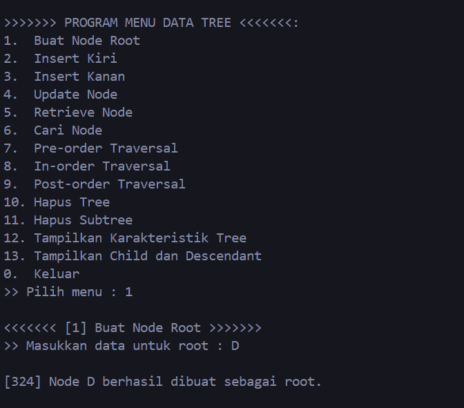

Pilih  2.  Insert Kiri

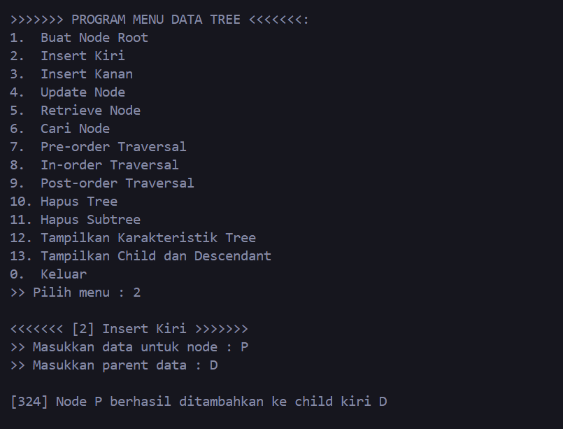

Pilih  3.  Insert Kanan

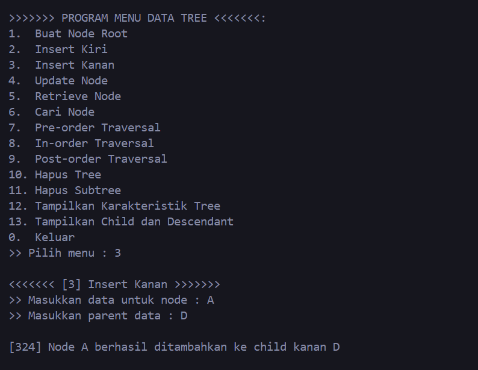
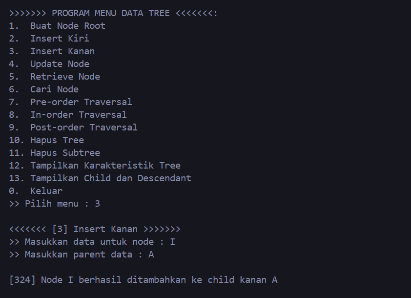

Pilih  4.  Update Node

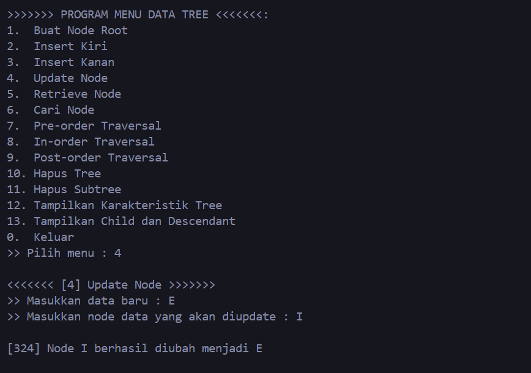

Pilih  5.  Retrieve Node

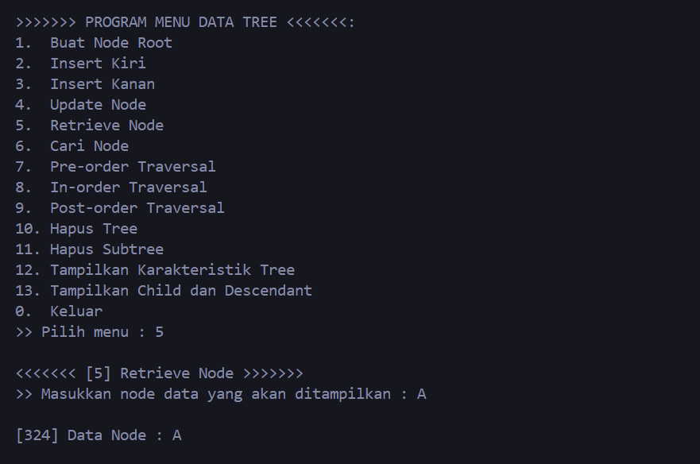

Pilih  6.  Cari Node

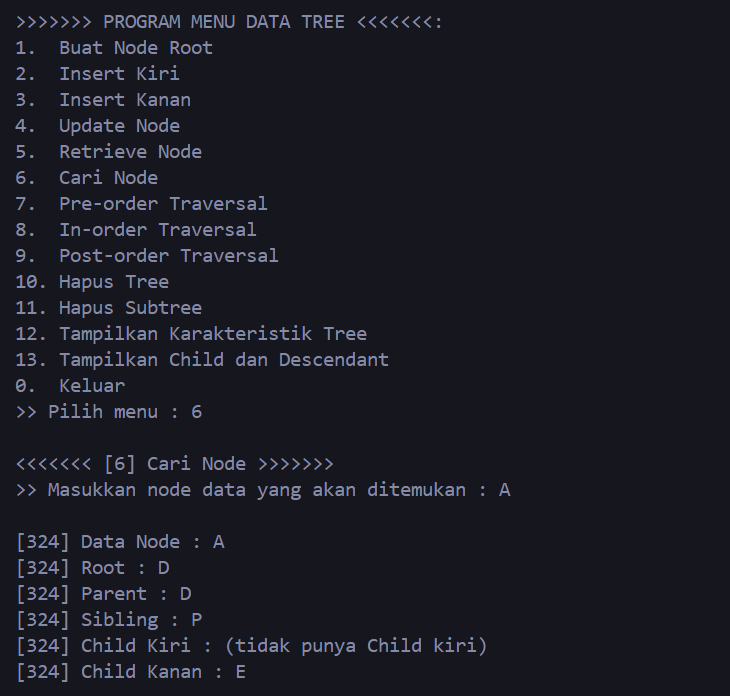

Pilih  7.  Pre-order Traversal

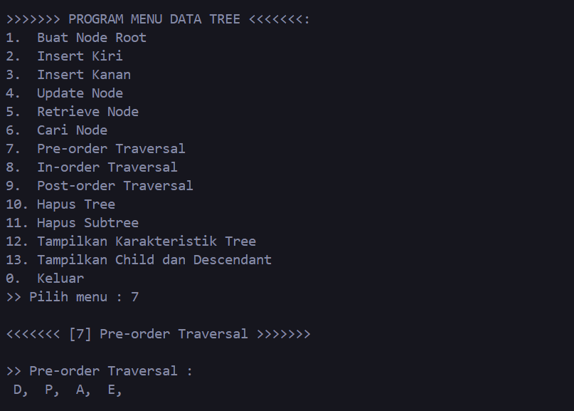

Pilih  8.  In-order Traversal

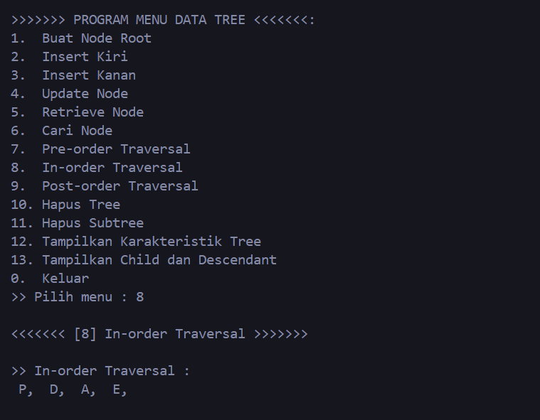

Pilih  9.  Post-order Traversal

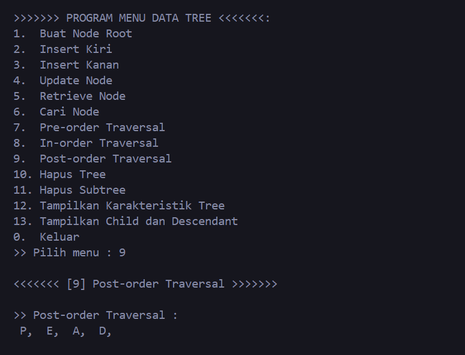

Pilih  12. Tampilkan Karakteristik Tree

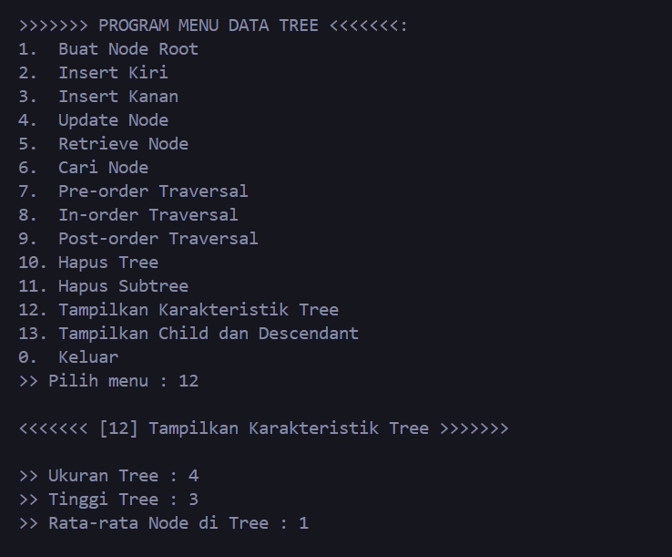

Pilih  13. Tampilkan Child dan Descendant

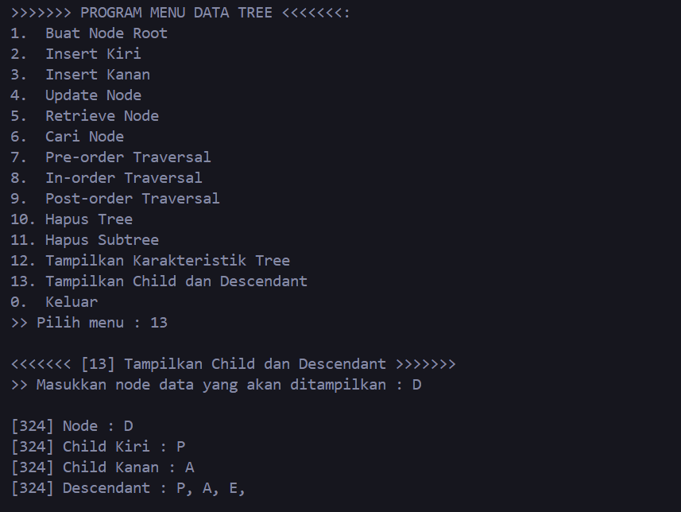

Pilih  11. Hapus Subtree

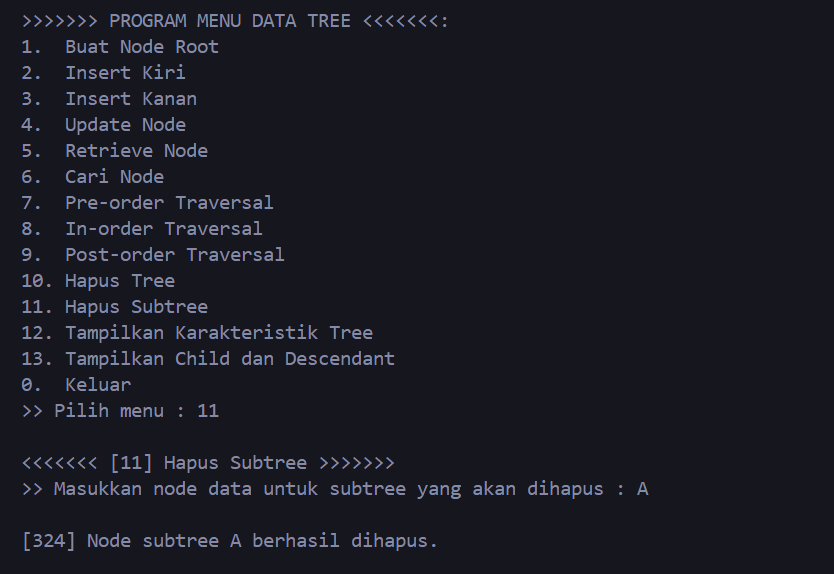

Pilih  10. Hapus Tree

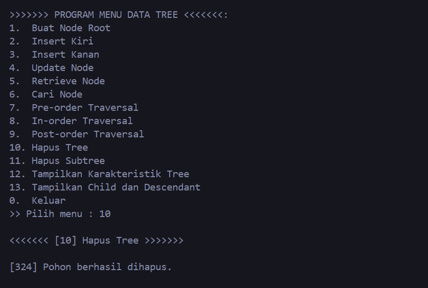

Pilih  0.  Keluar

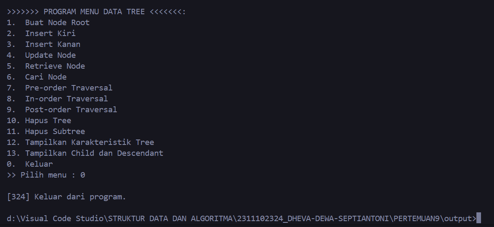


Kode di atas digunakan untuk implementasi Tree dalam C++. Program ini adalah Modifikasi Guided Tree diatas dengan program menu menggunakan input data tree dari user dan memberikan fungsi tambahan untuk menampilkan node child dan descendant dari node yang diinput kan.

Deskripsi Program :

Fungsi Utama :
1. Inisialisasi dan Pengecekan :
   - `init_324()`: Menginisialisasi root dari tree.
   - `isEmpty_324()`: Mengecek apakah tree kosong atau tidak.
2. Operasi Node :
   - `buatNode_324(char Data_324)`: Membuat node baru sebagai root tree.
   - `insertKiri_324(char Data_324, Pohon *Node_324)`: Menambahkan node baru sebagai child kiri dari node tertentu.
   - `insertKanan_2311102138(char Data_2311102138, Pohon *Node_2311102138)`: Menambahkan node baru sebagai child kanan dari node tertentu.
   - `update_324(char Data_324, Pohon *Node_324)`: Memperbarui data node tertentu.
   - `retrieve_324(Pohon *Node_324)`: Menampilkan data dari node tertentu.
3. Pencarian dan Informasi Node :
   - `find_324(Pohon *Node_324)`: Menampilkan informasi lengkap dari node tertentu termasuk parent, sibling, dan child.
4. Traversal Tree :
   - `preOrder_324(Pohon *Node_324)`: Traversal tree dalam urutan pre-order.
   - `inOrder_324(Pohon *Node_324)`: Traversal tree dalam urutan in-order.
   - `postOrder_324(Pohon *Node_324)`: Traversal tree dalam urutan post-order.
5. Penghapusan Node dan Tree :
   - `deleteTree_324(Pohon *Node_324)`: Menghapus seluruh node dalam tree secara rekursif.
   - `deleteSub_324(Pohon *Node_324)`: Menghapus subtree dari node tertentu.
   - `clear_324()`: Menghapus seluruh tree.
6. Informasi Tree :
   - `size_324(Pohon *Node_324)`: Menghitung ukuran tree.
   - `height_324(Pohon *Node_324)`: Menghitung tinggi tree.
   - `characteristic_324()`: Menampilkan karakteristik tree termasuk ukuran, tinggi, dan rata-rata node.
7. Menampilkan Child dan Descendant:
   - `showChilAndDescendant_324(Pohon *Node_324)`: Menampilkan child dan descendant dari node yang diinputkan pengguna.


## Kesimpulan
Kesimpulannya, pada modul 9 ini Graph dan Tree merupakan struktur data dua jenis yang berbeda, namun memiliki sebuah konsep yang hampir sama. Dua konsep ini adalah dasar dalam teori graf yang digunakan untuk mewakili hubungan antara entitas. Graph dan Tree adalah struktur data yang penting dalam pemrograman dan memiliki aplikasi yang luas dalam berbagai bidang. Graph atau Graf atau lintasan adalah struktur data non-linier yang terdiri dari node atau verteks yang terhubung oleh edge. Setiap node dapat memiliki beberapa edge yang menghubungkannya dengan node lain, dan setiap edge dapat memiliki bobot atau label yang terkait dengannya. Tree atau Pohon adalah jenis graf yang khusus, yang terhubung, tak berarah, dan tidak memiliki siklus. Ini terdiri dari satu set node tertaut yang terurut dalam grafik yang terhubung, dimana setiap node memiliki paling banyak satu simpul induk, dan nol atau lebih simpul anak dengan urutan tertentu.

Kekurangan dan Kelebihan
- Kekurangan Graph:
Graph menggunakan banyak pointer yang dapat rumit untuk ditangani, memiliki kompleksitas memori yang besar, dan operasi perkalian graph dapat sulit dilakukan.
- Kelebihan Graph:
Graph dapat dengan mudah menemukan jalur terpendek dan tetangga dari node, digunakan untuk mengimplementasikan algoritma seperti DFS dan BFS, membantu dalam mengatur data, dan memahami masalah yang kompleks.
- Kekurangan Tree:
Tree dapat memiliki kompleksitas memori yang besar jika memiliki banyak node, dan operasi pengurutan dapat rumit jika tree besar.
- Kelebihan Tree:
Tree digunakan dalam aplikasi seperti binary search tree (BST) untuk mencari data dengan efisiensi, membantu dalam mengatur data, dan memahami masalah yang kompleks.

## Referensi
 [1] Agustin, S., Permana, A. Y., Fazri, H. N., Robi, M., & Firmansyah, R. (2022). IMPLEMENTASI STRUKTUR DATA TREE PADA WEB BLOG SEBAGAI MEDIA PEMBELAJARAN. Jurnal Informatika Dan Tekonologi Komputer (JITEK), 2(2), 206-212.

 [2] Laisouw, R., & Burhanudin, H. (2020). Analisis Representasi Graf Berarah dalam Matriks. JURNAL BIOSAINSTEK, 2(01), 70-74.

 [3] Dr. Joseph Teguh Santoso. Struktur Data dan ALgoritma. Semarang: Yayasan Prima Agus Teknik. 2021.

 [4] Muhammad Nugraha. Dasar Pemrograman Dengan C++ Materi Paling Dasar untuk Menjadi Programmer Berbagai Platform. Yogyakarta. 2021.

 
